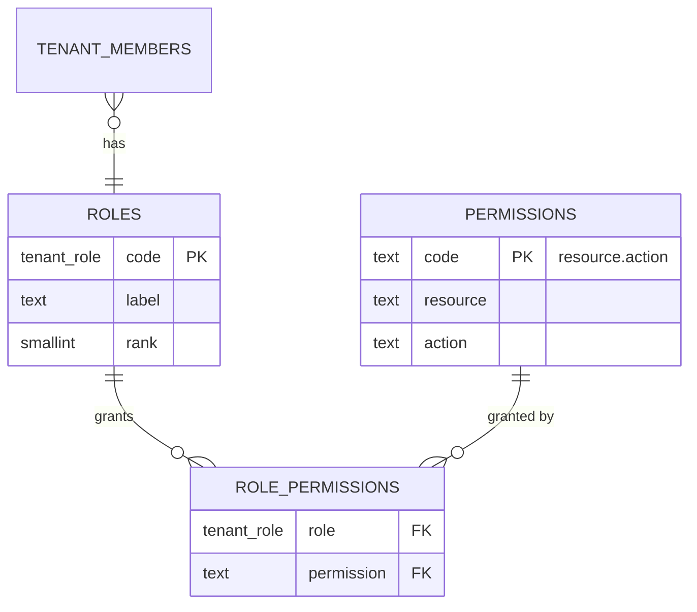

# Authorization

> Current as of Phase 24.

How CloverCode decides **what** an authenticated member may do. Identity —
_who_ is making the request — is [authentication.md](./authentication.md) and
is not covered here.

Full rationale: [ADR-010](../adr/010-rbac-authorization.md). This document is
the reference; the ADR is the argument for why it looks this way.

## The rule

Master section 12 is explicit about what to avoid:

```text
if (role === "admin")   // forbidden everywhere in this codebase
```

Code never compares a role. It asks for a **permission**:

```ts
await requirePermission(tenantId, PERMISSIONS.ORDERS_CANCEL);
```

Changing which role may cancel an order is a row in a migration, not a code
change.

## The model



`roles.code` reuses the `tenant_role` enum created in Phase 02 for
`tenant_members.role`, rather than migrating that column to a text FK — a role
outside the enum stays impossible **by type**, not by convention.

`permissions.code` is generated from its own parts
(`code = resource || '.' || action`, enforced by a CHECK), so the two can never
disagree.

The catalogue is loaded by **migration**, not by `supabase/seed.sql`
(departing from master section 23): seed data does not run on `db push` to a
deployed project, and a missing catalogue would make every permission check
return `false` — locking every environment out. Reference data RLS depends on
is schema, not sample data.

## Roles, in authority order

`rank` lets the UI order roles and lets a future "cannot manage someone above
you" rule be expressed without naming roles (0 = highest authority).

| Role         | rank | Who                                                                                       |
| ------------ | ---- | ----------------------------------------------------------------------------------------- |
| `owner`      | 0    | Full control, including the business's own configuration                                  |
| `admin`      | 10   | Everything except `settings.manage`                                                       |
| `manager`    | 20   | Supervises operations, catalogue, cash and reports                                        |
| `cashier`    | 30   | Takes orders, collects payment, opens/closes a till                                       |
| `waiter`     | 40   | Takes and updates orders only                                                             |
| `kitchen`    | 50   | Reads and advances order status only                                                      |
| `delivery`   | 60   | Manages assigned deliveries                                                               |
| `accountant` | 70   | Reads reports; issues and cancels billing documents (17), writes nothing else operational |

`owner` and `admin` do **not** inherit new permissions automatically. Phase
03's migration granted each a snapshot of the catalogue as it stood then;
every permission added since has needed its own explicit
`role_permissions` row for both — a fact easy to miss when adding a phase (see
[Adding a permission](#adding-a-permission-what-a-phase-must-remember) below).

## The permission catalogue

Grouped by resource, with the phase that introduced the code and the phase
that first consumes it. A code with no "used by" is pre-seeded ahead of the
phase that needs it — the same move Phase 03 made for `orders.*` (used from
Phase 13) and `cash.open`/`cash.close` (used from Phase 14).

| Resource          | Codes                        | Added in | Used from |
| ----------------- | ---------------------------- | -------- | --------- |
| `products`        | view, create, update, delete | 03       | 11        |
| `orders`          | view, create, update, cancel | 03       | 13        |
| `customers`       | view, manage                 | 03       | 12        |
| `cash`            | open, close                  | 03       | 14        |
| `cash`            | view, manage                 | 14       | 14        |
| `billing`         | view, create, cancel         | 03       | 17        |
| `billing`         | manage                       | 17       | 17        |
| `reports`         | view                         | 03       | 23        |
| `employees`       | manage                       | 03       | _pending_ |
| `settings`        | manage                       | 03       | 06        |
| `members`         | view, manage                 | 03       | 03        |
| `content`         | view, manage                 | 07       | 07        |
| `domains`         | view, manage                 | 09       | 09        |
| `locations`       | view, manage                 | 10       | 10        |
| `payment_methods` | view, manage                 | 14       | 14        |
| `payments`        | view, create, void           | 14       | 14        |
| `inventory`       | view, manage                 | 18       | 18        |
| `suppliers`       | view, manage                 | 18       | 18        |
| `purchases`       | view, create                 | 18       | 18        |
| `delivery_zones`  | view, manage                 | 19       | 19        |
| `deliveries`      | view, manage                 | 19       | 19        |
| `promotions`      | view, manage                 | 20       | 20        |
| `loyalty`         | view, manage                 | 20       | 20        |
| `audit`           | view                         | 24       | 24        |

`members.view`/`members.manage` are not in master section 12's own example
list (which is explicitly "ejemplos"); Phase 03 added them because it needed
something to govern `tenant_members` itself. Every phase since that needed a
permission master's list did not name has followed the same move:
`locations.*` (10), `domains.*` (09), `payment_methods.*` and `cash.view`/
`cash.manage` (14), `billing.manage` (17), `inventory.*`/`suppliers.*`/
`purchases.*` (18), `delivery_zones.*`/`deliveries.*` (19),
`promotions.*`/`loyalty.*` (20).

Phases 21, 22 and 23 added **no permission at all**, and that is the point: what a
business has contracted is governed by the Super Admin (master §29), not by
a tenant role, and reading one's own plan already fits under
`settings.manage`. A `subscription.manage` nobody could hold would be
vocabulary without users ([ADR-025](../adr/025-central-module-resolution-and-non-destructive-provisioning.md)
decision 6). Phase 22 repeated it for the same reason: charging a business is
CloverCode's side of the relationship, governed by `platform_admins`, and a
business reading its own charges needs no permission beyond the membership it
already has. Phase 23 needed none either, for the opposite reason:
`reports.view` has existed since Phase 03 and governed nothing until then —
which is what that phase was anticipating when it created it.

Phase 24 broke that run of three with exactly one code, `audit.view`, and the
same test gives the opposite answer: _"see who changed what"_ is a capability
an owner may want to give an accountant **without** `settings.manage`, and to
deny an operator **despite** `orders.update`. No existing code draws that line.
It reaches owner, admin and accountant. Not `manager` — who holds
`products.update`, `orders.cancel` and `cash.close`, and is therefore one of
the main **subjects** of that log; auditing is a control function, and whoever
operates does not control their own operation
([ADR-028](../adr/028-audit-by-trigger-with-forwarded-request-context.md)
decision 7).

### A second question, asked the same way

From Phase 21 a capability needs **two** answers, not one:

```text
has_permission(tenant, 'orders.create')   does THIS PERSON may?
has_module(tenant, 'pos')                 did THIS BUSINESS buy it?
```

`src/lib/features` mirrors `src/lib/permissions` deliberately, down to the
names (`hasFeature`/`requireFeature`/`getMyModules`), so a reader who has
seen one has seen both. The navigation filters on both; every page checks
both again, because hiding is not access control (§45).

`purchases` has no `.manage` code, unlike every other resource this
pattern produced: a purchase is a receipt, written once and never edited
or cancelled ([ADR-022](../adr/022-derived-stock-and-completion-triggered-consumption.md)
decision 2), so there is no second action for a `.manage` code to gate.

`billing.manage` is the first permission added _after_ its resource's other
codes had already sat unused for fourteen phases (`billing.view`/`create`/
`cancel` were pre-seeded in Phase 03, alongside `orders.*`, for exactly this
kind of gap — see [ADR-021](../adr/021-billing-provider-abstraction-and-vault-credentials.md)).
Configuring a provider and its credentials is a more sensitive action than
issuing or cancelling a document, so it earned its own code rather than
folding into `billing.create`.

`src/lib/permissions/permissions.ts`'s `PERMISSIONS` / `ROLES` constants
mirror this table exactly. `src/tests/database/authorization-schema.test.ts`
fails if they drift — code and database, checked against each other in both
directions, the same posture `schema-contract.test.ts` uses for table shapes.

### Adding a permission: what a phase must remember

1. `insert into permissions` for the new code(s), in that phase's own
   migration (see `..._create_location_permissions.sql`, or Phase 14's
   `..._create_payment_permissions.sql`, as templates).
2. Explicit `role_permissions` rows for **every** role that should hold it —
   `owner` and `admin` included, since they do not inherit.
3. Add the constant to `PERMISSIONS` in `permissions.ts`.
4. `authorization-schema.test.ts` and `authorization.test.ts` catch a
   mismatch in either direction; run them before calling the phase done.

## The three database functions

Every RLS policy and every server-side check resolves through these. All
three are `SECURITY DEFINER`, `SET search_path = ''`, take **no user
parameter** (identity comes from `auth.uid()` inside the body — a caller can
only ever ask about themselves), and have `EXECUTE` revoked from `PUBLIC` and
granted only to `authenticated` (never `anon`: with no session `auth.uid()` is
null, so these could only return false or nothing).

| Function                                | Returns                  | Used by                                               |
| --------------------------------------- | ------------------------ | ----------------------------------------------------- |
| `is_tenant_member(tenant_id)`           | `boolean`                | Membership-only gates                                 |
| `has_permission(tenant_id, permission)` | `boolean`                | Every RLS policy and every server check               |
| `my_permissions(tenant_id)`             | `table(permission text)` | Rendering a screen without one round trip per control |

`SECURITY DEFINER` is not a convenience here, it is what makes the model
possible at all: a policy on `tenant_members` that itself reads
`tenant_members` re-enters its own policy — `infinite recursion detected in
policy for relation`. A `SECURITY DEFINER` function runs as its owner and
therefore does not go back through RLS, breaking the cycle. Because it
bypasses RLS, it is written defensively — fully qualified names, no ambient
`search_path`, least-privilege grants — and every function added since
(`guard_payment()`, `resolve_tenant_by_domain()`, and the rest) follows the
same four precautions.

A `SECURITY DEFINER` function that writes into a **different** table than the
one its trigger fired on (Phase 13's `recompute_order_totals` updating
`orders`, Phase 14's `record_payment_cash_movement` inserting into
`cash_movements`) also bypasses that other table's RLS — the owner-bypass
applies to every statement the function runs, not just the row it was
triggered on. This is why `order_status_history` and `cash_movements` still
carry an INSERT policy even though their only realistic writer is a trigger:
the policy is what a legitimate _direct_ insert (a manual cash movement, an
audit correction) is checked against; the trigger's own writes never consult
it.

## The application layer

`src/lib/permissions/check.ts`:

| Function                                  | Use                                                                       |
| ----------------------------------------- | ------------------------------------------------------------------------- |
| `hasPermission(tenantId, permission)`     | Boolean check, for branching UI                                           |
| `requirePermission(tenantId, permission)` | Throws `AuthorizationError`; the first line of every Server Action        |
| `getMyPermissions(tenantId)`              | Cached per request; for `visibleNavItems` and similar rendering decisions |

`requirePermission` is what a Server Action calls first, always — a Server
Action is reachable directly by any client, so the check cannot live only in
the page that renders the triggering button.

## Hiding a control is not access control

Master section 45. `src/modules/dashboard/navigation.ts`'s `visibleNavItems`
decides what is **drawn**, nothing more. Every page a nav entry points at
checks its own permission again with `requirePermission` or `hasPermission` +
`notFound()`, because a URL can be typed by hand. `getMyPermissions` exists
for this and must never be treated as the authorization boundary itself.

## Escalation is blocked in the database

Only a caller holding `settings.manage` — granted to `owner` alone — may
create, modify, or remove a `tenant_members` row with `role = 'owner'`.
Enforced in the RLS policy's `WITH CHECK` as well as its `USING`: `USING`
alone would still let a manageable row be _turned into_ an owner row. This is
in the database, not the application, because a Server Action is never the
only path to a write.

## Row Level Security

Every business table's read/write policies resolve through `has_permission`.
The full per-table breakdown lives in [database.md](./database.md#row-level-security);
this document owns the _model_, that one owns the _inventory_.

## Where to read more

- [ADR-010](../adr/010-rbac-authorization.md) — why permissions live in the
  database and never as role comparisons in code.
- [ADR-017](../adr/017-order-snapshot-and-state-machine.md) — cancelling as a
  permission separate from updating (Phase 13's version of the pattern).
- [ADR-018](../adr/018-payment-void-and-cash-ledger.md) — voiding a payment as
  a permission separate from creating one (Phase 14's version).
- [ADR-021](../adr/021-billing-provider-abstraction-and-vault-credentials.md) —
  `billing.manage`, gating who may write a Vault-backed credential.
- [ADR-022](../adr/022-derived-stock-and-completion-triggered-consumption.md) —
  why `stock_movements`' own INSERT policy is split by movement type
  rather than one permission per table.
- `src/tests/database/authorization.test.ts`,
  `authorization-schema.test.ts` — the catalogue and its RLS, executed.
- `src/tests/database/isolation.test.ts` — TEST-331 walks every role in the
  catalogue and proves none reaches another tenant, reading or writing.

## Planned

| Change                                                                                                            | Phase |
| ----------------------------------------------------------------------------------------------------------------- | ----- |
| Module/plan gating on top of permissions (a permission held but not enabled by the tenant's plan must still deny) | 21    |
| Role changes recorded in an audit log                                                                             | 24    |
