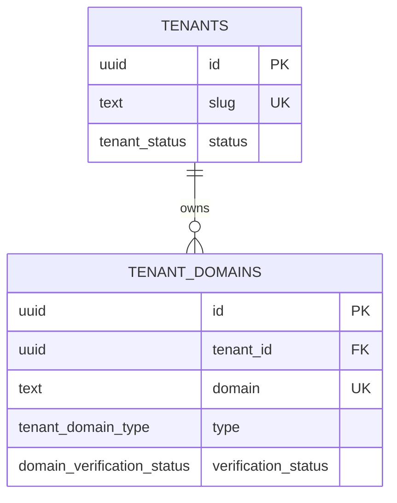

# Multi-tenancy

> Current as of Phase 23.

## The rule

Every business row in CloverCode belongs to exactly one tenant, and no tenant
can ever reach another tenant's data. Protection exists at **two** levels
(master section 5):

```text
Application   resolves and validates the tenant from secure server context
Database      Row Level Security refuses cross-tenant rows regardless
```

Neither level is allowed to be the only one.

## Entities



`tenants` is the root. From Phase 10 onward every business table carries
`tenant_id uuid not null` directly; a table subordinate to another business
row (an order line, a cash movement, …) derives it by trigger from its parent
instead — see [database.md](./database.md#conventions).

## Two globally unique namespaces

Almost everything in CloverCode is unique _per tenant_
(`UNIQUE(tenant_id, slug)`, never `UNIQUE(slug)` — master section 11). Two things
are deliberately global, because they are public identities:

| Value                   | Scope  | Why                                                  |
| ----------------------- | ------ | ---------------------------------------------------- |
| `tenants.slug`          | global | It becomes the DNS label `{slug}.clovercodeapp.com`. |
| `tenant_domains.domain` | global | A domain belongs to one site on the internet (§27).  |

The domain constraint is what makes host takeover impossible: a second tenant
simply cannot insert a row for a domain another tenant already holds.

## Resolution

```text
Request
   |
Host header                      (never x-forwarded-host - client-settable)
   |
normalizeHostname()              lowercase, drop port, drop trailing dot
   |
toLookupDomain()                 map every supported shape to one domain
   |
resolve_tenant_by_domain()       SECURITY DEFINER, at most one row
   |
ResolvedTenant | null
```

Supported host shapes:

| Host                          | Looks up                              | Where    |
| ----------------------------- | ------------------------------------- | -------- |
| `sugurolls.clovercodeapp.com` | itself                                | anywhere |
| `sugurolls.com`               | itself                                | anywhere |
| `sugurolls.localhost:3000`    | `sugurolls.clovercodeapp.com`         | dev only |
| `localhost:3000`              | `{DEV_TENANT_SLUG}.clovercodeapp.com` | dev only |
| `clovercodeapp.com`           | nothing                               | —        |
| `a.b.clovercodeapp.com`       | nothing                               | —        |
| `127.0.0.1`                   | nothing                               | —        |

Local development maps onto the production domain on purpose: there is one
query and one code path, so local work exercises what production runs.

Full rationale: [ADR-006](../adr/006-tenant-resolution.md).

## Why a function instead of an RLS policy

A public tenant site must resolve before any session exists, so the reader is
anonymous. Any policy permissive enough to let an anonymous client find its own
tenant would also let it read every other row — the customer list of the whole
platform.

So `tenants` and `tenant_domains` have RLS **enabled with no policies** (denied
for `anon` and `authenticated`), and the single read path is a SECURITY DEFINER
function that takes one hostname and returns at most one row.

## Using it

```ts
import { getCurrentTenant, requireCurrentTenant } from "@/lib/tenant/context";

const tenant = await getCurrentTenant(); // ResolvedTenant | null
const tenant = await requireCurrentTenant(); // throws AuthorizationError if none
```

Never accept a `tenant_id` from the client and never re-parse the hostname at a
call site (master sections 42 and 43).

## Status by phase

| Capability                                                  | Phase | State                                                                                                                                                                                           |
| ----------------------------------------------------------- | ----- | ----------------------------------------------------------------------------------------------------------------------------------------------------------------------------------------------- |
| `tenants`, `tenant_domains`                                 | 01    | Implemented                                                                                                                                                                                     |
| Hostname resolution                                         | 01    | Implemented                                                                                                                                                                                     |
| RLS deny-by-default                                         | 01    | Implemented                                                                                                                                                                                     |
| `tenant_members`, per-user policies                         | 02/03 | Implemented                                                                                                                                                                                     |
| RBAC (roles, permissions, matrix)                           | 03    | Implemented — [authorization.md](./authorization.md)                                                                                                                                            |
| Tenant provisioning                                         | 04    | Implemented                                                                                                                                                                                     |
| Domain verification                                         | 09    | Implemented — [domains.md](./domains.md)                                                                                                                                                        |
| Vercel API integration                                      | —     | **Not implemented**, deliberately (ADR-013)                                                                                                                                                     |
| `tenant_id` on business tables                              | 10+   | Implemented, through Phase 19                                                                                                                                                                   |
| Secrets outside the tenant-scoped tables (Supabase Vault)   | 17    | Implemented — a Vault secret is referenced by an opaque id in a tenant-scoped row, never itself tenant-scoped or readable back (ADR-021)                                                        |
| Tenant isolation through a derived `VIEW`, not just a table | 18    | Implemented — `inventory_stock_levels` is `security_invoker = true`, so it enforces the same RLS as `stock_movements` for whoever queries it, rather than the view owner's privileges (ADR-022) |
| A cross-tenant guard on a MEMBERSHIP, not just on a row     | 19    | Implemented — `order_deliveries.courier_user_id` is checked against `tenant_members` by trigger, so a delivery can never name somebody outside the business (ADR-023)                           |

## The proof

`src/tests/database/isolation.test.ts` runs the project's migrations against a
real PostgreSQL and asserts, among other things, that no hostname ever returns
another tenant's data (TEST-140), and — table by table, across every phase —
that no business table is reachable across a tenant boundary. It is the suite
the product rests on, and it grows with every phase; Phase 18 added its seven
new tables (and its one view) to the same invariant rather than a parallel one,
Phase 19 added its four the same way, Phase 20 its five, Phase 21 the two of
its five that hold tenant data — the other three are product catalogue — and
Phase 22 its two. Phase 23 added none at all, which is why the
phase-agnostic RLS check passed unchanged: a phase that creates no table
adds no surface to isolate.

`authorization.test.ts` (Phase 03) walks **every role in the catalogue** and
proves none of them reaches another tenant, reading or writing (TEST-331) —
the identical guarantee, exercised from the RBAC side rather than the
hostname side.
