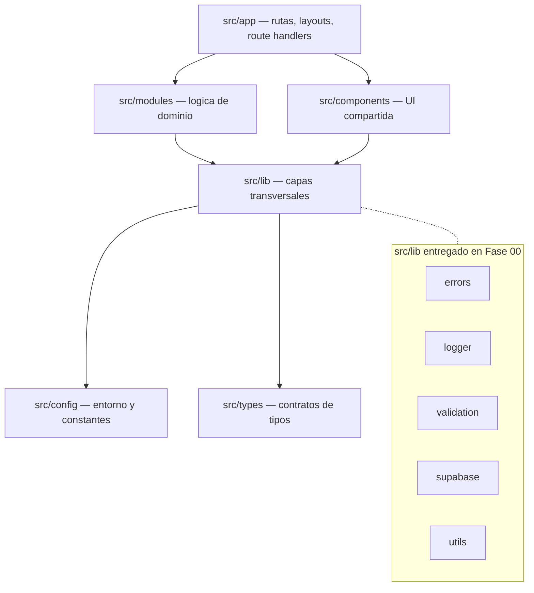

# SPEC — Phase 00 — Foundation

## 1. Información general

```text
Phase:                00
Nombre:               Foundation
Estado:               IN_PROGRESS
Versión:              1.0.0
Fecha creación:       2026-08-24
Última actualización: 2026-08-24
Responsable:          alejandro.avendano@masuno.pe
```

Documento maestro de referencia: [`CLOVERCODE_MASTER.md`](../../CLOVERCODE_MASTER.md)

---

## 2. Objetivo

### ¿Por qué existe esta fase?

CloverCode es una plataforma SaaS multi-tenant que debe sostener cientos de negocios sobre
una sola codebase y una sola base de datos. Antes de escribir la primera línea de lógica
empresarial es necesario que existan los mecanismos transversales de los que **todas** las
fases posteriores van a depender: tipos estrictos, validación de entrada, manejo de errores,
logging estructurado, acceso a Supabase, sistema de UI, testing y verificación automatizada.

Si estos cimientos se improvisan después, cada módulo empresarial inventará su propia forma
de fallar, de loguear y de validar, y el aislamiento multi-tenant se volverá imposible de
auditar de forma uniforme.

### ¿Qué capacidad agrega a CloverCode?

Una base técnica ejecutable, verificable y documentada sobre la cual la Fase 01
(Multi-Tenancy Core) puede construirse sin refactorizar nada.

### ¿Qué debe ser posible al terminarla?

```text
- Clonar el repositorio, instalar y levantar la aplicación en local.
- Ejecutar lint, typecheck, tests y build, y que los cuatro pasen.
- Obtener un cliente Supabase de navegador y uno de servidor, correctamente tipados.
- Lanzar y capturar errores de dominio tipados, con mensaje público seguro.
- Emitir logs estructurados con redacción de datos sensibles.
- Validar la configuración de entorno y recibir un error claro si falta una variable.
- Componer pantallas con primitivas de UI accesibles, incluidos empty/error/loading states.
- Que CI ejecute la misma verificación en cada push y pull request.
```

---

## 3. Alcance

### Incluido

```text
FND-01  Proyecto Next.js (App Router) + React + TypeScript estricto
FND-02  Tailwind CSS v4 + tokens de diseño (light/dark)
FND-03  Sistema de UI base (primitivas accesibles + estados)
FND-04  Clientes Supabase browser/server (@supabase/ssr)
FND-05  Configuración y validación de variables de entorno
FND-06  Estructura modular de carpetas
FND-07  ESLint (flat config) + Prettier
FND-08  Testing base (Vitest + Testing Library)
FND-09  Jerarquía de errores de dominio + mapeo a respuesta HTTP
FND-10  Logging estructurado con redacción y request_id
FND-11  Capa de validación (Zod) reutilizable
FND-12  Cabeceras de seguridad base en next.config
FND-13  CI (GitHub Actions): lint + typecheck + test + build
FND-14  Documentación: README técnico, SPEC, ADRs, architecture/overview
FND-15  Repositorio Git inicializado con .gitignore correcto
```

### Fuera de alcance

Deliberadamente **NO** se desarrolla en esta fase:

```text
OUT-01  Tabla tenants / tenant_domains y cualquier migración SQL       -> Fase 01
OUT-02  Supabase CLI, supabase/config.toml, entorno Supabase local     -> Fase 01
OUT-03  Tenant resolver por hostname                                   -> Fase 01
OUT-04  Autenticación, sesión SSR, middleware de rutas privadas        -> Fase 02
OUT-05  Cliente service_role (admin) de Supabase                       -> Fase 04
OUT-06  RBAC, permisos, políticas RLS                                  -> Fase 03
OUT-07  Tipos generados de la base de datos (db:types real)            -> Fase 01
OUT-08  Content Security Policy con nonces                             -> Fase 25
OUT-09  Rate limiting, CSRF, error tracking externo, métricas          -> Fase 24 / 25
OUT-10  Adopción de shadcn/ui como generador de componentes            -> Fase 05
OUT-11  Tests E2E (Playwright)                                         -> Fase 05
OUT-12  Cualquier módulo empresarial (catalog, orders, pos, ...)       -> Fases 10+
```

Motivo: `CLOVERCODE_MASTER.md` §33 (Fase 0) y §51 ("no desarrollar funcionalidades futuras
por adelantado").

---

## 4. Dependencias

```text
Dependencies: NINGUNA
```

Fase 00 es la raíz del proyecto. Las fases 01 a 28 dependen de ella.

---

## 5. Casos de uso

### UC-001 — Arranque del entorno de desarrollo

```text
Actor:            Desarrollador
Precondiciones:   Node >= 20.9.0, npm, acceso al repositorio
Acción:           Clona el repositorio, copia .env.example a .env.local,
                  ejecuta `npm install` y `npm run dev`
Resultado:        La aplicación levanta en http://localhost:3000 y responde
Errores posibles: Node por debajo de la versión mínima -> aviso de engines
```

### UC-002 — Verificación completa

```text
Actor:            Desarrollador / CI
Precondiciones:   Dependencias instaladas
Acción:           Ejecuta `npm run verify`
Resultado:        lint, typecheck, test y build se ejecutan en orden y pasan
Errores posibles: Cualquier fallo aborta la cadena con código de salida != 0
```

### UC-003 — Obtener un cliente Supabase de servidor

```text
Actor:            Código de servidor
Precondiciones:   NEXT_PUBLIC_SUPABASE_URL y NEXT_PUBLIC_SUPABASE_ANON_KEY definidas
Acción:           Invoca createSupabaseServerClient()
Resultado:        Recibe un SupabaseClient<Database> ligado a las cookies del request
Errores posibles: Variable ausente o inválida -> ConfigurationError con la lista
                  exacta de claves que fallaron, sin exponer sus valores
```

### UC-004 — Error de dominio en un Route Handler

```text
Actor:            Código de aplicación
Precondiciones:   Ninguna
Acción:           Lanza NotFoundError("Producto", id) dentro de un Route Handler
Resultado:        El cliente recibe HTTP 404 con { error: { code, message, requestId } }
                  y el servidor registra el detalle técnico completo
Errores posibles: Un error no operacional se mapea a 500 con mensaje genérico
```

### UC-005 — Log estructurado con dato sensible

```text
Actor:            Desarrollador
Precondiciones:   Ninguna
Acción:           logger.info("order.created", { tenantId, userId, password: "x" })
Resultado:        Se emite una línea estructurada con `password` redactado
Errores posibles: Ninguno; el logger nunca debe lanzar
```

### UC-006 — Comprobación de salud

```text
Actor:            Sistema de monitoreo / CI
Precondiciones:   Aplicación levantada
Acción:           GET /api/health
Resultado:        HTTP 200 con { status, service, version, environment, uptimeSeconds,
                  timestamp, requestId }
Errores posibles: Fallo inesperado -> 500 con mensaje genérico y log técnico
```

---

## 6. Requerimientos funcionales

```text
FR-001  El proyecto usará Next.js con App Router y directorio src/.
FR-002  TypeScript se ejecutará en modo estricto reforzado; el acceso a índices
        no verificado y el override implícito serán errores de compilación.
FR-003  Existirá el script `npm run lint` que ejecute ESLint sobre el repositorio.
FR-004  Existirá el script `npm run typecheck` que verifique tipos sin emitir,
        y que funcione sobre un checkout limpio sin build previo.
FR-005  Existirá el script `npm run test` que ejecute la suite en modo no interactivo.
FR-006  Existirá el script `npm run build` que produzca un build de producción.
FR-007  Existirá el script `npm run verify` que encadene FR-003..FR-006.
FR-008  Existirán los scripts `npm run format` y `npm run format:check` (Prettier).
FR-009  Existirá `.env.example` con todas las variables requeridas y sin secretos.
FR-010  La configuración de entorno se validará con un esquema Zod.
FR-011  La validación de entorno será perezosa y memoizada: no debe ejecutarse
        en import-time, para que `next build` funcione sin credenciales.
FR-012  Las variables públicas se leerán por referencia literal a
        `process.env.NEXT_PUBLIC_*` para permitir la sustitución estática de Next.
FR-013  Existirá `createSupabaseBrowserClient()` para componentes de cliente.
FR-014  Existirá `createSupabaseServerClient()` para código de servidor, ligado
        a las cookies del request mediante @supabase/ssr.
FR-015  El módulo de servidor de Supabase estará protegido con `server-only`.
FR-016  Los clientes Supabase estarán tipados con el tipo `Database` del proyecto.
FR-017  Existirá una jerarquía de errores: AppError base y las subclases
        ValidationError, AuthenticationError, AuthorizationError, NotFoundError,
        ConflictError, ExternalServiceError, DatabaseError y ConfigurationError.
FR-018  Cada error expondrá un `code` estable, un `httpStatus` y un mensaje
        público seguro, separado del detalle técnico.
FR-019  Existirá `toErrorResponse()` que convierta cualquier error en una
        respuesta JSON sin filtrar stack traces ni detalles internos.
FR-020  Existirá un logger estructurado con niveles debug/info/warn/error.
FR-021  El logger emitirá JSON en producción y salida legible en desarrollo.
FR-022  El logger redactará claves sensibles (password, token, secret, key,
        authorization, cookie, service_role, apiKey y variantes).
FR-023  El logger soportará contexto heredable mediante `child()`.
FR-024  Existirá una utilidad de `requestId` que reutilice la cabecera
        `x-request-id` si está presente y genere un UUID si no lo está.
FR-025  Existirá `parseOrThrow()` que convierta un fallo de Zod en ValidationError
        con los detalles de campo estructurados.
FR-026  Existirá un conjunto de primitivas de UI accesibles: Button, Input, Label,
        Card, Alert, Badge, Skeleton, Spinner y EmptyState.
FR-027  Ningún listado quedará vacío sin un empty state (componente EmptyState
        disponible desde Fase 00).
FR-028  Existirán `error.tsx`, `global-error.tsx`, `not-found.tsx` y `loading.tsx`
        en la raíz de la aplicación.
FR-029  `next.config` aplicará cabeceras de seguridad base a todas las rutas.
FR-030  `next.config` desactivará la cabecera `X-Powered-By`.
FR-031  Existirá `GET /api/health` que devuelva estado, uptime y requestId.
FR-032  Existirá un workflow de CI que ejecute lint, typecheck, test y build.
FR-033  El repositorio ignorará `.env*` excepto `.env.example`.
FR-034  El README documentará arquitectura, setup, variables, migraciones,
        testing, deployment, tenant model y security model.
```

---

## 7. Requerimientos no funcionales

```text
NFR-001 Seguridad
  - Ningún secreto en el repositorio; `.env*` ignorado salvo `.env.example`.
  - La clave `service_role` no se referencia en ningún archivo de esta fase.
  - Cabeceras de seguridad activas en todas las respuestas.
  - Los mensajes de error devueltos al cliente no contienen stack ni detalle interno.
  - Los logs no contienen credenciales (redacción obligatoria y probada por test).

NFR-002 Performance
  - El layout raíz es un Server Component; no se envía JS innecesario.
  - Sin dependencias de UI pesadas: las primitivas se basan en Tailwind + CVA.
  - Presupuesto: la ruta `/` debe compilarse como estática.

NFR-003 Escalabilidad
  - Estructura modular por dominio (`src/modules/<dominio>`), preparada para
    crecer a 20+ módulos sin reorganizar el árbol.
  - Las capas transversales viven en `src/lib` y no dependen de ningún módulo.

NFR-004 Observabilidad
  - Todo log es una estructura serializable con `event`, `level` y `timestamp`.
  - `requestId` propagable disponible desde la Fase 00.
  - `console.log` directo prohibido por regla de ESLint (`no-console`).

NFR-005 Accesibilidad
  - Todas las primitivas interactivas son operables por teclado y tienen
    estado `:focus-visible` visible.
  - Los tokens de color cumplen contraste AA para texto sobre fondo.
  - `Spinner` y estados de carga exponen `role`/`aria-*` apropiados.

NFR-006 Mantenibilidad
  - TypeScript estricto reforzado; `any` explícito prohibido por ESLint.
  - Prettier como único formateador; ESLint no compite en formato.
  - Cada decisión arquitectónica de la fase queda registrada como ADR.
```

---

## 8. Modelo de datos

```text
Tablas nuevas:       NINGUNA
Tablas modificadas:  NINGUNA
Enums:               NINGUNO
Índices:             NINGUNO
Políticas RLS:       NINGUNA
Migraciones:         NINGUNA
```

Fase 00 no toca la base de datos. Se define únicamente el **contrato de tipos** que las
fases siguientes rellenarán:

```text
src/types/database.ts

  export type Database = {
    public: {
      Tables:         Record<string, never>   // se poblará desde Fase 01
      Views:          Record<string, never>
      Functions:      Record<string, never>
      Enums:          Record<string, never>
      CompositeTypes: Record<string, never>
    }
  }
```

Este archivo será **reemplazado por tipos generados** (`supabase gen types typescript`)
a partir de la Fase 01. Su existencia en Fase 00 permite que los clientes Supabase estén
genéricamente tipados desde el primer día y que la migración a tipos reales no cambie
ninguna firma pública.

---

## 9. Diagrama de relaciones

Fase 00 no introduce entidades. El diagrama relevante es el de **capas**:



Regla de dependencia: `app -> modules -> lib -> config/types`.
`lib` **nunca** importa desde `modules` ni desde `app`.

---

## 10. Tenant Isolation

```text
Tenant Isolation Impact: NONE
```

Justificación explícita:

```text
¿Cómo se determina el tenant?          No se determina. El resolver es Fase 01.
¿Qué tablas llevan tenant_id?          Ninguna; esta fase no crea tablas.
¿Cómo evita RLS acceso cross-tenant?   No aplica; no hay datos ni políticas.
¿Qué consultas requieren validación?   Ninguna; no se ejecuta ninguna consulta.
¿Existe algún recurso global?          Sí: la propia aplicación, los tokens de
                                       diseño, las primitivas de UI y las capas
                                       de lib/, que son deliberadamente
                                       tenant-agnósticas y no deben contener
                                       ninguna referencia a un tenant concreto.
```

Compromiso hacia adelante: ningún archivo de `src/lib` creado en esta fase asume un único
tenant ni almacena estado de tenant en variables de módulo (lo que produciría fugas entre
requests en un servidor compartido).

---

## 11. Seguridad

```text
Authentication requirements   NINGUNO en esta fase (Fase 02). No existen rutas privadas.
Authorization requirements    NINGUNO en esta fase (Fase 03). No existen permisos.
Roles involucrados            NINGUNO
Permissions involucrados      NINGUNO

RLS policies                  NINGUNA (no hay tablas)

Input validation              Zod como única capa de validación. `parseOrThrow()`
                              convierte fallos en ValidationError con detalle por campo.
                              La única entrada validada en esta fase es el entorno.

Potential abuse cases
  AB-01  Fuga de detalle interno en respuestas de error.
         Mitigación: toErrorResponse() solo serializa code/message público/requestId.
  AB-02  Fuga de credenciales en logs.
         Mitigación: redacción por lista de claves sensibles + test dedicado.
  AB-03  Filtración de secretos de servidor al bundle del navegador.
         Mitigación: `server-only` en módulos de servidor; la clave service_role
         no se referencia en esta fase; solo las variables NEXT_PUBLIC_* se exponen.
  AB-04  Clickjacking / MIME sniffing sobre la web pública.
         Mitigación: cabeceras X-Frame-Options, X-Content-Type-Options,
         Referrer-Policy, Permissions-Policy y HSTS.

Sensitive information         Ninguna procesada en esta fase.
Secrets                       Ninguno en el repositorio. `.env.example` contiene
                              únicamente nombres y placeholders.
Rate limits                   No aplica en esta fase (Fase 24/25).
```

Cabeceras de seguridad aplicadas a todas las rutas:

```text
Strict-Transport-Security      max-age=63072000; includeSubDomains; preload
X-Content-Type-Options         nosniff
X-Frame-Options                DENY
Referrer-Policy                strict-origin-when-cross-origin
X-DNS-Prefetch-Control         off
Permissions-Policy             camera=(), microphone=(), geolocation=(), browsing-topics=()
```

`Content-Security-Policy` se difiere deliberadamente a la Fase 25: requiere nonces por
request y una superficie de aplicación estabilizada. Queda registrado como limitación
conocida de esta fase.

---

## 12. API / Server Actions

Un único contrato público en esta fase.

```text
GET /api/health

Permission:  NINGUNA (endpoint público, sin datos sensibles)
Input:       ninguno
Output 200:
{
  "status": "ok",
  "service": "clovercode",
  "version": "<package.json version>",
  "environment": "development" | "test" | "production",
  "uptimeSeconds": 12,
  "timestamp": "2026-08-24T00:00:00.000Z",
  "requestId": "..."
}
Output 5xx:
{
  "error": { "code": "INTERNAL_ERROR", "message": "...", "requestId": "..." }
}
```

Nota de diseño: el endpoint **no** consulta la base de datos. La verificación de
dependencias (Supabase, storage) se añade en la Fase 24, cuando exista una base de datos
que verificar.

Formato de error uniforme para todo el sistema, establecido aquí:

```text
{
  "error": {
    "code":      string,            // estable, apto para i18n y para clientes
    "message":   string,            // seguro para el usuario final
    "details"?:  unknown,           // solo en ValidationError: errores por campo
    "requestId": string             // correlación con los logs del servidor
  }
}
```

---

## 13. UI / UX

```text
/                        Landing técnica mínima de la plataforma
/api/health              Route Handler (sin UI)
```

### `/`

```text
Propósito      Confirmar que la base técnica está operativa y presentar CloverCode.
Acciones       Ninguna (no hay funcionalidad empresarial en Fase 00).
Estados
  Loading      app/loading.tsx — Skeleton
  Empty        No aplica (no hay colecciones)
  Error        app/error.tsx — Alert destructivo + acción "Reintentar"
  Success      Render estático
  Not found    app/not-found.tsx — EmptyState + enlace al inicio
Permissions    Público
```

### Sistema de UI entregado

```text
Button      variantes: default | secondary | outline | ghost | destructive | link
            tamaños:   sm | md | lg | icon
            estados:   default | hover | focus-visible | disabled | loading
Input       estados:   default | focus | disabled | invalid (aria-invalid)
Label       asociación explícita mediante htmlFor
Card        Card / CardHeader / CardTitle / CardDescription / CardContent / CardFooter
Alert       variantes: info | success | warning | destructive; role="alert"
Badge       variantes: neutral | success | warning | destructive
Skeleton    placeholder de carga, aria-hidden
Spinner     role="status" + etiqueta accesible
EmptyState  título + descripción + acción opcional (§35 del documento maestro)
```

Tokens de diseño en `globals.css` mediante `@theme` de Tailwind v4, con paleta clara y
oscura y escala de radios consistente.

---

## 14. Flujos principales

### Flujo de arranque del desarrollador

```text
git clone
    |
cp .env.example .env.local
    |
npm install
    |
npm run dev
    |
http://localhost:3000
```

### Flujo de verificación (idéntico en local y CI)

```text
npm run lint
    |
npm run typecheck   (next typegen -> tsc --noEmit)
    |
npm run test
    |
npm run build
    |
PASS / FAIL
```

### Flujo de resolución de configuración

```text
Código solicita getServerEnv()
    |
¿Ya memoizado?  -- sí -->  devuelve valor cacheado
    | no
Lee process.env
    |
Valida con esquema Zod
    |
¿Válido?  -- no -->  ConfigurationError (lista de claves fallidas, sin valores)
    | sí
Memoiza y devuelve
```

### Flujo de error en un Route Handler

```text
Handler lanza AppError (o error desconocido)
    |
toErrorResponse(error, requestId)
    |
¿isAppError && isOperational?
    |-- sí  -> log level=warn  -> HTTP status del error + mensaje público
    |-- no  -> log level=error -> HTTP 500 + mensaje genérico
    |
Respuesta JSON { error: { code, message, requestId } }
```

---

## 15. Manejo de errores

```text
Variable de entorno ausente o inválida      -> ConfigurationError   500
Entrada que no cumple el esquema Zod        -> ValidationError      422
Sesión ausente o inválida                   -> AuthenticationError  401
Sesión válida sin permiso suficiente        -> AuthorizationError   403
Recurso inexistente                         -> NotFoundError        404
Violación de unicidad / conflicto de estado -> ConflictError        409
Fallo de proveedor externo                  -> ExternalServiceError 502
Fallo de PostgreSQL / Supabase              -> DatabaseError        500
Error no controlado                         -> INTERNAL_ERROR       500
```

Reglas:

```text
- El mensaje público nunca incluye stack, SQL, nombres de columna ni valores de entorno.
- El detalle técnico viaja únicamente al logger.
- Todo error operacional lleva `isOperational = true`; los demás se tratan como bugs.
- `cause` se preserva para poder encadenar el error original.
```

---

## 16. Observabilidad

Eventos que esta fase debe registrar:

```text
app.request.completed      // emitido por /api/health
app.error.unhandled        // cualquier error no operacional mapeado a 500
app.error.operational      // error de dominio esperado (nivel warn)
config.env.invalid         // fallo de validación de entorno
```

Forma del registro:

```json
{
  "level": "info",
  "event": "app.request.completed",
  "timestamp": "2026-08-24T00:00:00.000Z",
  "requestId": "0f9f...",
  "durationMs": 3
}
```

```text
logs         stdout estructurado (JSON en producción, legible en desarrollo)
metrics      NO en esta fase -> Fase 24
audit logs   NO en esta fase (requiere tenant y usuario) -> Fase 24
alerts       NO en esta fase -> Fase 24
```

---

## 17. Testing Plan

### Unit

```text
TEST-001  AppError expone code, httpStatus, isOperational y mensaje público.
TEST-002  Cada subclase de error mapea al httpStatus documentado en §15.
TEST-003  toErrorResponse() no filtra stack ni `cause` en la respuesta.
TEST-004  toErrorResponse() convierte un error desconocido en 500 genérico.
TEST-005  ValidationError transporta los detalles por campo de Zod.
TEST-006  parseOrThrow() devuelve el valor tipado cuando la entrada es válida.
TEST-007  parseOrThrow() lanza ValidationError cuando la entrada es inválida.
TEST-008  El logger redacta password, token, secret, authorization y apiKey.
TEST-009  La redacción del logger es recursiva sobre objetos anidados y arrays.
TEST-010  logger.child() hereda y combina el contexto del padre.
TEST-011  El logger respeta el nivel mínimo configurado.
TEST-012  El logger no lanza ante referencias circulares en el contexto.
TEST-013  getRequestId() reutiliza la cabecera x-request-id cuando existe.
TEST-014  getRequestId() genera un UUID cuando la cabecera no existe.
TEST-015  La validación de entorno acepta una configuración completa y válida.
TEST-016  La validación de entorno rechaza una URL de Supabase malformada.
TEST-017  El error de entorno enumera las claves fallidas y NO sus valores.
TEST-018  cn() combina clases y resuelve conflictos de Tailwind.
```

### Integration

```text
TEST-019  createSupabaseBrowserClient() construye un cliente sin tocar la red.
TEST-020  createSupabaseServerClient() usa el adaptador de cookies provisto.
TEST-021  createSupabaseServerClient() tolera un almacén de cookies de solo lectura
          (contexto de Server Component) sin lanzar.
```

### RLS / Authorization

```text
NO APLICA EN ESTA FASE.
No existen tablas, políticas ni permisos. Las pruebas obligatorias de aislamiento
cross-tenant (`Tenant A != Tenant B`) se especifican en la Fase 03 y son requisito
de su Definition of Done.
```

### E2E

```text
NO APLICA EN ESTA FASE (fuera de alcance OUT-11).
Sustituto verificable en Fase 00: `npm run build` debe compilar todas las rutas,
y las pruebas de componente cubren el render accesible de las primitivas.
```

### Regression

```text
TEST-022  Button renderiza como <button>, es accesible por nombre y respeta disabled.
TEST-023  Button en estado loading queda deshabilitado y expone aria-busy.
TEST-024  EmptyState renderiza título, descripción y acción opcional.
TEST-025  Alert expone role="alert".
```

---

## 18. Edge Cases

```text
EC-01  Checkout limpio sin `next-env.d.ts` ni `.next/types`.
       El typecheck debe seguir funcionando -> `next typegen` precede a `tsc`.

EC-02  Build sin variables de Supabase (CI, preview sin secretos).
       No debe fallar -> la validación de entorno es perezosa, no de import-time.

EC-03  Variable de entorno presente pero vacía ("").
       Debe tratarse como ausente, no como valor válido.

EC-04  Variable NEXT_PUBLIC_* leída dinámicamente.
       Next no la sustituiría en el bundle -> se prohíbe el acceso dinámico y se
       leen por referencia literal.

EC-05  createSupabaseServerClient() invocado desde un Server Component.
       `cookies().set()` lanza en ese contexto -> el adaptador captura y descarta
       la escritura, delegando el refresco de sesión al middleware (Fase 02).

EC-06  Contexto de log con referencia circular o con BigInt.
       El logger debe degradar con elegancia y nunca romper el request.

EC-07  Error lanzado que no es instancia de Error (string, objeto plano).
       toErrorResponse() debe normalizarlo a 500 genérico sin romper.

EC-08  Ejecución en Node por debajo de 20.9.0.
       `engines` en package.json lo declara explícitamente.

EC-09  Windows como entorno de desarrollo primario.
       Los scripts de npm no deben depender de sintaxis exclusiva de shell POSIX.
```

---

## 19. Performance considerations

```text
queries            Ninguna en esta fase.
indexes            Ninguno en esta fase.
pagination         No aplica.
caching            Sin caché explícita. `/` es estática; `/api/health` es dinámica
                   por diseño (`dynamic = "force-dynamic"`), para no servir un
                   estado de salud congelado en build.
N+1                No aplica.
database calls     Cero.
server rendering   Layout y página raíz son Server Components; no hay client
                   components en la Fase 00 salvo `error.tsx` y `global-error.tsx`,
                   que Next exige que lo sean.
client rendering   El JS enviado se limita al runtime de Next; las primitivas de UI
                   no arrastran librerías de componentes pesadas.
Riesgo identificado
                   `clsx` + `tailwind-merge` se ejecutan en cada render de primitiva.
                   Coste despreciable a esta escala; revisar solo si un perfil real
                   lo señala (documento maestro §26: medir antes de optimizar).
```

---

## 20. Migraciones

```text
NINGUNA.
```

Fase 00 no crea, modifica ni elimina objetos de base de datos. La numeración de
migraciones comienza en la Fase 01 (`tenants`, `tenant_domains`).

---

## 21. Rollback

```text
database schema   No aplica: no hay cambios de esquema.
domains           No aplica.
billing           No aplica.
payments          No aplica.
SUNAT             No aplica.
subscriptions     No aplica.
```

Procedimiento de reversión de la fase:

```text
1. Revertir el commit de la Fase 00 (`git revert` sobre el rango de la fase).
2. Eliminar node_modules y .next.
3. No existe estado externo que revertir: sin base de datos, sin despliegue,
   sin recursos aprovisionados en terceros.
```

Riesgo de rollback: **BAJO**. La fase es puramente local y reversible con Git.

---

## 22. Definition of Done

```text
- [ ] Estructura de carpetas implementada según §13 del documento maestro
- [ ] TypeScript estricto reforzado configurado
- [ ] Tailwind v4 + tokens de diseño implementados
- [ ] Primitivas de UI implementadas y accesibles
- [ ] Clientes Supabase browser/server implementados y tipados
- [ ] Validación de entorno implementada (perezosa, con Zod)
- [ ] Jerarquía de errores implementada (§15 del documento maestro)
- [ ] Logger estructurado con redacción implementado
- [ ] Capa de validación (parseOrThrow) implementada
- [ ] Cabeceras de seguridad configuradas
- [ ] .env.example creado, sin secretos
- [ ] .gitignore ignora .env* y permite .env.example
- [ ] CI configurada (lint + typecheck + test + build)
- [ ] README técnico con las 8 secciones exigidas por §46
- [ ] ADRs de las decisiones de la fase registrados
- [ ] docs/architecture/overview.md creado
- [ ] Unit tests PASS
- [ ] Integration tests PASS
- [ ] Cross-tenant tests: N/A DOCUMENTADO (sin tablas en esta fase)
- [ ] Typecheck PASS
- [ ] Lint PASS
- [ ] Build PASS
- [ ] SPEC actualizado con el resultado real
```

---

## 23. Implementation notes

_(Se completa al finalizar la implementación.)_
