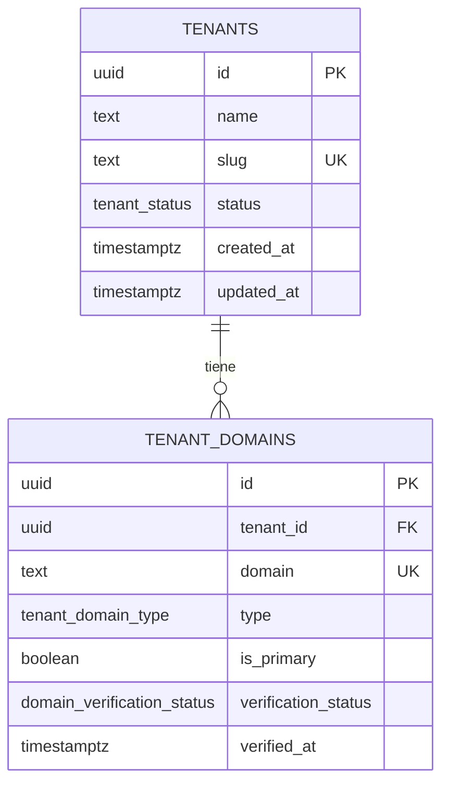

# SPEC — Phase 01 — Multi-Tenancy Core

## 1. Información general

```text
Phase:                01
Nombre:               Multi-Tenancy Core
Estado:               COMPLETED
Versión:              1.2.0
Fecha creación:       2026-08-24
Última actualización: 2026-08-25 (auditoría final)
Responsable:          alejandro.avendano@masuno.pe
```

Documento maestro: [`CLOVERCODE_MASTER.md`](../../CLOVERCODE_MASTER.md) — §5, §6, §7, §8, §9, §10, §13, §14, §22, §24, §27, §33 (Fase 1), §42, §43.
Fase previa: [`phase-00-foundation.md`](./phase-00-foundation.md) (COMPLETED).

---

## 2. Objetivo

### ¿Por qué existe esta fase?

CloverCode es multi-tenant sobre una sola base de datos. Antes de que exista un
solo dato de negocio tiene que existir **a quién pertenece ese dato** y **cómo se
determina de forma segura en cada request**. Si el concepto de tenant llega
después de los productos o los pedidos, cada tabla lo incorpora a su manera y el
aislamiento deja de ser auditable.

Esta fase crea la raíz del modelo (`tenants`), el mecanismo por el que un
visitante llega al tenant correcto (`tenant_domains` + resolver) y la garantía de
que nadie puede enumerar ni leer tenants ajenos.

### ¿Qué capacidad agrega?

```text
hostname -> tenant
```

resuelto en servidor, con la base de datos como autoridad, funcionando en
producción (`{slug}.clovercodeapp.com`), con dominio propio (`sugurolls.com`) y
en desarrollo local.

### ¿Qué debe ser posible al terminarla?

```text
- Aplicar migraciones versionadas que creen tenants y tenant_domains.
- Registrar un tenant con su dominio de sistema y dominios personalizados.
- Resolver el tenant a partir del hostname de la petición, en servidor.
- Que un dominio pertenezca a un solo tenant, garantizado por la base de datos.
- Que un dominio personalizado NO verificado no resuelva.
- Que nadie pueda listar los tenants de la plataforma.
- Desarrollar en local contra `{slug}.localhost` sin tocar el código.
```

---

## 3. Alcance

### Incluido

```text
MT-01  Herramienta de migraciones (Supabase CLI) y estructura `supabase/`
MT-02  Enum tenant_status
MT-03  Tabla tenants + constraints + índices
MT-04  Enums tenant_domain_type y domain_verification_status
MT-05  Tabla tenant_domains + constraints + índices
MT-06  Trigger de updated_at compartido
MT-07  RLS habilitada y deny-by-default en ambas tablas
MT-08  Función SECURITY DEFINER de resolución por hostname
MT-09  Normalización de hostname y mapeo a dominio de búsqueda (puro)
MT-10  Resolver de tenant en servidor + getCurrentTenant()
MT-11  Estrategia de desarrollo local ({slug}.localhost + DEV_TENANT_SLUG)
MT-12  Tipos de base de datos sincronizados + test de contrato de esquema
MT-13  Arnés de pruebas SQL sobre PostgreSQL real (PGlite)
MT-14  Tests: unit, integration, esquema, constraints y aislamiento
```

### Fuera de alcance

```text
OUT-01  Autenticación y sesiones                              -> Fase 02
OUT-02  tenant_members, roles, permisos, políticas RLS por     -> Fase 03
        usuario (esta fase solo deja deny-by-default)
OUT-03  Crear/editar/suspender tenants desde UI, provisioning  -> Fase 04
OUT-04  Selector de tenant y dashboard                         -> Fase 05
OUT-05  tenant_settings, tema, logo                            -> Fase 06
OUT-06  Renderizado de la web pública del tenant               -> Fase 07
OUT-07  Metadata/SEO por tenant                                -> Fase 08
OUT-08  Verificación real de dominios y API de Vercel          -> Fase 09
OUT-09  Cliente service_role / admin                           -> Fase 04
OUT-10  Middleware de Next.js                                  -> Fase 02
OUT-11  Caché entre requests de la resolución                  -> Fase 26
```

Motivo: §33 (Fase 1) acota la fase a tablas, resolver, índices, constraints y
pruebas; §51 prohíbe adelantar funcionalidad.

---

## 4. Dependencias

```text
Phase 00 — Foundation (COMPLETED)
  - errores de dominio (NotFoundError, DatabaseError, ValidationError)
  - logger estructurado
  - validación con Zod
  - cliente Supabase de servidor
  - configuración de entorno perezosa
```

---

## 5. Casos de uso

### UC-101 — Resolver por dominio del sistema

```text
Actor:            Visitante anónimo
Precondiciones:   Tenant activo con dominio system `sugurolls.clovercodeapp.com`
Acción:           Petición con Host: sugurolls.clovercodeapp.com
Resultado:        Se resuelve el tenant Sugu Rolls (id, slug, name, status)
Errores posibles: Sin coincidencia -> null (el llamante decide 404)
```

### UC-102 — Resolver por dominio personalizado verificado

```text
Actor:            Visitante anónimo
Precondiciones:   `sugurolls.com` registrado con verification_status = 'active'
Acción:           Petición con Host: sugurolls.com
Resultado:        Se resuelve el tenant Sugu Rolls
Errores posibles: Dominio no verificado -> NO resuelve (null)
```

### UC-103 — Dominio personalizado sin verificar

```text
Actor:            Atacante
Precondiciones:   Registra `banco-conocido.com` apuntando a su tenant, sin verificar
Acción:           Petición con Host: banco-conocido.com
Resultado:        NO resuelve. Reclamar un dominio no basta para servirlo.
```

### UC-104 — Desarrollo local

```text
Actor:            Desarrollador
Precondiciones:   Tenant con slug `sugurolls`; NODE_ENV != production
Acción:           Abre http://sugurolls.localhost:3000
Resultado:        Resuelve el mismo tenant que en producción, por el mismo camino
Errores posibles: En producción el sufijo .localhost se ignora siempre
```

### UC-105 — Intento de enumerar tenants

```text
Actor:            Cliente con la clave publishable
Precondiciones:   Ninguna
Acción:           SELECT sobre tenants o tenant_domains vía API
Resultado:        Cero filas. RLS activa sin políticas = denegado.
```

### UC-106 — Un dominio, un tenant

```text
Actor:            Operador / proceso de provisioning
Precondiciones:   `sugurolls.com` ya pertenece al tenant A
Acción:           Intenta registrarlo para el tenant B
Resultado:        La base de datos rechaza por UNIQUE(domain)
```

---

## 6. Requerimientos funcionales

```text
FR-101  Existirá la tabla `tenants` con id UUID como clave primaria.
FR-102  Cada tenant tendrá un `slug` único en toda la plataforma.
FR-103  El slug será una etiqueta DNS válida: minúsculas, dígitos y guiones,
        sin empezar ni terminar en guion, de 3 a 63 caracteres.
FR-104  Un conjunto de slugs reservados (www, api, app, admin, ...) será
        rechazado por la base de datos, no solo por la aplicación.
FR-105  Cada tenant tendrá un `status` de tenant_status.
FR-106  `tenants` no se elimina físicamente: el ciclo de vida se expresa con
        `status`, incluido `archived`.
FR-107  Existirá la tabla `tenant_domains` con id UUID.
FR-108  `tenant_domains.tenant_id` referenciará `tenants(id)`.
FR-109  `tenant_domains.domain` será único en TODA la tabla (no por tenant).
FR-110  El dominio se almacenará normalizado: minúsculas, sin puerto, sin
        punto final, sin esquema. La base de datos lo verifica.
FR-111  `type` distinguirá `system` de `custom`.
FR-112  Un tenant tendrá como máximo un dominio `system`.
FR-113  Un tenant tendrá como máximo un dominio `is_primary`.
FR-114  `verification_status` seguirá pending | verifying | active | failed.
FR-115  `verified_at` estará presente si y solo si el estado es `active`.
FR-116  Ambas tablas tendrán created_at y updated_at TIMESTAMPTZ NOT NULL.
FR-117  `updated_at` se mantendrá mediante trigger, no desde la aplicación.
FR-118  RLS estará HABILITADA en ambas tablas.
FR-119  Ninguna política concederá lectura a anon o authenticated en esta fase.
FR-120  La resolución se hará mediante una función SECURITY DEFINER que reciba
        un hostname y devuelva como máximo una fila.
FR-121  La función fijará `search_path` vacío.
FR-122  La función solo devolverá dominios con verification_status = 'active'.
FR-123  La función excluirá tenants con status `archived`.
FR-124  La función devolverá el `status` para que la aplicación distinga un
        tenant activo de uno suspendido.
FR-125  Existirá `normalizeHostname()` pura: minúsculas, sin puerto, sin punto
        final, sin espacios.
FR-126  Existirá `toLookupDomain()` pura que convierta cualquier hostname
        soportado en el dominio canónico a buscar.
FR-127  `{slug}.clovercodeapp.com` se buscará tal cual.
FR-128  `{slug}.localhost` se mapeará a `{slug}.clovercodeapp.com`, solo fuera
        de producción.
FR-129  `localhost` a secas usará `DEV_TENANT_SLUG`, solo fuera de producción.
FR-130  En producción, cualquier host local devolverá null.
FR-131  Existirá `resolveTenantByHostname()` en servidor, con `server-only`.
FR-132  Existirá `getCurrentTenant()` que resuelva desde las cabeceras del
        request, memoizado por request.
FR-133  El resolver nunca aceptará un tenant_id enviado por el cliente.
FR-134  `src/types/database.ts` reflejará el esquema real.
FR-135  Un test de contrato verificará que los tipos coinciden con el esquema.
FR-136  Las migraciones se ejecutarán en un PostgreSQL real durante los tests.
```

---

## 7. Requerimientos no funcionales

```text
NFR-101 Seguridad
  - Imposible enumerar tenants o dominios con la clave pública.
  - Un dominio no verificado no sirve contenido de ningún tenant.
  - La función SECURITY DEFINER fija search_path para impedir secuestro.
  - El hostname es entrada no confiable: se normaliza y se acota antes de
    llegar a la base de datos.

NFR-102 Performance
  - La resolución es UNA consulta por request, servida por un índice único
    sobre `domain`.
  - Memoización por request para que varios consumidores no repitan la consulta.
  - Sin caché entre requests: quedaría obsoleta al cambiar un dominio (Fase 26).

NFR-103 Escalabilidad
  - El índice único sobre `domain` mantiene la resolución en O(log n) con
    cientos de miles de dominios.
  - `tenant_id` indexado en tenant_domains para listados y para las
    comprobaciones de clave foránea.

NFR-104 Observabilidad
  - Cada resolución fallida se registra a nivel debug con el hostname
    normalizado; nunca a nivel error, porque un host desconocido es normal.

NFR-105 Mantenibilidad
  - La lógica de hostname es pura y está separada del acceso a datos.
  - Una sola ruta de búsqueda: producción y desarrollo usan la misma consulta.

NFR-106 Integridad
  - Toda invariante expresable de forma declarativa vive en la base de datos,
    no en la aplicación.
```

---

## 8. Modelo de datos

### Enums

```text
tenant_status               active | suspended | archived
tenant_domain_type          system | custom
domain_verification_status  pending | verifying | active | failed
```

### tenants

```text
id          uuid         PK    default gen_random_uuid()
name        text         NOT NULL
slug        text         NOT NULL
status      tenant_status NOT NULL default 'active'
created_at  timestamptz  NOT NULL default now()
updated_at  timestamptz  NOT NULL default now()

UNIQUE (slug)                          -> tenants_slug_key
CHECK  slug ~ '^[a-z0-9]([a-z0-9-]*[a-z0-9])?$'
CHECK  char_length(slug) BETWEEN 3 AND 63
CHECK  slug NOT IN (<reservados>)
CHECK  char_length(btrim(name)) BETWEEN 1 AND 120
```

Slugs reservados: `www, api, app, admin, dashboard, auth, login, static,
assets, cdn, mail, smtp, ftp, ns1, ns2, status, support, help, docs, blog,
clovercode, superadmin, system, internal, test, staging, preview`.

Razón de las reglas del slug: el slug **es** una etiqueta DNS
(`{slug}.clovercodeapp.com`). Un slug que no sea etiqueta DNS válida produce un
dominio irresoluble, y un slug reservado secuestraría un host de la plataforma.

### tenant_domains

```text
id                   uuid                        PK  default gen_random_uuid()
tenant_id            uuid                        NOT NULL REFERENCES tenants(id) ON DELETE CASCADE
domain               text                        NOT NULL
type                 tenant_domain_type          NOT NULL
is_primary           boolean                     NOT NULL default false
verification_status  domain_verification_status  NOT NULL default 'pending'
verified_at          timestamptz                 NULL
created_at           timestamptz                 NOT NULL default now()
updated_at           timestamptz                 NOT NULL default now()

UNIQUE (domain)                        -> tenant_domains_domain_key
CHECK  domain = lower(domain)
CHECK  domain !~ ':'                   (sin puerto)
CHECK  domain !~ '^https?://'          (sin esquema)
CHECK  domain NOT LIKE '%.'            (sin punto final)
CHECK  domain ~ '^[a-z0-9]([a-z0-9-]*[a-z0-9])?(\.[a-z0-9]([a-z0-9-]*[a-z0-9])?)+$'
CHECK  char_length(domain) BETWEEN 4 AND 253
CHECK  (verification_status = 'active') = (verified_at IS NOT NULL)
```

`UNIQUE(domain)` global es la **excepción deliberada** a §11 del documento
maestro (`UNIQUE(tenant_id, slug)` y no `UNIQUE(slug)`): un dominio es una
identidad global en internet y §27 exige que pertenezca a un solo tenant.

`ON DELETE CASCADE`: un dominio no significa nada sin su tenant. En la práctica
los tenants no se borran (FR-106); la cascada es red de seguridad.

### Índices

```text
tenants_slug_key                        UNIQUE (slug)
  -> búsqueda por slug y garantía de unicidad

tenant_domains_domain_key               UNIQUE (domain)
  -> ES el índice de la resolución. Una consulta por request lo usa.

tenant_domains_tenant_id_idx            (tenant_id)
  -> listar los dominios de un tenant (Fase 09) y acelerar la verificación
     de la clave foránea y la cascada

tenant_domains_one_system_per_tenant    UNIQUE (tenant_id) WHERE type = 'system'
tenant_domains_one_primary_per_tenant   UNIQUE (tenant_id) WHERE is_primary
```

Deliberadamente **no** se indexa `tenants.status`: con la cardinalidad prevista
(3 valores, pocos miles de filas) un escaneo secuencial gana al índice. §8 exige
que cada índice responda a un patrón real.

### Políticas RLS

```text
tenants          RLS ENABLED, sin políticas  -> denegado para anon y authenticated
tenant_domains   RLS ENABLED, sin políticas  -> denegado para anon y authenticated
```

Las políticas por usuario llegan en la Fase 03, cuando exista `tenant_members`.
Hasta entonces el acceso legítimo pasa por la función SECURITY DEFINER, que
expone exactamente los campos necesarios de exactamente una fila.

### Función de resolución

```text
public.resolve_tenant_by_domain(p_hostname text)
RETURNS TABLE (tenant_id uuid, slug text, name text, status tenant_status,
               domain text, domain_type tenant_domain_type, is_primary boolean)
LANGUAGE sql STABLE SECURITY DEFINER SET search_path = ''

WHERE d.domain = lower(btrim(p_hostname))
  AND d.verification_status = 'active'
  AND t.status <> 'archived'
LIMIT 1
```

---

## 9. Diagrama de relaciones



Flujo de resolución:

```text
Request
   |
Host header
   |
normalizeHostname()          minúsculas, sin puerto, sin punto final
   |
toLookupDomain()             {slug}.localhost -> {slug}.clovercodeapp.com
   |
resolve_tenant_by_domain()   SECURITY DEFINER, una fila como máximo
   |
ResolvedTenant | null
```

---

## 10. Tenant Isolation

```text
Tenant Isolation Impact: FUNDACIONAL
```

```text
¿Cómo se determina el tenant?
  Exclusivamente desde el hostname del request, en servidor. Nunca desde un
  parámetro, cabecera o cuerpo controlado por el cliente (FR-133, §42).

¿Qué tablas llevan tenant_id?
  tenant_domains. `tenants` es la raíz y por definición no lo lleva.

¿Cómo evita RLS el acceso cross-tenant?
  RLS habilitada sin políticas: con la clave publishable no se lee ni una fila
  de ninguna de las dos tablas. El único camino es la función SECURITY DEFINER,
  que recibe un hostname y devuelve como máximo una fila, la del dueño de ese
  dominio. No existe consulta que devuelva más de un tenant.

¿Qué consultas requieren validación de tenant?
  Todas las de esta fase pasan por la función. No hay acceso directo a tablas
  desde la aplicación.

¿Existe algún recurso global?
  Sí, y es intencionado: el espacio de nombres de dominios y el de slugs. Ambos
  son globalmente únicos porque son identidades públicas. Es lo que impide que
  dos tenants reclamen el mismo host.
```

---

## 11. Seguridad

```text
Authentication requirements   NINGUNO todavía (Fase 02). La resolución es
                              anónima por diseño: una web pública debe
                              resolverse antes de que exista una sesión.

Authorization requirements    NINGUNO todavía (Fase 03). En su lugar, esta fase
                              aplica deny-by-default a nivel de tabla.

RLS policies                  Ninguna política. RLS habilitada en ambas tablas.

Input validation              El hostname es entrada NO confiable. Se normaliza,
                              se acota en longitud y se valida su forma antes de
                              llegar a la base de datos. La consulta es
                              parametrizada; nunca se interpola SQL (§9).

Potential abuse cases
  AB-101  Enumerar los clientes de CloverCode.
          Mitigación: RLS deny-by-default; la función solo acepta un hostname
          concreto y devuelve una fila. No hay listado posible.

  AB-102  Reclamar el dominio de un tercero para servir contenido bajo su
          nombre. Mitigación: solo resuelven dominios con
          verification_status = 'active'. Registrar no es verificar.

  AB-103  Secuestro de search_path en la función SECURITY DEFINER.
          Mitigación: SET search_path = '' y nombres totalmente cualificados.

  AB-104  Colisión con hosts de plataforma vía slug (www, api, admin).
          Mitigación: lista de reservados aplicada por CHECK en la base de datos.

  AB-105  Forzar un tenant desde el cliente (cabecera o query param).
          Mitigación: el resolver solo lee el Host; no existe ningún override
          en producción. El override de desarrollo está bloqueado por NODE_ENV.

  AB-106  Hostname gigante o con caracteres de control para envenenar logs o
          la consulta. Mitigación: normalización + límite de 253 caracteres +
          validación de forma; si no encaja, se devuelve null sin consultar.

Sensitive information         El nombre y el slug del tenant son públicos por
                              naturaleza (se sirven en su web). No se expone
                              nada más en esta fase.

Secrets                       Ninguno nuevo.
Rate limits                   No aplica todavía (Fase 24/25).
```

---

## 12. API / Server Actions

Esta fase **no publica ningún endpoint HTTP nuevo**. Añadir una ruta pública de
resolución daría justamente el oráculo de enumeración que AB-101 quiere evitar.

Contrato interno de servidor:

```text
resolveTenantByHostname(hostname: string): Promise<ResolvedTenant | null>

  Entrada:  hostname crudo del request (puede traer puerto y mayúsculas)
  Salida:   ResolvedTenant | null
  Errores:  DatabaseError si la consulta falla. Un host desconocido NO es un
            error: devuelve null.

getCurrentTenant(): Promise<ResolvedTenant | null>

  Lee el Host de las cabeceras del request y delega en el anterior.
  Memoizado por request.
```

```text
ResolvedTenant {
  id: string
  slug: string
  name: string
  status: "active" | "suspended" | "archived"
  domain: string
  domainType: "system" | "custom"
  isPrimary: boolean
}
```

---

## 13. UI / UX

```text
Sin cambios de interfaz.
```

Esta fase entrega capacidad de servidor y esquema. La primera pantalla que
consume el tenant resuelto es el dashboard (Fase 05) y la web pública (Fase 07).
Se documenta explícitamente para que no se interprete como trabajo pendiente.

---

## 14. Flujos principales

### Resolución en producción

```text
GET https://sugurolls.com/
   |
Host: sugurolls.com
   |
normalizeHostname  -> "sugurolls.com"
   |
toLookupDomain     -> "sugurolls.com"   (dominio personalizado, tal cual)
   |
resolve_tenant_by_domain("sugurolls.com")
   |
verification_status = 'active'?  -- no --> null
   | sí
tenant.status <> 'archived'?     -- no --> null
   | sí
ResolvedTenant
```

### Resolución en desarrollo

```text
GET http://sugurolls.localhost:3000/
   |
normalizeHostname  -> "sugurolls.localhost"
   |
NODE_ENV != production?  -- no --> null
   | sí
toLookupDomain     -> "sugurolls.clovercodeapp.com"
   |
la MISMA consulta que en producción
```

### Aplicación de migraciones

```text
supabase/migrations/*.sql   (orden lexicográfico)
   |
supabase db push  /  supabase start
   |
esquema aplicado
   |
los tests aplican los MISMOS archivos sobre PostgreSQL real (PGlite)
```

---

## 15. Manejo de errores

```text
Hostname vacío, malformado o demasiado largo   -> null, sin consultar
Host local en producción                       -> null
DEV_TENANT_SLUG ausente con `localhost` puro   -> null
Ningún dominio coincide                        -> null (log debug)
Dominio existe pero sin verificar              -> null
Tenant archivado                               -> null
Fallo de la consulta                           -> DatabaseError (500 genérico)
```

Decisión: **un host desconocido devuelve `null`, no lanza.** Es un resultado
normal (alguien apuntó un DNS a la plataforma sin registrar el dominio) y el
llamante lo traduce a 404. Convertirlo en excepción llenaría los logs de ruido.

---

## 16. Observabilidad

```text
tenant.resolution.miss     debug  { hostname, lookupDomain }
tenant.resolution.failed   error  { hostname, error }   (fallo de BD)
```

No se registra un evento por resolución acertada: sería una línea de log por
request sin información nueva. La Fase 24 añade métricas si hacen falta.

---

## 17. Testing Plan

### Unit (hostname puro)

```text
TEST-101  normalizeHostname pasa a minúsculas y recorta espacios.
TEST-102  normalizeHostname elimina el puerto.
TEST-103  normalizeHostname elimina el punto final del FQDN.
TEST-104  normalizeHostname rechaza vacío, control chars y > 253 caracteres.
TEST-105  toLookupDomain devuelve tal cual un dominio de sistema.
TEST-106  toLookupDomain devuelve tal cual un dominio personalizado.
TEST-107  toLookupDomain mapea {slug}.localhost a {slug}.clovercodeapp.com.
TEST-108  toLookupDomain usa DEV_TENANT_SLUG con `localhost` puro.
TEST-109  toLookupDomain devuelve null para hosts locales en producción.
TEST-110  toLookupDomain rechaza subdominios anidados del dominio de sistema.
TEST-111  toLookupDomain rechaza el dominio de sistema desnudo.
```

### Integration (resolver + cliente)

```text
TEST-112  resolveTenantByHostname llama a la función con el dominio canónico.
TEST-113  Devuelve null sin consultar si el hostname no es resoluble.
TEST-114  Mapea la fila de la base de datos al tipo ResolvedTenant.
TEST-115  Un fallo de la consulta se convierte en DatabaseError.
TEST-116  getCurrentTenant lee el Host de las cabeceras del request.
```

### Esquema y constraints (PostgreSQL real)

```text
TEST-117  Las migraciones se aplican limpias sobre una base vacía.
TEST-118  Las migraciones son idempotentes en orden lexicográfico.
TEST-119  tenants rechaza slug con mayúsculas, espacios o guion inicial/final.
TEST-120  tenants rechaza slug de menos de 3 o más de 63 caracteres.
TEST-121  tenants rechaza slugs reservados.
TEST-122  tenants rechaza slug duplicado.
TEST-123  tenant_domains rechaza dominio duplicado entre tenants distintos.
TEST-124  tenant_domains rechaza dominio con mayúsculas, puerto o esquema.
TEST-125  tenant_domains permite un solo dominio system por tenant.
TEST-126  tenant_domains permite un solo dominio primario por tenant.
TEST-127  verified_at debe existir si y solo si el estado es 'active'.
TEST-128  Borrar un tenant arrastra sus dominios (cascade).
TEST-129  updated_at se actualiza solo al hacer UPDATE.
TEST-130  Los índices documentados existen realmente.
```

### Aislamiento / Autorización

```text
TEST-131  RLS está habilitada en tenants y en tenant_domains.
TEST-132  Ninguna de las dos tablas tiene políticas en esta fase.
TEST-133  El rol anon no puede leer ninguna fila de tenants.
TEST-134  El rol anon no puede leer ninguna fila de tenant_domains.
TEST-135  El rol anon no puede insertar, actualizar ni borrar.
TEST-136  resolve_tenant_by_domain devuelve la fila del dueño del dominio.
TEST-137  resolve_tenant_by_domain NO devuelve dominios sin verificar.
TEST-138  resolve_tenant_by_domain NO devuelve tenants archivados.
TEST-139  resolve_tenant_by_domain devuelve como máximo una fila.
TEST-140  Ningún hostname devuelve datos de un tenant distinto al dueño.
          ESTA ES LA PRUEBA DE AISLAMIENTO OBLIGATORIA DE LA FASE.
```

### Contrato de tipos

```text
TEST-141  Las columnas declaradas en src/types/database.ts coinciden con el
          esquema real: nombres, tipos, nulabilidad y valores de los enums.
```

### E2E

```text
NO APLICA (fuera de alcance). No hay pantalla que ejercitar hasta la Fase 05.
```

---

## 18. Edge Cases

```text
EC-101  Host con puerto (`sugurolls.localhost:3000`). Se elimina el puerto.
EC-102  Host con mayúsculas (`SuguRolls.COM`). Se normaliza a minúsculas.
EC-103  FQDN con punto final (`sugurolls.com.`). Se elimina.
EC-104  Cabecera Host ausente. Devuelve null; no revienta.
EC-105  Hostname de 5000 caracteres. Rechazado antes de consultar.
EC-106  `www.sugurolls.com` cuando solo está registrado `sugurolls.com`.
        NO resuelve. El prefijo www NO se elimina automáticamente: hacerlo
        haría resolver hosts que nadie registró. La Fase 09 permitirá
        registrar ambos explícitamente.
EC-107  Subdominio anidado (`a.b.clovercodeapp.com`). No resuelve.
EC-108  Dominio de sistema desnudo (`clovercodeapp.com`). No resuelve: no es
        de ningún tenant.
EC-109  `localhost` en producción. Devuelve null aunque exista DEV_TENANT_SLUG.
EC-110  Direcciones IP como Host. No resuelven: no cumplen el formato.
EC-111  Tenant suspendido. SÍ resuelve, con status `suspended`, para que la
        aplicación pueda mostrar un aviso en vez de un 404 (Fase 07).
EC-112  Dominio verificado cuyo tenant se archiva después. Deja de resolver.
EC-113  IDN / punycode (`ñandú.pe`). Solo se acepta la forma punycode
        (`xn--...`), que es ASCII. Se documenta como limitación.
```

---

## 19. Performance considerations

```text
queries          Una por request, con memoización por request.
indexes          UNIQUE(domain) sirve la resolución; UNIQUE(slug) el resto.
pagination       No aplica: la resolución devuelve una fila.
caching          Ninguna caché entre requests. Un cambio de dominio debe surtir
                 efecto de inmediato; una caché obsoleta serviría el tenant
                 equivocado, que es el peor fallo posible aquí. Fase 26.
N+1              Descartado: la función hace el JOIN en la base de datos.
database calls   1 por request como máximo, 0 si el hostname no es resoluble.
Riesgo           Un tenant con muchísimos dominios haría lento el listado de la
                 Fase 09; `tenant_domains_tenant_id_idx` lo cubre.
```

---

## 20. Migraciones

```text
20260824120000_create_tenants.sql
  - enum tenant_status
  - función set_updated_at()
  - tabla tenants + constraints + índice único
  - trigger de updated_at
  - RLS habilitada
  - revoke explícito a anon y authenticated

20260824120100_create_tenant_domains.sql
  - enums tenant_domain_type y domain_verification_status
  - tabla tenant_domains + constraints
  - índices (incluidos los parciales únicos)
  - trigger de updated_at
  - RLS habilitada
  - revoke explícito a anon y authenticated

20260824120200_create_tenant_resolution.sql
  - función resolve_tenant_by_domain() SECURITY DEFINER
  - grant execute a anon y authenticated
```

Reglas heredadas de §22: una migración ya aplicada en producción no se edita
nunca; se crea otra. Los archivos se aplican en orden lexicográfico.

---

## 21. Rollback

```text
database schema   Cada migración es reversible con:
                    drop function public.resolve_tenant_by_domain(text);
                    drop table public.tenant_domains;
                    drop table public.tenants;
                    drop type public.domain_verification_status;
                    drop type public.tenant_domain_type;
                    drop type public.tenant_status;
                    drop function public.set_updated_at();
                  En esta fase no hay datos de producción que preservar.

domains           No se aprovisiona nada en Vercel todavía (Fase 09), así que
                  no hay estado externo que revertir.

código            git revert del rango de la fase.
```

Riesgo de rollback: **BAJO** mientras no exista un tenant en producción. A
partir de la Fase 04 dejará de serlo y el rollback pasará a exigir respaldo.

---

## 22. Definition of Done

Resultado real, verificado el 2026-08-24:

```text
- [x] Migraciones creadas y aplicables en orden
- [x] Enums creados (3)
- [x] tenants con constraints e índice único
- [x] tenant_domains con constraints, índices y parciales únicos
- [x] Trigger de updated_at en ambas tablas
- [x] RLS habilitada en ambas tablas
- [x] Función de resolución SECURITY DEFINER con search_path fijado
- [x] Normalización de hostname pura y probada
- [x] Estrategia de desarrollo local implementada y bloqueada en producción
- [x] resolveTenantByHostname y getCurrentTenant implementados
- [x] src/types/database.ts sincronizado con el esquema
- [x] Test de contrato de tipos PASS (compile-time + run-time)
- [x] Arnés de PostgreSQL real funcionando (PGlite / PostgreSQL 18.3)
- [x] Unit tests PASS            (171 tests)
- [x] Integration tests PASS     (25 tests)
- [x] Tests de esquema y constraints PASS  (44 tests)
- [x] Tests de aislamiento PASS  (29 tests, TEST-140 incluido)
- [x] Typecheck PASS
- [x] Lint PASS
- [x] Format PASS
- [x] Build PASS
- [x] .env.example actualizado (DEV_TENANT_SLUG)
- [x] README actualizado (migraciones y tenant model)
- [x] ADRs registrados (006, 007)
- [x] SPEC actualizado con el resultado real
- [x] Auditoría final contra CLOVERCODE_MASTER.md ejecutada (2026-08-25)
```

### Resultado de las validaciones

```text
Format     PASS   prettier --check .            All matched files use Prettier code style
Lint       PASS   eslint --max-warnings=0       0 errores, 0 warnings
Types      PASS   next typegen && tsc --noEmit  0 errores
Tests      PASS   vitest run                    297/297 en 13 archivos
Build      PASS   next build                    3 rutas, sin credenciales
Audit      PASS   npm audit --omit=dev          0 vulnerabilidades
```

Reparto de los 297 tests:

```text
  52  unit/tenant-hostname.test.ts        <- nuevos en esta fase
  39  database/schema.test.ts             <- nuevos
  29  database/isolation.test.ts          <- nuevos
  17  integration/tenant-resolve.test.ts  <- nuevos
   5  database/schema-contract.test.ts    <- nuevos
 ---
 142  añadidos en la Fase 01
 155  heredados de la Fase 00
```

---

## 23. Implementation notes

### 23.1 Cómo se verificó realmente el SQL

Docker está instalado en la máquina de desarrollo pero su daemon no está en
ejecución, y arrancar la pila completa de Supabase en CI en cada push no es
razonable. Dejar el SQL sin ejecutar tampoco lo era: el aislamiento es lo único
sobre lo que descansa el producto entero.

Solución: las migraciones del propio proyecto se ejecutan contra un PostgreSQL
real embebido en el proceso de test (PGlite, PostgreSQL 18.3 compilado a
WebAssembly). Se comprobó previamente que soporta todo lo que esta fase
necesita: enums, CHECK, UNIQUE, índices parciales únicos, triggers, RLS,
`SET ROLE` y `SECURITY DEFINER`.

Detalle importante del arnés: antes de las aserciones se conceden a `anon` y
`authenticated` los mismos GRANT que Supabase concede por defecto. Sin ese paso,
un "anon no ve filas" pasaría por falta de privilegio en vez de por RLS, y la
prueba no significaría nada.

Decisión y limitaciones: [ADR-007](../adr/007-sql-testing-without-docker.md).

### 23.2 Documentación oficial y herramientas consultadas

| Tema                     | Fuente                              | Hallazgo aplicado                                          |
| ------------------------ | ----------------------------------- | ---------------------------------------------------------- |
| Estructura Supabase      | `npx supabase@2 init`               | `supabase/config.toml` generado por la CLI oficial (PG 17) |
| Capacidades del motor    | Sonda ejecutada contra PGlite 0.5.7 | PostgreSQL 18.3; enums, RLS, SECURITY DEFINER operativos   |
| Disponibilidad de Docker | `docker info`                       | Daemon no accesible; se descarta `supabase start` en CI    |

### 23.3 Contratos finales

**Rutas HTTP nuevas:** ninguna. Publicar un endpoint de resolución habría creado
el oráculo de enumeración que AB-101 evita.

**Superficie de servidor**

```text
@/lib/tenant            normalizeHostname, toLookupDomain, isTenantServing,
                        tipos (ResolvedTenant, TenantStatus, ...)
@/lib/tenant/resolve    resolveTenantByHostname          (server-only)
@/lib/tenant/context    getCurrentTenant, requireCurrentTenant  (server-only)
```

**Esquema final:** 2 tablas, 3 enums, 7 índices, 2 triggers, 2 funciones.

**Políticas RLS finales:** ninguna, deliberadamente. RLS habilitada en ambas
tablas sin políticas = denegado para `anon` y `authenticated`. Las políticas por
usuario son de la Fase 03.

**Permisos:** ninguno todavía. `grant execute` sobre
`resolve_tenant_by_domain(text)` a `anon` y `authenticated`, porque la web
pública resuelve antes de que exista sesión.

### 23.4 Desviaciones respecto al diseño original

| #   | Diseño en el SPEC                                                              | Implementación real                                               | Motivo                                                                                                                                         |
| --- | ------------------------------------------------------------------------------ | ----------------------------------------------------------------- | ---------------------------------------------------------------------------------------------------------------------------------------------- |
| 1   | El SPEC preveía CHECKs separados para minúsculas, puerto y esquema del dominio | Un único CHECK de formato más uno de longitud                     | El regex ya rechaza mayúsculas, puerto, esquema y punto final. Cuatro constraints redundantes dan peor diagnóstico, no mejor.                  |
| 2   | `toLookupDomain` no contemplaba rechazar direcciones IP explícitamente         | Añadido `isIpLike()`                                              | `127.0.0.1` supera el patrón de dominio genérico. EC-110 lo exigía y el patrón por sí solo no bastaba.                                         |
| 3   | Normalización con un regex de caracteres de control                            | Comprobación explícita de code points                             | Escribir el rango de control como regex introducía bytes crudos en el archivo fuente. La comprobación por code point es equivalente y legible. |
| 4   | El SPEC no mencionaba scripts de base de datos                                 | Añadidos `db:start`, `db:stop`, `db:reset`, `db:diff`, `db:types` | §22 exige que las migraciones se puedan aplicar de forma consistente; sin scripts, el procedimiento queda en la memoria de alguien.            |
| 5   | `DEV_TENANT_SLUG` solo documentado                                             | Además validado en `getServerEnv()` con formato de slug           | Un valor mal formado construiría un dominio de búsqueda inválido en silencio.                                                                  |

### 23.5 Decisiones arquitectónicas registradas

```text
docs/adr/006-tenant-resolution.md          Un dominio canónico + función guardada
docs/adr/007-sql-testing-without-docker.md PostgreSQL real en proceso para probar SQL y RLS
```

### 23.6 Documentación de arquitectura añadida

```text
docs/architecture/multitenancy.md   Modelo, resolución, namespaces globales, estado por fase
docs/architecture/database.md       Convenciones, migraciones, índices, RLS, tipos
```

---

## 24. Known limitations

```text
KL-101  El arnés de tests usa PostgreSQL 18 mientras `supabase/config.toml`
        fija 17. Todo lo utilizado se comporta igual en ambos, pero es una
        divergencia real que debe revisarse al introducir alguna función
        sensible a la versión. Owner: revisión continua.

KL-102  El arnés no tiene PostgREST. El SQL se prueba directamente y el
        resolver TypeScript contra un cliente simulado; la costura entre ambos
        no la cubre ninguno de los dos. Owner: Fase 28.

KL-103  El arnés no tiene el esquema `auth` de Supabase ni `auth.uid()`. La
        Fase 01 no los necesita; la Fase 03 sí y deberá extenderlo.

KL-104  Ninguna pantalla consume todavía el resolver: la fase entrega
        capacidad de servidor. La primera consumidora es la Fase 05
        (dashboard) y la Fase 07 (web pública). No es deuda: publicar un
        endpoint de resolución habría creado un oráculo de enumeración.

KL-105  `www.` no se elimina automáticamente. `www.sugurolls.com` no resuelve
        salvo que se registre. Owner: Fase 09.

KL-106  Solo se aceptan dominios en punycode. Un IDN debe suministrarse ya
        codificado (`xn--...`). No hay conversión automática. Owner: Fase 09.

KL-107  "Al menos un dominio primario por tenant" no es expresable de forma
        declarativa; solo se garantiza "como máximo uno". La invariante
        completa es responsabilidad del provisioning. Owner: Fase 04.

KL-108  No existe seed ni tenant de ejemplo. Crear tenants es Fase 04, así que
        en local hay que insertarlos a mano hasta entonces.

KL-109  Las migraciones nunca se han ejecutado contra una instancia real de
        Supabase, solo contra PostgreSQL embebido. Antes de cualquier
        despliegue debe correrse `supabase start` con Docker.

KL-110  Un dominio con `type = 'system'` no está obligado por la base de datos
        a ser `{slug}.clovercodeapp.com`: nada impide registrar
        `cualquier-cosa.com` como `system`. Un CHECK no puede referenciar otra
        tabla, así que la invariante requiere un trigger o que la creación pase
        siempre por provisioning. Owner: Fase 04. Detectado en la auditoría
        final de la Fase 01.
```

---

## 24.1 Auditoría final (2026-08-25)

Revisión de la fase completa contra `CLOVERCODE_MASTER.md` §5, §6, §7, §8, §9,
§10, §13, §14, §22, §24, §25, §27, §33 (Fase 1), §42 y §43, con las cinco
validaciones re-ejecutadas sobre un checkout limpio.

### Conformidad

```text
§5   Multi-tenant, una sola BD, tenant_id + RLS          CUMPLE
§6   UUID en entidades principales                       CUMPLE
§7   PK, FK, NOT NULL, UNIQUE, CHECK, timestamps, cascade CUMPLE
§8   Índice sobre `domain` y sobre `tenant_id`; sin sobreindexar CUMPLE
§9   Mínimo privilegio, sin secretos, entrada validada    CUMPLE (tras AUD-01)
§10  RLS habilitada, sin políticas `using (true)`         CUMPLE
§13  Estructura modular src/lib/tenant                    CUMPLE
§14  TypeScript estricto, sin `any`                       CUMPLE
§22  Migraciones versionadas y reproducibles              CUMPLE
§24  .env.example sin secretos                            CUMPLE
§27  Modelo de dominios y cadena de resolución            CUMPLE
§33  Fase 1: tenants, tenant_domains, resolver, 3 formas
     de host, estrategia local, índices, constraints, tests CUMPLE
§42  Tenant desde contexto seguro de servidor             CUMPLE
§43  getCurrentTenant() como abstracción única            CUMPLE
```

### Hallazgos y disposición

```text
AUD-01  ALTA-MEDIA  resolve_tenant_by_domain tenía EXECUTE para PUBLIC.
        PostgreSQL lo concede por defecto; la migración solo añadía anon y
        authenticated encima, sin revocar. En una función SECURITY DEFINER eso
        significa que cualquier rol futuro hereda el privilegio sin decisión
        explícita, contra §9.
        CORREGIDO: `revoke execute ... from public` antes del grant.
        Cubierto por dos tests nuevos en database/isolation.test.ts.

AUD-02  MEDIA  normalizeHostname() devolvía fragmentos que no son hostnames
        para IPv6 sin corchetes: `::1` -> `":"`, `fe80::1` -> `"fe80:"`. El
        cálculo del puerto usa el ÚLTIMO `:`. Sin impacto hoy porque
        DOMAIN_PATTERN los rechaza después, pero rompe el contrato de la
        función justo antes de que la Fase 02 añada middleware que la usará.
        CORREGIDO: se rechaza cualquier host con más de un `:`, y ningún
        valor con `:` puede sobrevivir al retorno. 7 tests nuevos.

AUD-03  BAJA  La entrada `"::1"` de LOOPBACK_HOSTS era código muerto:
        normalizeHostname nunca produce ese valor.
        CORREGIDO: eliminada, con nota de por qué no debe volver.

AUD-04  BAJA  El docstring de toLookupDomain afirmaba `127.0.0.1 -> null` sin
        matices, mientras que en desarrollo devuelve
        `{DEV_TENANT_SLUG}.clovercodeapp.com` (comportamiento correcto y ya
        probado). Documentación engañosa en la función más sensible de la fase.
        CORREGIDO: tabla del docstring ampliada.

AUD-05  BAJA  KL-110 declaraba los cambios «sin commitear»; ya estaban en
        `b44610e`.
        CORREGIDO: KL-110 reasignada a la invariante de dominio `system`.

AUD-06  INFO  Un dominio `type = 'system'` puede ser cualquier dominio; nada lo
        ata al slug del tenant. No es corregible con un CHECK.
        REGISTRADO como KL-110, owner Fase 04 (provisioning).
```

### Validaciones re-ejecutadas

```text
Format   PASS   prettier --check .
Lint     PASS   eslint --max-warnings=0        0 errores, 0 warnings
Types    PASS   next typegen && tsc --noEmit   0 errores
Tests    PASS   vitest run                     305/305 en 13 archivos
Build    PASS   next build                     3 rutas
Audit    PASS   npm audit --omit=dev           0 vulnerabilidades
```

Veredicto: **Fase 01 APROBADA**. Ningún hallazgo bloqueante; los cuatro
corregidos son de endurecimiento y contrato, no de funcionalidad.

---

## 25. Future considerations

```text
- Fase 02 añadirá el middleware de sesión. Cuando exista, deberá reutilizar
  `resolveTenantByHostname()` y no volver a parsear el hostname.

- Fase 03 debe extender `src/tests/helpers/database.ts` con un shim de
  `auth.uid()` y abrir el deny-by-default con políticas basadas en
  `tenant_members`. Las políticas que se añadan deben mantener el invariante
  que TEST-140 ya prueba.

- Fase 04 (provisioning) debe crear, en una sola transacción: tenant + dominio
  system + dominio primario, garantizando la invariante que KL-107 deja abierta.

- Fase 09 debe implementar la verificación real de dominios. Hasta entonces,
  poner `verification_status = 'active'` a mano es lo único que hace resolver
  un dominio personalizado, y eso equivale a saltarse la verificación.

- Toda tabla de negocio a partir de la Fase 10 lleva `tenant_id uuid not null`
  y `UNIQUE(tenant_id, ...)`, nunca `UNIQUE(...)` a secas.

- Si `SYSTEM_DOMAIN` llega a variar por entorno (staging con otro dominio),
  deberá pasar de constante a variable de entorno validada.
```
