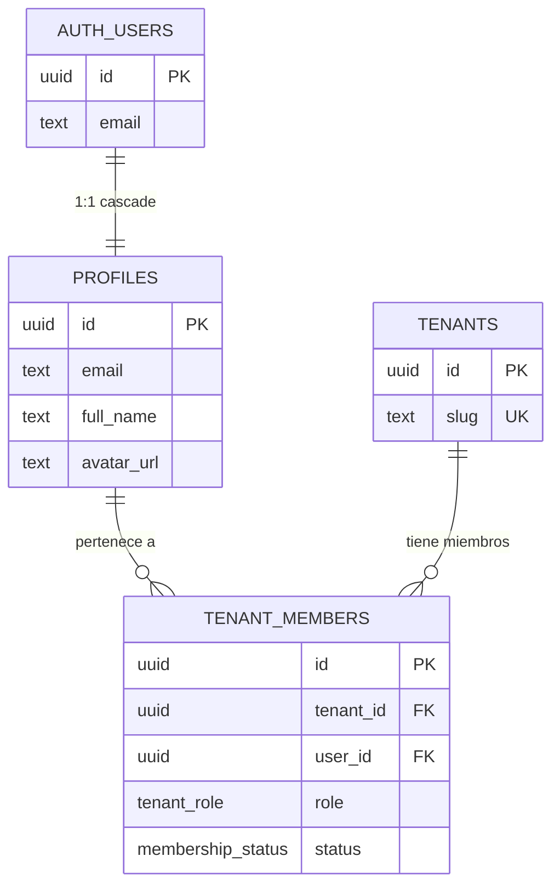

# SPEC — Phase 02 — Authentication

## 1. Información general

```text
Phase:                02
Nombre:               Authentication
Estado:               COMPLETED
Versión:              1.1.0
Fecha creación:       2026-08-25
Última actualización: 2026-08-25 (auditoría de fase: §15-§25 añadidas)
Responsable:          alejandro.avendano@masuno.pe
```

Documento maestro: [`CLOVERCODE_MASTER.md`](../../CLOVERCODE_MASTER.md) — §9, §10, §11, §12, §13, §15, §16, §19, §33 (Fase 2), §34, §35, §42, §43.
Fase previa: [`phase-01-multitenancy.md`](./phase-01-multitenancy.md) (COMPLETED, auditada 2026-08-25).

---

## 2. Objetivo

### ¿Por qué existe esta fase?

La Fase 01 respondió **de quién es este request** (el tenant). Esta responde
**quién lo hace** (la persona). Sin identidad verificada no hay autorización
posible: la Fase 03 construye permisos sobre un `auth.uid()` en el que la base de
datos debe poder confiar.

El orden importa. Si la autenticación llegara después de los módulos de negocio,
cada uno resolvería la sesión a su manera y la superficie de ataque dejaría de
ser auditable.

### ¿Qué capacidad agrega?

```text
cookie -> sesión verificada -> profile -> memberships
```

resuelto en servidor, con Supabase Auth como autoridad de credenciales y la base
de datos como autoridad de pertenencia.

### ¿Qué debe ser posible al terminarla?

```text
- Iniciar sesión con correo y contraseña.
- Cerrar sesión.
- Solicitar y completar un restablecimiento de contraseña.
- Mantener la sesión viva en SSR sin que expire a mitad de navegación.
- Bloquear las rutas privadas para quien no tenga sesión.
- Saber a qué tenants pertenece el usuario y con qué rol.
- Que nadie pueda leer el perfil ni las membresías de otra persona.
```

---

## 3. Alcance

### Incluido

```text
AU-01  Tabla profiles + trigger de sincronización desde auth.users
AU-02  Enums tenant_role y membership_status
AU-03  Tabla tenant_members + constraints + índices
AU-04  Políticas RLS en ambas tablas
AU-05  Función guardada get_my_memberships()
AU-06  Shim de auth.uid() en el arnés de tests (cierra KL-103 de la Fase 01)
AU-07  Capa de sesión en servidor (getCurrentUser, requireUser)
AU-08  Capa de membresías (getMyMemberships, requireMembership)
AU-09  Esquemas Zod de todos los inputs de autenticación
AU-10  Protección contra open redirect en `next`
AU-11  Reglas de acceso por ruta, cerradas por defecto
AU-12  src/proxy.ts: refresco de sesión y protección de rutas
AU-13  Server Actions: signIn, signOut, requestPasswordReset, updatePassword
AU-14  Pantallas /login, /forgot-password, /reset-password
AU-15  /auth/confirm: verificación del token de los enlaces por correo
AU-16  /dashboard mínimo autenticado (sustituido por la Fase 05)
AU-17  Endurecimiento de supabase/config.toml (registro público cerrado)
AU-18  Tests: unit, integration, esquema y aislamiento
```

### Fuera de alcance

```text
OUT-01  roles, permissions, role_permissions y RBAC          -> Fase 03
OUT-02  Políticas RLS basadas en permisos                     -> Fase 03
OUT-03  Alta de usuarios, invitaciones, gestión de membresías -> Fase 04
OUT-04  Registro público                                      -> nunca (por diseño)
OUT-05  Dashboard real, selector de tenant, navegación        -> Fase 05
OUT-06  OAuth, magic link, MFA, passkeys                      -> no solicitado
OUT-07  Rate limiting propio de la aplicación                 -> Fase 25
OUT-08  audit_logs de eventos de sesión                       -> Fase 24
OUT-09  Listar los miembros de un tenant                      -> Fase 03
```

§33 (Fase 2) acota la fase a «email, password, logout, reset password, sesión SSR
segura, profiles, tenant_members, proteger rutas privadas». §51 prohíbe adelantar
funcionalidad.

**Nota sobre el registro.** §33 no lista «signup» entre lo que esta fase debe
implementar, y la creación de tenants es de la Fase 04. No se implementa registro
público, y además se desactiva en Supabase (ver §11.4).

---

## 4. Dependencias

```text
Phase 00 — Foundation (COMPLETED)
  - errores de dominio, logger, validación Zod, clientes Supabase, sistema UI
Phase 01 — Multi-Tenancy Core (COMPLETED, auditada)
  - tenants, tenant_domains, trigger set_updated_at compartido
  - patrón de función guardada SECURITY DEFINER
  - arnés de PostgreSQL real
```

---

## 5. Casos de uso

### UC-201 — Iniciar sesión

```text
Actor:            Miembro de un negocio
Precondiciones:   Cuenta creada por el operador; contraseña conocida
Acción:           POST del formulario de /login
Resultado:        Sesión establecida; redirección a `next` o a /dashboard
Errores posibles: Credenciales incorrectas -> un único mensaje genérico
```

### UC-202 — Cerrar sesión

```text
Actor:            Usuario autenticado
Acción:           Submit del formulario de cierre de sesión (POST, nunca GET)
Resultado:        Cookies limpiadas; redirección a /login
```

### UC-203 — Restablecer contraseña

```text
Actor:            Usuario que olvidó su contraseña
Acción:           Introduce su correo en /forgot-password
Resultado:        Mensaje idéntico exista o no la cuenta
Continuación:     Enlace -> /auth/confirm -> sesión -> /reset-password
```

### UC-204 — Acceder a una ruta privada sin sesión

```text
Actor:            Visitante anónimo
Acción:           GET /dashboard/pedidos
Resultado:        302 a /login?next=%2Fdashboard%2Fpedidos
Tras autenticarse: vuelve exactamente a donde iba
```

### UC-205 — Un usuario en dos negocios

```text
Actor:            Contadora externa
Precondiciones:   Membresía activa en Sugu Rolls y en Polleria El Rey
Acción:           Abre /dashboard
Resultado:        Ve sus dos negocios y su rol en cada uno
```

### UC-206 — Intento de leer el perfil de otro

```text
Actor:            Usuario autenticado con la clave publishable
Acción:           SELECT sobre profiles o tenant_members vía API
Resultado:        Solo sus propias filas. RLS lo garantiza.
```

---

## 6. Requerimientos funcionales

```text
FR-201  Existirá `profiles` cuya PK es `auth.users.id`.
FR-202  `profiles` no contendrá ninguna columna de credencial.
FR-203  El perfil se creará por trigger ante cualquier alta en auth.users.
FR-204  `profiles.email` se mantendrá sincronizado por trigger.
FR-205  Borrar el usuario de auth eliminará su perfil en cascada.
FR-206  Existirá `tenant_members` con tenant_id, user_id, role y status.
FR-207  Un usuario tendrá como máximo una membresía por tenant.
FR-208  Un usuario podrá pertenecer a varios tenants.
FR-209  Solo `status = 'active'` concederá acceso.
FR-210  RLS estará habilitada en ambas tablas, con políticas explícitas.
FR-211  Un usuario solo leerá su propio perfil y sus propias membresías.
FR-212  Ningún cliente escribirá en tenant_members en esta fase.
FR-213  get_my_memberships() no aceptará parámetro de usuario.
FR-214  El servidor verificará la sesión con getUser(), nunca con getSession().
FR-215  Ningún valor mostrado o de decisión saldrá de user_metadata.
FR-216  La sesión se refrescará en src/proxy.ts.
FR-217  Toda ruta no listada como pública exigirá sesión.
FR-218  `next` se filtrará contra open redirect en servidor, dos veces.
FR-219  El fallo de inicio de sesión será indistinguible entre causas.
FR-220  La solicitud de restablecimiento responderá igual exista o no la cuenta.
FR-221  El cierre de sesión será POST, nunca GET.
FR-222  El registro público estará desactivado en Supabase.
```

---

## 7. Requerimientos no funcionales

```text
NFR-201  Una petición autenticada hará como máximo un getUser() por render,
         gracias a React cache().
NFR-202  Las membresías se consultarán una vez por render, no una por tenant.
NFR-203  El build funcionará sin credenciales (EC-02 de la Fase 00).
NFR-204  Todo formulario tendrá label asociado y error anunciado (§19).
NFR-205  Todo formulario tendrá estado de carga y bloqueo de doble envío (§34).
NFR-206  Ninguna contraseña ni token aparecerá en un log (§9, §16).
NFR-207  El proxy no se ejecutará sobre archivos estáticos.
NFR-208  El proxy no se ejecutará sobre /api/health: es una sonda de liveness y
         no debe depender de que Supabase Auth esté accesible.
```

---

## 8. Modelo de datos

```text
auth.users  (Supabase)
   │ 1:1  ON DELETE CASCADE
   ▼
profiles
   │ 1:N
   ▼
tenant_members ──────► tenants  (Fase 01)
```

### profiles

| Columna    | Tipo        | Nulo | Nota                       |
| ---------- | ----------- | ---- | -------------------------- |
| id         | uuid        | no   | PK y FK a auth.users(id)   |
| email      | text        | no   | espejo de auth.users.email |
| full_name  | text        | sí   |                            |
| avatar_url | text        | sí   |                            |
| created_at | timestamptz | no   |                            |
| updated_at | timestamptz | no   | por trigger                |

Constraints: `profiles_email_format`, `profiles_email_length`,
`profiles_full_name_length`.

### tenant_members

| Columna    | Tipo              | Nulo | Nota                   |
| ---------- | ----------------- | ---- | ---------------------- |
| id         | uuid              | no   | PK                     |
| tenant_id  | uuid              | no   | FK a tenants, CASCADE  |
| user_id    | uuid              | no   | FK a profiles, CASCADE |
| role       | tenant_role       | no   | §12                    |
| status     | membership_status | no   | default `active`       |
| created_at | timestamptz       | no   |                        |
| updated_at | timestamptz       | no   | por trigger            |

Constraints: `UNIQUE (tenant_id, user_id)`.
Índices: la UNIQUE sirve todo lo que empieza por `tenant_id`;
`tenant_members_user_id_idx` sirve la consulta más caliente de la fase.

### Enums

```text
tenant_role        owner admin manager cashier waiter kitchen delivery accountant
membership_status  active invited suspended
```

---

## 9. Seguridad

```text
AB-201  Enumeración de usuarios por el formulario de acceso
        -> mensaje único para contraseña incorrecta, correo inexistente y
           cuenta sin confirmar.

AB-202  Enumeración por el formulario de recuperación
        -> respuesta idéntica siempre, incluso si Supabase reportó un fallo.

AB-203  Cookie de sesión falsificada
        -> getUser() revalida el token contra Supabase Auth en cada llamada.
           getSession() no se usa en servidor en ningún punto.

AB-204  Escalada de privilegios vía user_metadata
        -> el usuario puede escribir su propio user_metadata; no se lee para
           ningún valor mostrado ni de decisión. La fuente es `profiles`.

AB-205  Open redirect en `next`
        -> safeRedirectPath() rechaza URL absoluta, protocolo-relativa,
           barra invertida, esquema, ruta relativa, carácter de control y
           percent-encoding que oculte cualquiera de los anteriores.
           Se aplica en la página Y en la acción, porque el cliente puede
           invocar la acción directamente.

AB-206  Ruta privada nueva olvidada
        -> lista blanca de rutas públicas. Lo no listado exige sesión.

AB-207  CSRF en el cierre de sesión
        -> POST vía Server Action, nunca un enlace GET.

AB-208  Registro público no deseado
        -> `enable_signup = false`. No basta con no tener formulario: la clave
           publishable viaja al navegador y `/auth/v1/signup` es alcanzable.

AB-209  Sesión de un usuario cacheada por un CDN
        -> se aplican las cabeceras `no-store` que @supabase/ssr entrega en el
           segundo argumento de setAll.

AB-210  Fuga de la sesión entre peticiones
        -> el cliente Supabase se construye por petición, nunca en módulo.

AB-211  Enlace de correo reutilizado o expirado
        -> exchangeCodeForSession / verifyOtp lo rechazan; `type` se valida
           contra una lista blanca antes de llegar a la librería. Todas las
           causas comparten un único destino de fallo.

AB-213  Texto arbitrario inyectado por `?error=` en /login
        -> el parámetro no se renderiza: solo selecciona un mensaje de un mapa
           fijo. Un valor no reconocido no muestra nada.

AB-212  Lectura del padrón de miembros por un miembro
        -> la política solo expone las filas propias. El listado de miembros es
           un permiso de la Fase 03.
```

---

## 10. Testing plan

```text
TEST-201  Open redirect: 20 vectores rechazados, rutas locales aceptadas
TEST-202  Reglas de ruta: cerrado por defecto, prefijos parecidos, anidados,
          /api/health público Y excluido del matcher del proxy
TEST-203  Esquemas: normalización, límites, sin reglas de fuerza al iniciar sesión
TEST-210  Trigger de perfil: alta, sincronización de email, cascada, sin credenciales
TEST-211  Lectura de perfil: propio sí, ajeno no, sin identidad nada, anon nada
TEST-212  Escritura de perfil: propio sí, ajeno no, WITH CHECK, insert, delete
TEST-213  Membresías: propias sí, padrón no, dos tenants, escritura denegada
TEST-214  Constraints: unicidad, FK, cascada, trigger de updated_at
TEST-220  get_my_memberships: identidad, join con tenants, varios tenants
TEST-221  get_my_memberships: nunca ajenas, sin parámetro, sin identidad
TEST-222  Ciclo de vida: archived oculto, suspended visible, invited reportado
TEST-223  Privilegios: SECURITY DEFINER, search_path, no PUBLIC, no anon
```

---

## 11. Implementation notes

### 11.1 Documentación oficial consultada

§4 exige verificar antes de implementar componentes sensibles. Tres hallazgos
cambiaron el diseño:

| Tema                  | Hallazgo                                                                    |
| --------------------- | --------------------------------------------------------------------------- |
| Next.js 16 middleware | Renombrado a `proxy.ts` con función `proxy`, runtime Node.js fijo.          |
| @supabase/ssr 0.12    | `setAll` recibe un segundo argumento `headers` con directivas no-store.     |
| Flujo de enlaces      | `createServerClient` fija `flowType: "pkce"`; el enlace llega con `?code=`. |
| getSession vs getUser | `getSession()` no revalida; prohibido en servidor.                          |

El primero se verificó empíricamente contra el Next.js 16.3.2 instalado: un
`src/proxy.ts` que exporta `proxy` produce `ƒ Proxy (Middleware)` en el build.
Seguir un tutorial de `middleware.ts` habría sido el caso peligroso descrito en
§4: en una versión posterior el archivo se ignora en silencio y las rutas
privadas quedan abiertas sin ningún error.

El segundo y el tercero se verificaron leyendo el paquete instalado
(`node_modules/@supabase/ssr/dist/main/types.d.ts` y `createServerClient.js`),
no de memoria. `flowType: "pkce"` se asigna DESPUÉS del spread de las opciones
del llamante, así que no es configurable.

### 11.2 Desviaciones respecto al diseño inicial

| #   | Diseño inicial                                      | Implementación real                              | Motivo                                                                                                                                                                                                                                                                |
| --- | --------------------------------------------------- | ------------------------------------------------ | --------------------------------------------------------------------------------------------------------------------------------------------------------------------------------------------------------------------------------------------------------------------- |
| 1   | Política SELECT en `tenants` para miembros          | Función guardada `get_my_memberships()`          | Abrir `tenants` es una decisión de autorización, y §33 la sitúa en la Fase 03.                                                                                                                                                                                        |
| 2   | `AuthFormState` e `IDLE_FORM_STATE` en `actions.ts` | Extraídos a `server/form-state.ts`               | Un módulo `"use server"` solo puede exportar funciones async; una constante ahí es un error de build.                                                                                                                                                                 |
| 3   | `getPublicEnv()` antes de `cookies()` en el cliente | Orden invertido                                  | `cookies()` marca la ruta como dinámica. Leer el entorno primero rompía el build sin credenciales (EC-02).                                                                                                                                                            |
| 4   | Sin cambios en `supabase/config.toml`               | Registro cerrado, contraseña mínima 8, redirects | Sin `enable_signup = false` cualquiera crea cuentas con la clave del navegador.                                                                                                                                                                                       |
| 5   | `/auth/confirm` solo con `token_hash`               | Acepta también `?code=` (PKCE)                   | `createServerClient` fija `flowType: "pkce"` tras hacer spread de las opciones: no es desactivable, y la plantilla de correo por defecto produce `?code=`. Soportar solo una forma fallaría en cuanto alguien editara una plantilla, con un enlace de aspecto válido. |

### 11.3 Contratos finales

**Rutas HTTP nuevas**

```text
/login             página     pública
/forgot-password   página     pública
/reset-password    página     pública (autoriza el token, no la sesión)
/auth/confirm      handler    pública, verifica (?code= o ?token_hash=) y redirige
/dashboard         página     privada, sustituida por la Fase 05
```

**Superficie de servidor**

```text
@/lib/auth            esquemas, safeRedirectPath, tipos
@/lib/auth/session    getCurrentUser, requireUser         (server-only)
@/lib/auth/membership getMyMemberships, requireMembership (server-only)
@/lib/auth/route-access  isPublicPath, requiresAuthentication (puro)
@/modules/auth        formularios y Server Actions
```

**Esquema final:** 4 tablas, 5 enums, 8 índices, 4 triggers, 5 funciones.

**Políticas RLS finales:** 3 — `profiles_select_own`, `profiles_update_own`,
`tenant_members_select_own`. `tenants` y `tenant_domains` siguen sin políticas.

### 11.4 Registro público

Desactivado en `supabase/config.toml` (`enable_signup = false`). Ese archivo
configura únicamente la pila local: **el mismo interruptor debe activarse en el
panel de Supabase de cada proyecto desplegado**. Ver KL-206.

---

## 12. Definition of Done

```text
- [x] Migraciones creadas y aplicables en orden
- [x] Enums creados (2 nuevos)
- [x] profiles con PK compartida, constraints y sin columna de credencial
- [x] tenant_members con constraints, unicidad por tenant e índice de usuario
- [x] Triggers de sincronización con auth.users (alta y cambio de email)
- [x] RLS habilitada y con políticas explícitas en ambas tablas nuevas
- [x] get_my_memberships() sin parámetro, sin PUBLIC, con search_path fijado
- [x] Shim de auth.uid() en el arnés (cierra KL-103 de la Fase 01)
- [x] getUser() en servidor; getSession() no aparece en el código
- [x] src/proxy.ts con refresco de sesión y protección cerrada por defecto
- [x] Server Actions con validación propia y mensajes no enumerables
- [x] Pantallas de acceso, recuperación y nueva contraseña
- [x] /auth/confirm con lista blanca de tipos de token
- [x] src/types/database.ts sincronizado; test de contrato PASS
- [x] Registro público desactivado en supabase/config.toml
- [x] Tests de la fase PASS (118 nuevos)
- [x] Typecheck / Lint / Format / Build PASS
- [x] ADRs registrados (008, 009)
- [x] docs/architecture/authentication.md escrito
```

### Resultado de las validaciones

```text
Format     PASS   prettier --check .            All matched files use Prettier code style
Lint       PASS   eslint --max-warnings=0       0 errores, 0 warnings
Types      PASS   next typegen && tsc --noEmit  0 errores
Tests      PASS   vitest run                    426/426 en 19 archivos
Build      PASS   next build                    8 rutas + proxy, sin credenciales
Audit      PASS   npm audit --omit=dev          0 vulnerabilidades
```

Reparto de los tests añadidos en esta fase:

```text
  26  database/auth-isolation.test.ts     <- nuevos
  25  unit/auth-redirect.test.ts          <- nuevos
  19  unit/auth-schemas.test.ts           <- nuevos
  20  unit/auth-route-access.test.ts      <- nuevos
  14  database/membership-access.test.ts  <- nuevos
  14  integration/auth-session.test.ts    <- nuevos
 ---
 118  añadidos en la Fase 02
   3  añadidos a suites de la Fase 01 (inventario de esquema, RLS global)
 305  heredados de las Fases 00-01
 ---
 426  total
```

---

## 13. Known limitations

```text
KL-201  Ninguna acción de autenticación se prueba de extremo a extremo contra
        una instancia real de Supabase Auth. Las Server Actions se apoyan en la
        librería oficial y los tests cubren la validación, el mapeo y los
        contratos de error, no la conversación HTTP con el proveedor.
        Owner: Fase 28.

KL-202  El arnés de tests sigue sin PostgREST: la costura entre el cliente
        tipado y el SQL no la cubre ninguna de las dos mitades. Heredado de
        KL-102. Owner: Fase 28.

KL-203  No existe rate limiting propio de la aplicación. Se depende del de
        Supabase Auth (`[auth.rate_limit]` en config.toml). Un limitador propio
        necesita estado compartido. Owner: Fase 25.

KL-204  Los eventos de sesión se registran en el logger estructurado, no en
        `audit_logs`: esa tabla no existe todavía. Owner: Fase 24.

KL-205  No hay forma de crear un usuario ni una membresía desde la aplicación.
        Hasta la Fase 04 hay que insertarlos a mano (auth.users vía el panel de
        Supabase, tenant_members vía SQL).

KL-206  `enable_signup = false` en `supabase/config.toml` solo afecta a la pila
        local. El mismo interruptor debe activarse en el panel de cada proyecto
        desplegado; si no, `/auth/v1/signup` sigue abierto con la clave que ya
        viaja al navegador. Owner: Fase 28 (checklist de despliegue).

KL-207  `/dashboard` es un marcador de posición. Su única función es demostrar
        la fase de extremo a extremo. Owner: Fase 05.

KL-208  Las migraciones siguen sin ejecutarse contra una instancia real de
        Supabase, solo contra PostgreSQL embebido. Heredado de KL-109.

KL-209  `tenant_members.role` es un enum. La Fase 03 debe decidir si permanece
        así o pasa a ser FK a `roles`. Ninguna comprobación de permisos depende
        todavía de esa columna, así que ambas opciones siguen abiertas.

KL-210  El shim de `auth` en el arnés no reproduce `auth.jwt()` ni los claims de
        rol. La Fase 03 deberá extenderlo si sus políticas los usan.

KL-211  La numeración de secciones de este SPEC no sigue el orden de §55: las
        secciones que faltaban se añadieron al final (§15-§25) en lugar de
        reordenar el documento, para no invalidar las referencias existentes.
        El contenido exigido está completo; el orden no coincide.
```

---

## 14. Future considerations

```text
- Fase 03 debe construir sobre `auth.uid()` y `tenant_members`, y mantener el
  invariante que TEST-211 y TEST-213 ya prueban: nadie lee filas ajenas.

- Fase 03 debe decidir si abre `tenants` con una política para miembros. Si lo
  hace, `get_my_memberships()` puede simplificarse o desaparecer; hasta
  entonces es la única vía.

- Fase 04 (provisioning) debe crear, en una sola transacción: usuario + perfil
  + membresía owner + tenant, cerrando también KL-107 de la Fase 01.

- Fase 05 sustituirá /dashboard y debe reutilizar `getMyMemberships()` para el
  selector de negocio, sin volver a consultar.

- Cuando exista el middleware de tenant, `src/proxy.ts` debe reutilizar
  `resolveTenantByHostname()` y no volver a parsear el hostname (nota de futuro
  de la Fase 01).

- Fase 24 debe registrar en `audit_logs` los eventos que hoy solo van al logger:
  inicio de sesión, cierre, cambio de contraseña.
```

---

## 15. Diagrama de relaciones

> Añadido en la auditoría de la fase (§55 punto 9).



Un usuario pertenece a **varios** tenants con distinto rol en cada uno
(§11 del documento maestro). `UNIQUE (tenant_id, user_id)` impide la membresía
duplicada, no la múltiple.

---

## 16. Tenant Isolation

```text
Tenant Isolation Impact: ALTO
```

> Sección obligatoria de §55 punto 10. Faltaba en la versión 1.0.0 del SPEC y se
> añade aquí sin cambiar el código: describe lo que las migraciones ya hacen.

```text
¿Cómo se determina el tenant?
  En esta fase NO se determina un tenant activo. La autenticación responde
  "quién eres", no "en qué empresa estás". La selección de tenant activo es de
  la Fase 05. El tenant de una petición sigue viniendo del hostname (Fase 01).

¿Qué tablas llevan tenant_id?
  tenant_members. `profiles` no lo lleva a propósito: un usuario es una persona,
  no una persona-por-empresa, y duplicarlo por tenant rompería el modelo de
  §11 (un mismo usuario en varias empresas).

¿Cómo evita RLS el acceso cross-tenant?
  tenant_members solo tiene política de SELECT y su predicado es
  `(select auth.uid()) = user_id`. Un miembro del tenant A no puede ver las
  filas del tenant B ni siquiera del suyo propio si no son suyas: la política
  filtra por usuario, no por tenant, que es más restrictivo.

  No existen políticas de INSERT, UPDATE ni DELETE. Conceder o revocar una
  membresía es imposible con la clave publishable, por diseño: es una decisión
  de autorización y pertenece a las Fases 03 y 04.

¿Qué consultas requieren validación de tenant?
  Ninguna de esta fase consulta por tenant. `get_my_memberships()` parte de
  `auth.uid()` y devuelve solo las membresías propias.

¿Existe algún recurso global?
  `profiles` es global por naturaleza: la identidad de una persona no pertenece
  a ninguna empresa. Su política restringe cada fila a su dueño, de modo que la
  globalidad de la tabla no implica visibilidad global.
```

**Invariante que esta fase añade y la Fase 03 debe preservar:** ninguna política
puede permitir que un usuario lea filas de `tenant_members` cuyo `user_id` no
sea el suyo, salvo que un permiso explícito de listado de miembros lo autorice
y quede acotado al tenant activo.

---

## 17. API / Server Actions

```text
signInWithPassword(formData)      Server Action
  Input:    email, password, next?
  Éxito:    redirect a `next` saneado, o a DEFAULT_SIGNED_IN_PATH
  Error:    mensaje único e indistinguible (AB-201)

requestPasswordReset(formData)    Server Action
  Input:    email
  Salida:   respuesta idéntica siempre (AB-202)

updatePassword(formData)          Server Action
  Precondición: sesión de recuperación activa
  Error:    ValidationError con detalle por campo

signOut()                         Server Action
  Método:   POST. Nunca un enlace GET (AB-207)

GET /auth/confirm                 Route Handler
  Input:    token_hash, type (lista blanca), next?
  Salida:   redirect; todas las causas de fallo comparten destino (AB-211)
```

No se publica ningún endpoint que reciba un identificador de usuario: eso
convertiría la autenticación en un oráculo de enumeración.

---

## 18. UI / UX

```text
/login             Formulario de acceso. Estados: idle | pending | error.
                   El error nunca distingue causa (AB-201).
/forgot-password   Solicitud de recuperación. Confirmación siempre idéntica.
/reset-password    Nueva contraseña. Requiere sesión de recuperación.
/auth/confirm      Sin UI. Route Handler que redirige.
/dashboard         Marcador de posición protegido (KL-207).
```

Todas las pantallas usan las primitivas accesibles de la Fase 00: `Label`
asociado con `htmlFor`, `aria-invalid` en campos con error, `role="alert"` en
los mensajes y estado `loading` que bloquea el reenvío del formulario.

---

## 19. Flujos principales

```text
ACCESO
  /login -> signInWithPassword -> Supabase Auth
     |                                |
     |  credenciales inválidas        |  válidas
     |  o correo inexistente          |
     v                                v
  mismo mensaje                  cookies de sesión
                                       |
                                 redirect a `next` saneado

RECUPERACIÓN
  /forgot-password -> requestPasswordReset -> correo (si la cuenta existe)
     |
  confirmación idéntica en ambos casos
     |
  enlace -> /auth/confirm -> verifyOtp -> /reset-password -> updatePassword

CADA PETICIÓN
  proxy.ts -> getUser() (revalida contra Supabase)
     |            |
     |  anónima   |  autenticada
     v            v
  ¿ruta privada?  ¿ruta solo-anónima?
     |  sí            |  sí
     v                v
  redirect /login  redirect /dashboard
```

---

## 20. Manejo de errores

```text
Credenciales inválidas / correo inexistente  -> mensaje único (nunca distingue)
Cuenta sin confirmar                          -> el mismo mensaje único
Entrada que no cumple el esquema Zod          -> ValidationError      422
Sesión ausente en código que la exige         -> AuthenticationError  401
`next` no local                               -> se descarta y se usa el default
Enlace de correo inválido, usado o expirado   -> destino de fallo único
Fallo de lectura de `profiles`                -> se registra; la sesión sigue
                                                 siendo válida (el perfil es
                                                 accesorio, la identidad no)
```

La regla de la fase: **ningún mensaje de error puede revelar si una cuenta
existe**. Es la diferencia entre un formulario de acceso y un verificador de
correos electrónicos.

---

## 21. Observabilidad

```text
auth.session.absent            debug  petición anónima; es lo normal
auth.signin.succeeded          info   { userId }
auth.signin.failed             warn   { reason }  sin el correo introducido
auth.signout.succeeded         info   { userId }
auth.password.reset_requested  info   sin indicar si la cuenta existía
auth.profile.read_failed       error  { userId }
auth.proxy.redirect_to_sign_in debug  { pathname }
```

Nunca se registran contraseñas, tokens ni `token_hash`: la redacción central de
la Fase 00 los cubre, y además no se pasan al logger.

---

## 22. Edge cases

```text
EC-201  Cookie de sesión manipulada -> getUser() la rechaza contra el servidor.
EC-202  Sesión expirada a mitad de navegación -> el proxy la refresca y escribe
        la cookie; sin ese paso el usuario quedaría fuera en silencio.
EC-203  Redirect con `?next=//evil.com` -> descartado por safeRedirectPath.
EC-204  Redirect con `?next=%2F%2Fevil.com` -> descartado; se decodifica antes.
EC-205  Server Action invocada directamente sin pasar por la página -> cada
        acción valida la sesión por su cuenta (requireUser).
EC-206  Usuario con sesión visitando /login -> redirigido a /dashboard.
EC-207  Usuario existente en auth.users sin fila en profiles -> la sesión sigue
        siendo válida; los campos de perfil quedan nulos.
EC-208  Usuario sin ninguna membresía -> autenticado, cero tenants. Es un
        estado legítimo hasta la Fase 04.
EC-209  Tenant archivado entre las membresías -> get_my_memberships lo omite.
EC-210  `?error=` con texto arbitrario en /login -> no se renderiza; solo
        selecciona de un mapa fijo (AB-213).
```

---

## 23. Performance considerations

```text
queries        getUser() es una llamada HTTP a Supabase Auth por petición que
               atraviesa el proxy. Es el coste inevitable de no confiar en la
               cookie. Los assets estáticos y /api/health quedan fuera del
               matcher precisamente por esto.
memoización    getCurrentUser() usa cache() de React: varios componentes en un
               render comparten una sola verificación.
indexes        tenant_members_user_id_idx sirve la consulta más frecuente
               ("mis membresías"); la UNIQUE (tenant_id, user_id) sirve el resto.
caching        Ninguna caché entre peticiones de la identidad: serviría la
               sesión de un usuario a otro.
Riesgo         Si la latencia de getUser() se vuelve un problema medible, la
               alternativa es verificar el JWT localmente con la clave pública
               del proyecto. No se hace ahora: sin medición sería optimización
               prematura (§26), y la verificación local tiene sus propios modos
               de fallo.
```

---

## 24. Migraciones

```text
20260825120000_create_profiles.sql
  - tabla profiles (PK = FK a auth.users, ON DELETE CASCADE)
  - constraints de formato y longitud
  - trigger de updated_at
  - trigger de alta automática desde auth.users
  - RLS habilitada + políticas profiles_select_own y profiles_update_own

20260825120100_create_tenant_members.sql
  - enums tenant_role y membership_status
  - tabla tenant_members + UNIQUE (tenant_id, user_id)
  - índice tenant_members_user_id_idx
  - trigger de updated_at
  - RLS habilitada + política tenant_members_select_own
  - SIN políticas de escritura: deliberado

20260825120200_create_membership_access.sql
  - función get_my_memberships() SECURITY DEFINER, search_path fijado
  - revoke execute from public, grant solo a authenticated
```

Reglas heredadas de §22: una migración aplicada en producción no se edita nunca.

---

## 25. Rollback

```text
database schema
  drop function public.get_my_memberships();
  drop table public.tenant_members;
  drop type public.membership_status;
  drop type public.tenant_role;
  drop table public.profiles;          -- arrastra el trigger de alta
  (auth.users NO se toca: lo gestiona Supabase)

configuración
  Revertir enable_signup en el panel del proyecto desplegado si se había
  cambiado (KL-206).

código
  git revert del rango de la fase. `src/proxy.ts` desaparece y con él la
  protección de rutas; comprobar que ninguna ruta privada quede publicada.
```

Riesgo de rollback: **MEDIO**. A diferencia de las Fases 00 y 01, aquí ya puede
haber usuarios reales en `auth.users`. Borrar `profiles` elimina sus datos de
perfil, no sus cuentas. A partir de la Fase 04 el rollback exigirá respaldo.
