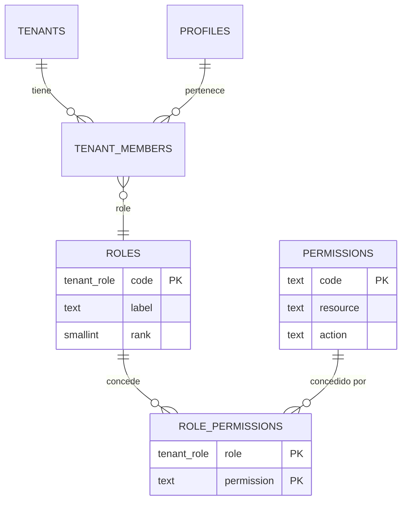

# SPEC — Phase 03 — Authorization + RLS

## 1. Información general

```text
Phase:                03
Nombre:               Authorization + RLS
Estado:               COMPLETED
Versión:              1.1.0
Fecha creación:       2026-08-25
Última actualización: 2026-08-25
Responsable:          alejandro.avendano@masuno.pe
```

Documento maestro: [`CLOVERCODE_MASTER.md`](../../CLOVERCODE_MASTER.md) — §5, §9, §10, §12, §21, §22, §33 (Fase 3), §42, §45, §48.
Fases previas: [00](./phase-00-foundation.md), [01](./phase-01-multitenancy.md), [02](./phase-02-authentication.md) — todas COMPLETED.

---

## 2. Objetivo

### ¿Por qué existe esta fase?

Las fases 01 y 02 dejaron el sistema en una postura deliberadamente cerrada:
RLS activa y casi sin políticas. Eso es seguro, pero inservible: un miembro de
Sugu Rolls no puede leer ni el nombre de su propia empresa.

Esta fase abre esa puerta, y lo hace **una sola vez y en un solo sitio**. Si
cada módulo posterior inventa su forma de comprobar permisos, el aislamiento
deja de ser demostrable. Aquí se define el mecanismo que las fases 04 a 28
reutilizan sin volver a pensarlo.

Es además la fase donde el documento maestro exige la prueba central del
producto: **Tenant A ≠ Tenant B a nivel PostgreSQL**.

### ¿Qué capacidad agrega?

```text
usuario + tenant + acción  ->  permitido / denegado
```

resuelto en la base de datos, no en la aplicación, y reutilizable desde la
aplicación con una sola función.

### ¿Qué debe ser posible al terminarla?

```text
- Consultar el catálogo de roles y permisos del sistema.
- Que un miembro lea SU tenant y ningún otro.
- Que un miembro vea el padrón de miembros solo si tiene permiso.
- Que conceder o revocar membresías exija un permiso explícito.
- Comprobar un permiso desde código de servidor con una sola llamada.
- Demostrar, contra PostgreSQL real, que el tenant A no alcanza al tenant B
  en ninguna tabla, con ninguna consulta y con ningún rol.
```

---

## 3. Alcance

### Incluido

```text
AZ-01  Tabla roles (catálogo del sistema)
AZ-02  Tabla permissions (catálogo del sistema)
AZ-03  Tabla role_permissions (matriz rol -> permiso)
AZ-04  Datos del catálogo cargados por migración, no por seed
AZ-05  Función is_tenant_member(tenant_id)
AZ-06  Función has_permission(tenant_id, permission)
AZ-07  Función my_permissions(tenant_id)
AZ-08  Política de SELECT en tenants para miembros
AZ-09  Políticas de SELECT / INSERT / UPDATE / DELETE en tenant_members
AZ-10  Guarda contra escalada de privilegios en el rol owner
AZ-11  Capa RBAC en TypeScript: constantes, hasPermission, requirePermission
AZ-12  Tests cross-tenant obligatorios (Tenant A ≠ Tenant B)
```

### Fuera de alcance

```text
OUT-01  UI de gestión de miembros e invitaciones          -> Fase 04 / 05
OUT-02  Super Admin y sus permisos de plataforma          -> Fase 04
OUT-03  Roles personalizados por tenant                    -> no planificado
OUT-04  Permisos sobre tablas de negocio (products, ...)  -> Fases 10+
OUT-05  Módulos y planes (hasFeature)                      -> Fase 21
OUT-06  audit_logs de cambios de rol                       -> Fase 24
OUT-07  Cliente service_role                               -> Fase 04
```

El catálogo de permisos **sí** incluye los de negocio (`products.*`,
`orders.*`, …) porque §12 los enumera y la matriz rol→permiso es lo que esta
fase debe entregar. Lo que queda fuera es aplicarlos a tablas que aún no
existen.

---

## 4. Dependencias

```text
Phase 01  tenants                     (la política de SELECT se añade aquí)
Phase 02  tenant_members, tenant_role, membership_status, auth.uid()
Phase 02  arnés de tests con shim de auth y helper asUser()
```

---

## 5. Casos de uso

### UC-301 — Un miembro lee su empresa

```text
Actor:            Usuario autenticado, miembro activo de Sugu Rolls
Acción:           SELECT sobre tenants
Resultado:        Ve exactamente la fila de Sugu Rolls
Errores posibles: Membresía `invited` o `suspended` -> cero filas
```

### UC-302 — Un miembro no alcanza otra empresa

```text
Actor:            Miembro de Sugu Rolls
Acción:           SELECT sobre tenants filtrando por el id de Pollería El Rey
Resultado:        Cero filas. No distingue "no existe" de "no es tuyo".
```

### UC-303 — Padrón de miembros según permiso

```text
Actor:            Miembro con rol cashier (sin members.view)
Acción:           SELECT sobre tenant_members de su tenant
Resultado:        Solo su propia fila
Variante:         Con rol admin (con members.view) -> todo el padrón del tenant
```

### UC-304 — Conceder una membresía

```text
Actor:            Usuario con members.manage en el tenant
Acción:           INSERT en tenant_members para ese tenant
Resultado:        Fila creada
Errores posibles: Sin el permiso -> denegado por RLS
                  Para OTRO tenant -> denegado aunque tenga el permiso aquí
```

### UC-305 — Intento de escalada a owner

```text
Actor:            Usuario con rol admin y members.manage
Acción:           INSERT o UPDATE fijando role = 'owner'
Resultado:        Denegado. Solo un owner puede crear o modificar un owner.
```

### UC-306 — Comprobación desde la aplicación

```text
Actor:            Server Action
Acción:           await requirePermission(tenantId, PERMISSIONS.ORDERS_CANCEL)
Resultado:        Continúa, o AuthorizationError -> 403
```

---

## 6. Requerimientos funcionales

```text
FR-301  Existirá `roles` con el código del rol como clave primaria.
FR-302  `roles.code` usará el enum tenant_role, para que un rol inexistente
        sea imposible por tipo, no por convención.
FR-303  Existirá `permissions` con un código `recurso.acción` como PK.
FR-304  El código de permiso tendrá formato validado por CHECK.
FR-305  Existirá `role_permissions` (role, permission) como PK compuesta.
FR-306  Ambas claves de role_permissions serán FK con ON DELETE CASCADE.
FR-307  El catálogo se cargará mediante MIGRACIÓN, no mediante seed.
FR-308  Las tres tablas tendrán RLS habilitada.
FR-309  El catálogo será legible por cualquier usuario autenticado: es
        información del producto, no de ningún tenant.
FR-310  El catálogo será de solo lectura para anon y authenticated.
FR-311  `is_tenant_member(uuid)` devolverá true solo con membresía `active`.
FR-312  `has_permission(uuid, text)` resolverá membresía activa + rol + permiso.
FR-313  Ambas serán SECURITY DEFINER con search_path fijado, para poder
        consultarse desde políticas sin provocar recursión infinita.
FR-314  Ambas revocarán EXECUTE de PUBLIC antes de concederlo.
FR-315  Ninguna aceptará un user_id como parámetro: la identidad viene de
        auth.uid() dentro del cuerpo.
FR-316  `tenants` tendrá política de SELECT para miembros activos.
FR-317  `tenant_members` permitirá SELECT de las filas propias siempre.
FR-318  `tenant_members` permitirá SELECT del padrón con `members.view`.
FR-319  `tenant_members` permitirá INSERT/UPDATE/DELETE con `members.manage`.
FR-320  Solo un `owner` podrá crear, modificar o eliminar una fila con
        role = 'owner'.
FR-321  Existirá `PERMISSIONS` como constantes tipadas en TypeScript.
FR-322  Existirá `hasPermission(tenantId, permission)` en servidor.
FR-323  Existirá `requirePermission(...)` que lance AuthorizationError.
FR-324  Existirá `getMyPermissions(tenantId)` para pintar la navegación.
FR-325  La navegación NO determinará la autorización (§45).
FR-326  Los tipos de base de datos reflejarán las tablas nuevas.
```

---

## 7. Requerimientos no funcionales

```text
NFR-301 Seguridad
  - Ninguna política podrá permitir lectura cross-tenant, con ningún rol.
  - Las funciones de política son SECURITY DEFINER: se auditan una vez y se
    reutilizan, en lugar de repetir subconsultas en cada política.
  - Escalada a owner bloqueada en la base de datos, no en la aplicación.

NFR-302 Performance
  - has_permission se resuelve con dos índices existentes más la PK de
    role_permissions. Sin escaneos secuenciales.
  - auth.uid() se envuelve en (select auth.uid()) para que PostgreSQL lo
    evalúe una vez por consulta y no una vez por fila.

NFR-303 Mantenibilidad
  - Cero comparaciones `role === "admin"` en el código (§12).
  - Añadir un permiso es una fila en una migración, no un cambio de código.

NFR-304 Demostrabilidad
  - El aislamiento se prueba ejecutando SQL contra PostgreSQL real, con RLS
    activa y bajo la identidad de usuarios distintos.
```

---

## 8. Modelo de datos

### roles

```text
code         tenant_role  PK
label        text         NOT NULL
description  text         NULL
rank         smallint     NOT NULL   -- 0 = mayor autoridad
created_at   timestamptz  NOT NULL

CHECK rank BETWEEN 0 AND 100
```

`rank` existe para poder ordenar la interfaz y para expresar "un rol no puede
gestionar a otro de mayor autoridad" sin codificar nombres.

### permissions

```text
code         text  PK
resource     text  NOT NULL
action       text  NOT NULL
description  text  NULL
created_at   timestamptz NOT NULL

CHECK code ~ '^[a-z_]+\.[a-z_]+$'
CHECK code = resource || '.' || action
```

### role_permissions

```text
role        tenant_role  NOT NULL  FK roles(code)        ON DELETE CASCADE
permission  text         NOT NULL  FK permissions(code)  ON DELETE CASCADE

PRIMARY KEY (role, permission)
INDEX role_permissions_permission_idx (permission)
```

### Catálogo cargado por migración

Roles: los 8 de §12. Permisos: los 18 de §12, más `members.view` y
`members.manage`, que esta fase necesita para gobernar `tenant_members` y que
§12 no nombra porque su lista es de ejemplos.

Matriz resumida:

```text
owner       todos
admin       todos salvo settings.manage
manager     products.*, orders.*, customers.*, cash.*, reports.view, members.view
cashier     products.view, orders.view/create/update, customers.view, cash.*,
            billing.view/create
waiter      products.view, orders.view/create/update, customers.view
kitchen     products.view, orders.view/update
delivery    orders.view/update, customers.view
accountant  reports.view, billing.*, orders.view, cash.view equivalente
```

### Políticas RLS que esta fase añade

```text
tenants
  tenants_select_member        SELECT  using is_tenant_member(id)

tenant_members
  tenant_members_select_own    SELECT  (ya existía, Fase 02)
  tenant_members_select_roster SELECT  using has_permission(tenant_id,'members.view')
  tenant_members_insert        INSERT  with check has_permission(...,'members.manage')
                                       AND guarda de owner
  tenant_members_update        UPDATE  using/with check ídem
  tenant_members_delete        DELETE  using ídem

roles / permissions / role_permissions
  *_select_authenticated       SELECT  to authenticated using (true)
```

`using (true)` en el catálogo **no** contradice §10: esas tablas no contienen
información de ningún tenant. Son la lista de capacidades del producto, igual
de pública que su documentación. §10 prohíbe `using (true)` en tablas privadas.

---

## 9. Diagrama de relaciones



---

## 10. Tenant Isolation

```text
Tenant Isolation Impact: MÁXIMO
```

```text
¿Cómo se determina el tenant?
  Se recibe como parámetro explícito en cada comprobación
  (has_permission(tenant_id, ...)). No se infiere ni se toma de una variable
  de sesión: una comprobación cuyo tenant es implícito es una comprobación que
  algún día mira el tenant equivocado.

¿Qué tablas llevan tenant_id?
  tenant_members (Fase 02). Las tres tablas de catálogo NO llevan: son globales
  del producto y no contienen datos de negocio.

¿Cómo evita RLS el acceso cross-tenant?
  Toda política nueva sobre datos de tenant pasa por is_tenant_member() o
  has_permission(), y ambas anclan la fila a (auth.uid(), tenant_id). No existe
  política que conceda acceso sin fijar el tenant.

  El permiso NO es global: tener members.manage en el tenant A no concede nada
  en el tenant B, porque el permiso se resuelve contra la membresía de ESE
  tenant.

¿Qué consultas requieren validación de tenant?
  Todas las de tenant_members y tenants. El catálogo no.

¿Existe algún recurso global?
  Sí: roles, permissions y role_permissions. Legibles por cualquier usuario
  autenticado y de solo lectura. No revelan nada de ningún tenant.
```

---

## 11. Seguridad

```text
AB-301  Escalada horizontal: usar un permiso del tenant A sobre el tenant B.
        Mitigación: el permiso se resuelve por (usuario, tenant). Probado.

AB-302  Escalada vertical: un admin se asciende a owner.
        Mitigación: guarda en INSERT y UPDATE; solo un owner toca filas owner.

AB-303  Recursión infinita en la política de tenant_members.
        Mitigación: las funciones son SECURITY DEFINER, así que no vuelven a
        pasar por RLS. Sin esto, la política se consultaría a sí misma.

AB-304  Secuestro de search_path en las funciones de política.
        Mitigación: SET search_path = '' y nombres cualificados. Probado.

AB-305  EXECUTE concedido a PUBLIC por defecto en funciones nuevas.
        Mitigación: revoke from public antes del grant. Hallazgo de la
        auditoría de la Fase 01, aplicado aquí desde el principio.

AB-306  Membresía suspendida que sigue concediendo acceso.
        Mitigación: ambas funciones exigen status = 'active'.

AB-307  Confiar en la navegación como control de acceso.
        Mitigación: getMyPermissions solo pinta la interfaz; toda acción de
        servidor vuelve a comprobar (§45).

AB-308  Un miembro lee el padrón completo sin permiso.
        Mitigación: dos políticas separadas; la propia fila siempre, el padrón
        solo con members.view.
```

---

## 12. API / Server Actions

Esta fase **no publica endpoints**. Entrega funciones de servidor:

```text
hasPermission(tenantId, permission): Promise<boolean>
requirePermission(tenantId, permission): Promise<void>   // lanza AuthorizationError
getMyPermissions(tenantId): Promise<Permission[]>
isTenantMember(tenantId): Promise<boolean>
```

---

## 13. UI / UX

```text
Sin cambios de interfaz.
```

La interfaz que consume permisos es de la Fase 05. Se documenta explícitamente
para que no se lea como trabajo pendiente.

---

## 14. Flujos principales

```text
COMPROBACIÓN DE PERMISO
  Server Action
     |
  requirePermission(tenantId, 'orders.cancel')
     |
  has_permission(tenant_id, permission)   [SECURITY DEFINER]
     |
  tenant_members (activa) JOIN role_permissions
     |
  true -> continúa      false -> AuthorizationError -> 403

LECTURA CON RLS
  SELECT * FROM tenants
     |
  política tenants_select_member -> is_tenant_member(id)
     |
  solo las filas de los tenants donde el usuario es miembro activo
```

---

## 15. Manejo de errores

```text
Sin sesión                          -> AuthenticationError  401
Sesión válida sin permiso           -> AuthorizationError    403
Tenant inexistente o ajeno          -> cero filas (no 403: no confirma existencia)
Escalada a owner denegada           -> error de RLS -> AuthorizationError
Fallo de la consulta                -> DatabaseError         500
```

Regla: una fila ajena **no existe**. Devolver 403 confirmaría que sí existe.

---

## 16. Observabilidad

```text
authz.permission.denied   warn   { tenantId, permission, userId }
authz.permission.granted  debug  solo en desarrollo; en producción sería una
                                 línea por acción sin información nueva
```

---

## 17. Testing Plan

### Unit

```text
TEST-301  PERMISSIONS expone exactamente los códigos del catálogo.
TEST-302  El tipo Permission impide un código inexistente en compilación.
```

### Integration

```text
TEST-303  hasPermission delega en la función y devuelve booleano.
TEST-304  requirePermission lanza AuthorizationError cuando no hay permiso.
TEST-305  requirePermission no lanza cuando sí lo hay.
TEST-306  getMyPermissions devuelve la lista del rol.
TEST-307  Un fallo de consulta se convierte en DatabaseError.
```

### Esquema

```text
TEST-308  Las tres tablas existen con sus claves y FK.
TEST-309  El catálogo carga los 8 roles y los 20 permisos.
TEST-310  El formato del código de permiso está validado por CHECK.
TEST-311  role_permissions rechaza un permiso inexistente.
TEST-312  Las funciones son SECURITY DEFINER con search_path fijado.
TEST-313  EXECUTE está revocado de PUBLIC en las funciones nuevas.
```

### RLS / Authorization — OBLIGATORIOS

```text
TEST-314  is_tenant_member es true para miembro activo.
TEST-315  is_tenant_member es false para membresía invited o suspended.
TEST-316  is_tenant_member es false para un tenant ajeno.
TEST-317  has_permission respeta la matriz del rol.
TEST-318  has_permission es false en un tenant donde no hay membresía.
TEST-319  Un miembro lee SU tenant.
TEST-320  Un miembro NO lee el tenant ajeno.
TEST-321  Sin members.view solo se ve la fila propia del padrón.
TEST-322  Con members.view se ve el padrón completo de SU tenant.
TEST-323  Con members.view NO se ve el padrón del tenant ajeno.
TEST-324  Sin members.manage no se puede insertar una membresía.
TEST-325  Con members.manage se puede insertar en SU tenant.
TEST-326  Con members.manage NO se puede insertar en el tenant ajeno.
TEST-327  Un admin no puede crear una fila con role = 'owner'.
TEST-328  Un owner sí puede.
TEST-329  Un admin no puede ascender a otro miembro a owner.
TEST-330  Un anónimo no lee ninguna de las tablas de tenant.
```

### Cross-tenant — LA PRUEBA DE LA FASE

```text
TEST-331  Tenant A ≠ Tenant B a nivel PostgreSQL:
          para CADA tabla con datos de tenant y para CADA rol del catálogo,
          un usuario del tenant A no obtiene ninguna fila del tenant B, ni
          leyendo, ni escribiendo, ni borrando.
```

---

## 18. Edge Cases

```text
EC-301  Usuario sin ninguna membresía -> autenticado, cero permisos, cero filas.
EC-302  Membresía en tenant archivado -> is_tenant_member sigue siendo true
        (la membresía existe), pero el tenant no resuelve por hostname y
        get_my_memberships lo omite. La política de tenants sí lo mostraría;
        se documenta como decisión: el operador de plataforma necesita verlo.
EC-303  Usuario con dos membresías y roles distintos -> los permisos se
        resuelven por tenant, nunca se mezclan.
EC-304  Permiso retirado de un rol en caliente -> efecto inmediato: no hay
        caché entre peticiones.
EC-305  Rol sin ninguna fila en role_permissions -> cero permisos, no error.
EC-306  Último owner eliminado -> la base de datos NO lo impide en esta fase.
        Documentado como limitación; corresponde al provisioning (Fase 04).
EC-307  tenant_id nulo o inexistente en has_permission -> false, no error.
```

---

## 19. Performance considerations

```text
queries        has_permission: una consulta con dos JOIN sobre índices.
indexes        tenant_members UNIQUE(tenant_id,user_id) + user_id_idx (Fase 02),
               role_permissions PK(role,permission) + índice por permission.
N+1            Riesgo real si una interfaz comprueba permiso por elemento de
               lista. Mitigación: getMyPermissions devuelve el conjunto de una
               vez y la interfaz filtra en memoria.
caching        Sin caché entre peticiones: un permiso retirado debe surtir
               efecto de inmediato. Memoización por petición con cache().
Riesgo         auth.uid() sin envolver se evalúa por fila. Se envuelve en
               (select auth.uid()) en todas las políticas y funciones.
```

---

## 20. Migraciones

```text
20260825130000_create_authorization_catalog.sql
  - tablas roles, permissions, role_permissions
  - constraints e índices
  - RLS + políticas de solo lectura para authenticated
  - carga del catálogo (8 roles, 20 permisos, matriz)

20260825130100_create_authorization_functions.sql
  - is_tenant_member(uuid)
  - has_permission(uuid, text)
  - my_permissions(uuid)
  - revoke from public + grant a authenticated

20260825130200_create_authorization_policies.sql
  - política de SELECT en tenants
  - políticas de SELECT/INSERT/UPDATE/DELETE en tenant_members
  - guarda de escalada a owner
```

El catálogo va en **migración y no en seed**, apartándose de §23. Motivo: el
`seed.sql` de Supabase se ejecuta en `db reset` local pero **no** en
`db push` a producción. Un catálogo ausente haría que `has_permission` devuelva
siempre false y el sistema quedaría inutilizable en producción. La referencia
de la que depende RLS es parte del esquema, no datos de ejemplo.

---

## 21. Rollback

```text
drop policy ... on public.tenant_members;   (las 4 nuevas)
drop policy tenants_select_member on public.tenants;
drop function public.my_permissions(uuid);
drop function public.has_permission(uuid, text);
drop function public.is_tenant_member(uuid);
drop table public.role_permissions;
drop table public.permissions;
drop table public.roles;
```

Revertir devuelve el sistema a la postura cerrada de la Fase 02: seguro pero
inservible. Riesgo: **MEDIO**; a partir de la Fase 04 habrá membresías reales.

---

## 22. Definition of Done

```text
- [ ] roles, permissions, role_permissions creadas con constraints
- [ ] Catálogo cargado por migración (8 roles, 20 permisos, matriz)
- [ ] RLS habilitada en las tres tablas de catálogo
- [ ] is_tenant_member, has_permission y my_permissions implementadas
- [ ] SECURITY DEFINER con search_path fijado en las tres
- [ ] revoke execute from public aplicado antes del grant
- [ ] Política de SELECT en tenants para miembros
- [ ] Políticas completas en tenant_members
- [ ] Guarda contra escalada a owner
- [ ] Capa RBAC en TypeScript sin comparaciones de rol
- [ ] src/types/database.ts actualizado
- [ ] Test de contrato de esquema PASS
- [ ] Unit + integration tests PASS
- [ ] Tests de RLS/autorización PASS
- [ ] TEST-331 (cross-tenant) PASS
- [ ] Typecheck / Lint / Format / Build PASS
- [ ] ADR de la estrategia RBAC registrado
- [ ] Documentación de arquitectura actualizada
- [ ] SPEC actualizado con el resultado real
```

---

## 23. Implementation notes

### 23.1 Resultado de las validaciones

```text
Format     PASS   prettier --check .            All matched files use Prettier code style
Lint       PASS   eslint --max-warnings=0       0 errores, 0 warnings
Types      PASS   next typegen && tsc --noEmit  0 errores
Tests      PASS   vitest run                    509/509 en 22 archivos
Build      PASS   next build                    8 rutas + Proxy
```

Reparto de los tests añadidos en esta fase:

```text
  54  database/authorization.test.ts          politicas, funciones, TEST-331
   8  database/authorization-schema.test.ts   contrato catalogo <-> TypeScript
  18  integration/authorization-layer.test.ts capa RBAC en TypeScript
 ---
  80  añadidos
 429  heredados
 509  total
```

### 23.2 La prueba obligatoria

TEST-331 no comprueba un caso, comprueba una propiedad: **para cada rol del
catálogo**, se asigna a un usuario dentro del tenant A y se verifica que el
tenant B sigue siendo invisible, en `tenants` y en `tenant_members`, leyendo y
escribiendo. Así el aislamiento no depende de los roles que se me ocurriera
probar.

Además se comprueba que un `UPDATE` y un `DELETE` dirigidos al tenant B desde
una sesión del tenant A no cambian ni una fila.

### 23.3 Desviaciones respecto al diseño original

| #   | Diseño en el SPEC                                   | Implementación real                      | Motivo                                                                                                                 |
| --- | --------------------------------------------------- | ---------------------------------------- | ---------------------------------------------------------------------------------------------------------------------- |
| 1   | El SPEC decía «22 permisos»                         | Son **20**                               | Recuento real: §12 enumera 18, más `members.view` y `members.manage`. El SPEC se corrigió al medirlo, no al estimarlo. |
| 2   | La guarda de owner comparando `role = 'owner'`      | Se apoya en el permiso `settings.manage` | Comparar el rol reintroduce justo lo que §12 prohíbe, y en el punto más sensible. El permiso lo tiene solo el owner.   |
| 3   | Se esperaba que un UPDATE denegado afectara 0 filas | `WITH CHECK` **lanza** error             | Es el resultado más estricto: el intento falla en vez de pasar desapercibido. Los tests se ajustaron a la realidad.    |

### 23.4 Tests preexistentes actualizados

Abrir la postura cerrada de las fases 01 y 02 invalidó, **a propósito**, siete
aserciones que afirmaban la ausencia de políticas. Ninguna se debilitó; todas se
reescribieron para codificar el invariante nuevo, que es más fuerte:

```text
isolation.test.ts        "sin políticas en tenants"  ->  "exactamente una,
                         predicada por is_tenant_member, y tenant_domains
                         sigue completamente cerrada"
isolation.test.ts        "ningún using(true)"        ->  "ningún using(true)
                         sobre datos de tenant; el catálogo es la única
                         excepción y además es de solo lectura"
auth-isolation.test.ts   "un miembro no ve el padrón" ->  "un miembro SIN
                         members.view no ve el padrón; el owner sí, y solo el
                         de su propio tenant"
schema.test.ts           listas de migraciones y tablas ampliadas
membership-access.test.ts la premisa «tenants es ilegible» dejó de ser cierta;
                         el test ahora verifica lo que la función sí aporta
```

### 23.5 Decisión registrada

```text
docs/adr/010-rbac-authorization.md
```

---

## 24. Known limitations

```text
KL-301  Nada impide eliminar al ÚLTIMO owner de un tenant, dejándolo sin quien
        lo administre. Expresarlo de forma declarativa requiere un trigger a
        nivel de sentencia. Owner: Fase 04, que es quien crea el primer owner.

KL-302  Los permisos de negocio (products.*, orders.*, ...) existen en el
        catálogo pero no gobiernan ninguna tabla todavía: esas tablas se crean
        en las Fases 10+. La matriz está lista; su aplicación no.

KL-303  No hay permisos de plataforma (Super Admin). Un SUPER_ADMIN no es un
        rol de tenant y no cabe en este modelo. Owner: Fase 04.

KL-304  `employees.manage` está en el catálogo por §12 pero ningún módulo lo
        consume. Se mantiene para no divergir de la especificación maestra.

KL-305  Un tenant archivado sigue siendo visible para sus miembros vía la
        política de `tenants` (EC-302). Es deliberado: el operador necesita
        verlo. Si la Fase 05 decide ocultarlo, es un cambio de política.

KL-306  Sin caché de permisos entre peticiones. Correcto por seguridad, pero
        cada comprobación distinta es un viaje a la base de datos.

KL-307  Las migraciones siguen sin ejecutarse contra Supabase real. Heredado
        de KL-109 y KL-208.

KL-308  Los cambios de esta fase están sin commitear.
```

---

## 25. Future considerations

```text
- Fase 04 debe crear tenant + dominio + owner en una sola transacción y asumir
  la invariante de KL-301.
- Fase 05 consumirá getMyPermissions para pintar la navegación. Recordar §45:
  ocultar un control no es control de acceso; la acción vuelve a comprobar.
- Fase 21 añadirá módulos y planes. Un permiso concedido pero no habilitado por
  el plan debe seguir denegando: la comprobación se compone, no se sustituye.
- Toda tabla de negocio a partir de la Fase 10 debe traer su política RLS en la
  MISMA migración que la crea, apoyada en has_permission().
- Cada nueva función SECURITY DEFINER necesita las cuatro precauciones:
  search_path fijado, nombres cualificados, revoke de PUBLIC y sin parámetro
  de usuario.
```
