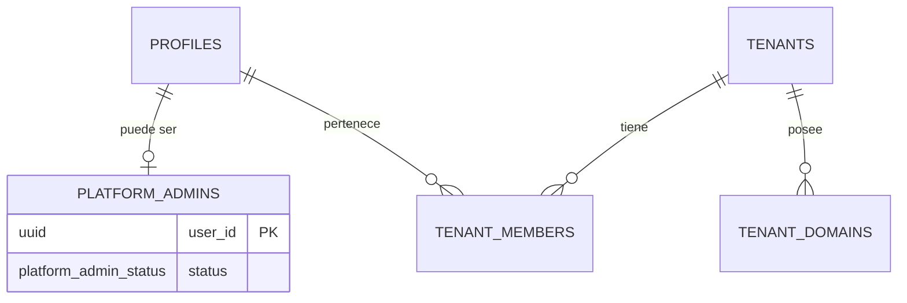

# SPEC — Phase 04 — Super Admin

## 1. Información general

```text
Phase:                04
Nombre:               Super Admin
Estado:               COMPLETED
Versión:              1.1.0
Fecha creación:       2026-08-25
Última actualización: 2026-08-25
Responsable:          alejandro.avendano@masuno.pe
```

Documento maestro: §9, §10, §12, §22, §29, §33 (Fase 4), §34, §35, §36, §37, §42, §45, §49.
Fases previas: [00](./phase-00-foundation.md) · [01](./phase-01-multitenancy.md) · [02](./phase-02-authentication.md) · [03](./phase-03-authorization-rls.md) — todas COMPLETED.

---

## 2. Objetivo

### ¿Por qué existe esta fase?

Hasta aquí no hay forma de crear una empresa. Las tres fases anteriores
construyeron el aislamiento, la identidad y los permisos, pero un tenant solo
existe si alguien lo inserta a mano por SQL.

Esta fase cierra el circuito que §49 define como la primera meta del proyecto:

```text
Super Admin -> Crear Tenant -> dominio -> OWNER -> Login -> Dashboard
            -> y Tenant A no puede acceder a Tenant B
```

### La distinción que gobierna toda la fase

§29: **`SUPER_ADMIN` de CloverCode nunca es `OWNER` de un tenant.** Son dos
identidades distintas, en tablas distintas, con caminos distintos. Un owner con
todos los permisos de su empresa no tiene ninguno sobre la plataforma, y un
operador de plataforma no es miembro de ninguna empresa por el hecho de
administrarla.

### ¿Qué debe ser posible al terminarla?

```text
- Un operador de CloverCode entra a /super-admin y ve todos los tenants.
- Crea una empresa y en UNA transacción quedan: tenant + dominio de sistema +
  membresía OWNER.
- Suspende y reactiva una empresa.
- Consulta los dominios y los usuarios de cualquier empresa.
- Nada de lo anterior es alcanzable por un usuario normal, ni siquiera owner.
```

---

## 3. Alcance

### Incluido

```text
SA-01  Tabla platform_admins (identidad de plataforma, separada)
SA-02  Función is_platform_admin()
SA-03  Políticas RLS de plataforma sobre tenants, tenant_domains, tenant_members
SA-04  Función provision_tenant() transaccional e idempotente
SA-05  Funciones de consulta: listado de tenants y detalle
SA-06  Server Actions: crear, activar, suspender, archivar
SA-07  Área /super-admin protegida
SA-08  UI: listado, alta y detalle de tenant
SA-09  Capa TypeScript de plataforma (requirePlatformAdmin)
SA-10  Tests, incluido "un owner no es un operador de plataforma"
```

### Fuera de alcance

```text
OUT-01  Cliente service_role                     -> ver §11, se descarta
OUT-02  Invitar/crear cuentas de usuario nuevas  -> Fase 05
OUT-03  tenant_settings y tema                   -> Fase 06
OUT-04  Verificación real de dominios / Vercel   -> Fase 09
OUT-05  Planes, módulos, métricas, logs, soporte -> Fases 21-24
OUT-06  Editar el slug de un tenant existente    -> ver KL
OUT-07  Dashboard del tenant                     -> Fase 05
```

Nota sobre §33: el provisionamiento debe crear «default settings». La tabla
`tenant_settings` es de la Fase 06 y no existe. Esta fase crea tenant, dominio
de sistema y owner; la Fase 06 extenderá `provision_tenant()` con los ajustes.
Se documenta en lugar de inventar una tabla fuera de fase.

---

## 4. Dependencias

```text
Phase 01  tenants, tenant_domains, SYSTEM_DOMAIN
Phase 02  profiles, tenant_members, sesión SSR, proxy
Phase 03  roles, permissions, has_permission, políticas de tenant
```

---

## 5. Casos de uso

### UC-401 — Listar empresas

```text
Actor:            Operador de plataforma
Acción:           Abre /super-admin/tenants
Resultado:        Ve TODAS las empresas con estado, dominio y nº de miembros
Errores posibles: Sin sesión -> /login; con sesión pero sin ser operador -> 404
```

### UC-402 — Crear empresa (§49)

```text
Actor:            Operador de plataforma
Precondiciones:   El futuro owner ya tiene cuenta
Acción:           Nombre + slug + correo del owner
Resultado:        En una transacción: tenant, {slug}.clovercodeapp.com como
                  dominio system primario y verificado, y membresía OWNER
Errores posibles: Slug en uso -> ConflictError
                  Slug reservado o mal formado -> ValidationError
                  Correo sin cuenta -> NotFoundError
```

### UC-403 — Suspender y reactivar

```text
Actor:            Operador de plataforma
Acción:           Suspende Sugu Rolls
Resultado:        status = suspended. El sitio sigue resolviendo (Fase 01) para
                  poder mostrar aviso, pero la empresa queda marcada.
```

### UC-404 — Un owner intenta entrar al área de plataforma

```text
Actor:            OWNER de Sugu Rolls, autenticado
Acción:           Navega a /super-admin/tenants
Resultado:        404. No 403: un 403 confirmaría que el área existe.
```

### UC-405 — Un owner intenta leer otra empresa por API

```text
Actor:            OWNER de Sugu Rolls
Acción:           SELECT sobre tenants
Resultado:        Solo su empresa. Ser owner no acerca a la plataforma.
```

---

## 6. Requerimientos funcionales

```text
FR-401  Existirá `platform_admins`, separada de `tenant_members`.
FR-402  Su PK será el user_id, FK a profiles con ON DELETE CASCADE.
FR-403  Tendrá un `status` para poder revocar sin borrar el registro.
FR-404  `is_platform_admin()` no aceptará parámetro de usuario.
FR-405  Será SECURITY DEFINER con search_path fijado y sin EXECUTE a PUBLIC.
FR-406  Las políticas de plataforma serán ADICIONALES a las de la Fase 03.
FR-407  Un operador podrá SELECT sobre todos los tenants.
FR-408  Un operador podrá INSERT y UPDATE sobre tenants.
FR-409  Ningún rol podrá DELETE sobre tenants: se archivan (§41).
FR-410  Un operador podrá leer y escribir tenant_domains.
FR-411  Un operador podrá leer tenant_members de cualquier tenant.
FR-412  `provision_tenant()` creará tenant + dominio system + owner atómicamente.
FR-413  Será idempotente: repetirla con el mismo slug no duplica ni rompe (§37).
FR-414  Exigirá ser operador de plataforma; si no, lanzará.
FR-415  El dominio de sistema será `{slug}.clovercodeapp.com`, primario y con
        verification_status = 'active'.
FR-416  El owner recibirá role = 'owner' y status = 'active'.
FR-417  `/super-admin` exigirá sesión Y condición de operador.
FR-418  Un usuario autenticado que no sea operador recibirá 404 en esa área.
FR-419  Cada Server Action de plataforma revalidará la condición.
FR-420  El listado mostrará estado, dominio primario y nº de miembros.
FR-421  Las acciones destructivas pedirán confirmación (§36).
FR-422  Toda pantalla tendrá empty state (§35).
```

---

## 7. Requerimientos no funcionales

```text
NFR-401 Seguridad
  - La condición de operador no se infiere de ningún rol de tenant.
  - Sin service_role: el área usa RLS como todo lo demás (§11).
  - El área responde 404 y no 403, para no confirmar su existencia.

NFR-402 Integridad
  - El provisionamiento es una función SQL, no tres llamadas desde la
    aplicación: un fallo a la mitad dejaría una empresa sin owner.

NFR-403 Auditabilidad
  - Cada operación de plataforma emite un evento estructurado con el operador.

NFR-404 Accesibilidad
  - Tablas con encabezados asociados, foco visible, confirmación accesible.
```

---

## 8. Modelo de datos

### platform_admins

```text
user_id     uuid                   PK, FK profiles(id) ON DELETE CASCADE
status      platform_admin_status  NOT NULL default 'active'
note        text                   NULL
created_at  timestamptz            NOT NULL
updated_at  timestamptz            NOT NULL

enum platform_admin_status: active | revoked
```

Tabla propia y no una columna en `profiles` ni un rol en `tenant_members`: §29
exige que las dos identidades no se confundan, y una tabla separada hace que
confundirlas sea imposible por estructura, no por disciplina.

`revoked` en vez de DELETE: quién tuvo acceso de plataforma y cuándo dejó de
tenerlo es información auditable.

### Políticas que añade esta fase

```text
platform_admins   solo la fila propia, y solo lectura. La concesión de
                  privilegio de plataforma NO es alcanzable por la API.

tenants           platform_select / platform_insert / platform_update
tenant_domains    platform_select / platform_insert / platform_update
tenant_members    platform_select
```

Ninguna política de DELETE en ninguna: los tenants se archivan.

`tenant_members` es de solo lectura para la plataforma **a propósito**: cambiar
la membresía de una empresa es asunto de esa empresa. El único camino por el que
un operador crea una membresía es `provision_tenant()`, que crea al primer owner
porque sin él la empresa nacería inaccesible.

---

## 9. Diagrama de relaciones



Las dos aristas que salen de `PROFILES` son independientes: ser operador no
implica membresía y ser owner no implica operador.

---

## 10. Tenant Isolation

```text
Tenant Isolation Impact: ALTO — esta fase introduce la ÚNICA identidad que
cruza la frontera entre tenants a propósito.
```

```text
¿Cómo se determina el tenant?
  El operador lo elige explícitamente. No hay tenant implícito en el área de
  plataforma; cada acción lo recibe como parámetro.

¿Cómo evita RLS el acceso cross-tenant?
  Para los usuarios normales, exactamente igual que en la Fase 03: nada cambia.
  Las políticas de plataforma son ADICIONALES y su predicado es
  is_platform_admin(), que no tiene nada que ver con la membresía. Un usuario
  sin fila en platform_admins ve exactamente lo mismo que antes de esta fase.

¿Existe algún recurso global?
  Sí, y es el punto de la fase: el operador de plataforma ve todos los tenants.
  Es la excepción deliberada, acotada a una tabla de una sola columna
  significativa y comprobada por función guardada.

Invariante que los tests deben preservar
  Un OWNER con todos los permisos de su empresa sigue sin ver ninguna otra.
  Ser owner nunca se acerca a ser operador.
```

---

## 11. Seguridad

```text
AB-401  Un owner se concede privilegio de plataforma.
        Mitigación: platform_admins no tiene política de INSERT ni UPDATE. Solo
        se puebla por migración o por acceso directo a la base de datos.

AB-402  Confundir SUPER_ADMIN con OWNER al comprobar.
        Mitigación: is_platform_admin() no mira tenant_members en absoluto.

AB-403  Descubrir el área de plataforma por su respuesta.
        Mitigación: 404 y no 403 para un usuario autenticado sin privilegio.

AB-404  Provisionamiento a medias tras un fallo.
        Mitigación: una sola función SQL; la transacción revierte entera.

AB-405  Doble envío del formulario de alta crea dos empresas.
        Mitigación: la función es idempotente por slug (§37).

AB-406  Escalada usando el service_role.
        Mitigación: esta fase NO introduce el cliente service_role. Se
        evaluó y se descartó: con políticas de plataforma no hace falta, y
        una clave que ignora RLS es un radio de impacto que no se justifica
        mientras exista alternativa. Queda para la fase que demuestre
        necesitarlo (crear cuentas por API, Fase 05).

AB-407  Un operador revocado conserva acceso.
        Mitigación: la función exige status = 'active'.
```

---

## 12. API / Server Actions

```text
createTenantAction(formData)     name, slug, ownerEmail
setTenantStatusAction(formData)  tenantId, status  (active|suspended|archived)

Ambas: requirePlatformAdmin() antes de nada, y de nuevo en la función SQL.
```

Funciones SQL:

```text
is_platform_admin()                          -> boolean
provision_tenant(p_name, p_slug, p_owner_email) -> tenant_id
list_platform_tenants()                      -> tenants + dominio + nº miembros
```

---

## 13. UI / UX

```text
/super-admin                   redirige al listado
/super-admin/tenants           listado; empty state; badge de estado
/super-admin/tenants/new       formulario de alta
/super-admin/tenants/[id]      detalle: dominios, miembros, activar/suspender
```

Estados por pantalla: loading (skeleton), empty, error (alert), success.
Las acciones de suspender y archivar piden confirmación explícita (§36).

---

## 14. Flujos principales

```text
ALTA DE EMPRESA (§49)
  /super-admin/tenants/new
      |
  requirePlatformAdmin()
      |
  Zod: nombre, slug, correo
      |
  provision_tenant()  [transacción]
      |-- ¿es operador?            no -> excepción
      |-- ¿existe el slug?         sí -> devuelve el tenant existente (idempotente)
      |-- insert tenants
      |-- insert tenant_domains    {slug}.clovercodeapp.com, system, primario, activo
      |-- ¿existe el correo?       no -> excepción
      |-- insert tenant_members    role = owner
      |
  redirect al detalle
```

---

## 15. Manejo de errores

```text
Sin sesión                       -> redirect a /login
Con sesión, sin privilegio       -> 404
Slug ya usado                    -> el tenant existente (idempotencia), no error
Slug inválido o reservado        -> ValidationError 422
Correo del owner sin cuenta      -> NotFoundError 404
Fallo de la transacción          -> DatabaseError 500, nada se crea
```

---

## 16. Observabilidad

```text
platform.tenant.provisioned   info  { tenantId, slug, operatorId }
platform.tenant.status_changed info { tenantId, from, to, operatorId }
platform.access.denied        warn  { pathname, userId }
```

---

## 17. Testing Plan

```text
Unit / Integration
TEST-401  requirePlatformAdmin lanza cuando no hay privilegio.
TEST-402  Las Server Actions validan su entrada con Zod.
TEST-403  Un fallo de consulta se convierte en DatabaseError.

Esquema
TEST-404  platform_admins existe con PK, FK y enum.
TEST-405  is_platform_admin es SECURITY DEFINER, search_path fijado, sin PUBLIC.
TEST-406  No hay política de INSERT ni UPDATE en platform_admins.

RLS / Authorization — OBLIGATORIOS
TEST-407  Un operador ve TODOS los tenants.
TEST-408  Un operador con status revoked no ve ninguno.
TEST-409  Un OWNER sigue viendo solo su empresa.
TEST-410  Un owner NO es operador de plataforma.
TEST-411  Un operador NO es miembro de ningún tenant por serlo.
TEST-412  Un usuario normal no lee platform_admins de otros.
TEST-413  Nadie puede concederse privilegio de plataforma vía API.
TEST-414  Nadie puede borrar un tenant.

Provisionamiento
TEST-415  Crea tenant + dominio system + owner en una transacción.
TEST-416  El dominio queda primario, system y verificado.
TEST-417  Es idempotente: dos llamadas con el mismo slug -> un tenant.
TEST-418  Un no-operador no puede invocarla.
TEST-419  Con un correo sin cuenta, no crea NADA (atomicidad).
TEST-420  Un slug reservado es rechazado por la base de datos.

Meta del proyecto (§49)
TEST-421  Flujo completo: crear tenant, resolver su dominio, y verificar que
          su owner no alcanza al otro tenant.
```

---

## 18. Edge Cases

```text
EC-401  Provisionar con un slug existente -> devuelve el tenant existente.
EC-402  Provisionar con un correo sin cuenta -> nada se crea.
EC-403  Operador revocado a mitad de sesión -> la siguiente acción falla.
EC-404  Tenant archivado -> sigue listándose para la plataforma; deja de
        resolver por hostname (Fase 01).
EC-405  El owner asignado ya es miembro del tenant -> no se duplica.
EC-406  Dos altas simultáneas con el mismo slug -> UNIQUE decide; una gana.
EC-407  Operador sin fila en profiles -> imposible: la FK lo impide.
```

---

## 19. Performance considerations

```text
El listado hace una consulta con agregados sobre tenants + dominios + miembros.
A escala de cientos de tenants es irrelevante; a escala de miles habrá que
paginar (§18 exige paginar listados). Documentado como limitación con
disparador, no resuelto especulativamente.
```

---

## 20. Migraciones

```text
20260825140000_create_platform_admins.sql
  - enum platform_admin_status, tabla, trigger, RLS, política de fila propia
  - is_platform_admin()

20260825140100_create_platform_policies.sql
  - políticas de plataforma sobre tenants, tenant_domains, tenant_members

20260825140200_create_tenant_provisioning.sql
  - provision_tenant()
  - list_platform_tenants()
```

---

## 21. Rollback

```text
drop function public.list_platform_tenants();
drop function public.provision_tenant(text, text, text);
drop policy ... (las 7 de plataforma)
drop function public.is_platform_admin();
drop table public.platform_admins;
drop type public.platform_admin_status;
```

Revertir deja el sistema sin forma de crear empresas. Los tenants ya creados
siguen funcionando. Riesgo: **MEDIO**.

---

## 22. Definition of Done

```text
- [ ] platform_admins con enum, FK y trigger
- [ ] is_platform_admin() endurecida
- [ ] Políticas de plataforma, sin DELETE en ninguna
- [ ] platform_admins sin política de escritura
- [ ] provision_tenant() transaccional e idempotente
- [ ] list_platform_tenants()
- [ ] Capa TypeScript de plataforma
- [ ] Área /super-admin protegida, 404 para no operadores
- [ ] UI: listado, alta, detalle, con empty y confirmación
- [ ] src/types/database.ts actualizado
- [ ] Tests de esquema, RLS, provisionamiento y §49
- [ ] Typecheck / Lint / Format / Build PASS
- [ ] ADR de la identidad de plataforma
- [ ] SPEC actualizado con el resultado real
```

---

## 23. Implementation notes

### 23.1 Resultado de las validaciones

```text
Format PASS · Lint PASS (0/0) · Types PASS · Tests 541/541 (23 archivos) · Build PASS
```

Rutas compiladas: 12 + Proxy. Las cuatro nuevas son `/super-admin`,
`/super-admin/tenants`, `/super-admin/tenants/new` y `/super-admin/tenants/[id]`.

```text
  25  database/platform.test.ts   <- añadidos en esta fase
 516  heredados
 541  total
```

### 23.2 La decisión que cambió respecto al plan

Las fases 00–03 difirieron el cliente `service_role` «a la Fase 04». Al llegar
aquí se reconsideró y **se descartó**.

El motivo por el que parecía necesario era que un operador de plataforma debe
leer y escribir en todos los tenants, y RLS lo impide. Pero eso es exactamente
para lo que existe una política. `is_platform_admin()` expresa la autoridad con
precisión, y las políticas de plataforma son **aditivas**: la visibilidad de un
usuario normal es idéntica byte a byte a la que tenía antes de esta fase, cosa
que los tests comprueban.

Una clave `service_role` ignora RLS por completo. Introducirla significa que
cualquier fallo futuro en el código que la sostenga es un compromiso total en
vez de uno acotado. Mientras una política haga el trabajo, la clave es radio de
impacto injustificado. Queda para la fase que demuestre una necesidad que la
base de datos no pueda cubrir. «El plan decía Fase 04» no es razón para añadir
una llave maestra.

### 23.3 Desviaciones respecto al diseño original

| #   | Diseño                                             | Implementación                                       | Motivo                                                                                                        |
| --- | -------------------------------------------------- | ---------------------------------------------------- | ------------------------------------------------------------------------------------------------------------- |
| 1   | §33 pide crear «default settings» al provisionar   | No se crean                                          | `tenant_settings` es de la Fase 06 y no existe. Se documenta en vez de inventar una tabla fuera de fase.      |
| 2   | OUT-01 esperaba introducir el cliente service_role | Descartado                                           | Ver §23.2. Registrado en ADR-011.                                                                             |
| 3   | La confirmación de acciones destructivas con JS    | Casilla de verificación obligatoria en el formulario | Mantiene la página como Server Component y funciona sin JavaScript. §36 pide confirmación, no un `confirm()`. |

### 23.4 Tests preexistentes actualizados

Añadir las políticas de plataforma invalidó tres aserciones de fases anteriores
que afirmaban la ausencia de políticas. Ninguna se debilitó:

```text
isolation.test.ts   "tenant_domains sin políticas"  ->  "solo políticas de
                    plataforma; ningún usuario de tenant las alcanza"
isolation.test.ts   "tenants tiene exactamente una" ->  "toda política de
                    tenants está predicada por is_tenant_member o
                    is_platform_admin, y no hay ninguna de DELETE"
schema.test.ts      listas de migraciones, tablas y enums ampliadas
```

Durante esa actualización se encontró un fallo en mi propia consulta de test:
comprobaba solo `qual`, pero una política de INSERT no tiene `qual`, solo
`with_check`. Habría dado por buena una política que nunca llegó a inspeccionar.
Corregido con `coalesce(qual, with_check)`.

### 23.5 Decisión registrada

```text
docs/adr/011-platform-identity.md
```

---

## 24. Known limitations

```text
KL-401  No hay forma de crear ni invitar cuentas desde el producto. El
        propietario que se asigna debe existir ya. Owner: Fase 05.

KL-402  Conceder autoridad de plataforma requiere acceso directo a la base de
        datos: `platform_admins` no tiene política de escritura. Es correcto
        para un puñado de personas; necesitaría un flujo real si el equipo
        creciera.

KL-403  El listado de empresas no está paginado. §18 exige paginar listados.
        Aceptable con cientos de tenants; disparador: si el listado supera unos
        cientos de filas, paginar.

KL-404  No se puede editar el slug de un tenant existente. Cambiarlo invalidaría
        su dominio de sistema y rompería enlaces. Requiere migración de dominio,
        no un UPDATE. Owner: Fase 09.

KL-405  «Ver usuarios» del §33 se cubre con el contador de miembros y la lectura
        de `tenant_members`; el listado con identidades usa
        `get_tenant_members`, que exige `members.view` en ese tenant y por
        tanto no está disponible para el operador. Owner: Fase 05, si se
        confirma que soporte lo necesita.

KL-406  Un tenant puede quedarse sin owner si su último owner se retira
        (heredado de KL-301). El provisionamiento crea el primero, pero nada
        impide eliminarlo después.

KL-407  Las migraciones siguen sin ejecutarse contra Supabase real.

KL-408  Los cambios de esta fase están sin commitear.
```

---

## 25. Future considerations

```text
- Fase 05 debe decidir la cuestión del service_role al implementar invitaciones.
  Si se introduce, debe quedar tras `server-only`, no reexportarse desde ningún
  barrel, y usarse en la superficie más pequeña posible.
- Fase 06 debe extender provision_tenant() con los ajustes por defecto.
- Fase 09 debe resolver el cambio de slug como migración de dominio.
- Fase 24 debe registrar las operaciones de plataforma en audit_logs: hoy solo
  quedan en el log estructurado.
- Si el soporte necesita ver identidades de miembros, es una decisión de
  exposición de datos personales y merece su propia función guardada, no
  ampliar una existente.
```
