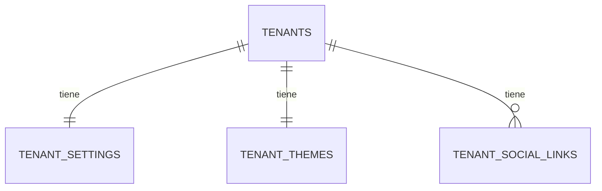

# SPEC — Phase 06 — Business Settings + Theme

## 1. Información general

```text
Phase:                06
Nombre:               Business Settings + Theme
Estado:               COMPLETED
Versión:              1.1.0
Fecha creación:       2026-08-25
Última actualización: 2026-08-25
Responsable:          alejandro.avendano@masuno.pe
```

Documento maestro: §5, §7, §9, §10, §12, §22, §30, §32, §33 (Fase 6), §34, §39, §40, §42.
Fases previas: 00 · 01 · 02 · 03 · 04 · 05 — todas COMPLETED y auditadas.

---

## 2. Objetivo

### ¿Por qué existe esta fase?

Hasta aquí un tenant es un nombre y un slug. Todo lo que hace que una empresa se
parezca a sí misma —su RUC, su teléfono, su moneda, su zona horaria, sus
colores, su logo— no existe en ninguna parte.

Esa carencia bloquea tres fases posteriores: la web pública (07) no tiene qué
mostrar, el SEO (08) no tiene metadata de dónde salir, y la facturación (17) no
puede emitir un documento sin RUC ni moneda.

Es además la primera fase que guarda **archivos**, así que es donde se decide
cómo se aísla el almacenamiento entre empresas.

### ¿Qué debe ser posible al terminarla?

```text
- Que cada empresa tenga su ficha: identidad fiscal, contacto, moneda, zona horaria.
- Que tenga su tema: colores, tipografía, radios.
- Que tenga sus redes sociales, ordenadas.
- Que suba su logo y su favicon a una ruta que solo ella puede tocar.
- Que solo quien tiene settings.manage pueda cambiar nada de lo anterior.
- Que una empresa nueva nazca con todo esto ya creado.
```

---

## 3. Alcance

### Incluido

```text
BS-01  Tabla tenant_settings (identidad, contacto, localización)
BS-02  Tabla tenant_themes (colores, tipografía, radios)
BS-03  Tabla tenant_social_links (redes, ordenadas)
BS-04  RLS: lectura para miembros, escritura con settings.manage
BS-05  Bucket de Storage por convención tenants/{tenant_id}/...
BS-06  Políticas de Storage acotadas por tenant
BS-07  Validación de tamaño y MIME antes de subir
BS-08  provision_tenant() crea ajustes y tema por defecto
BS-09  Capa TypeScript + validación Zod (RUC, moneda, timezone, color)
BS-10  UI de configuración del negocio y del tema
BS-11  Shim de storage en el arnés, para poder probar sus políticas
BS-12  Tests, incluidos los de aislamiento de archivos
```

### Fuera de alcance

```text
OUT-01  Aplicar el tema a la web pública          -> Fase 07
OUT-02  Metadata y SEO por tenant                 -> Fase 08
OUT-03  Banners y galerías                        -> Fase 07
OUT-04  Horarios de atención                      -> Fase 10 (locations)
OUT-05  Configuración de SUNAT                    -> Fase 17
OUT-06  Recorte de imagen en el navegador         -> no planificado
```

Nota sobre §33: la lista de la fase incluye «dirección» y «horarios». La
dirección se guarda como texto de la sede fiscal; los **horarios** pertenecen a
`locations` (Fase 10), donde tienen sentido por sucursal. Se documenta en lugar
de duplicar el concepto.

---

## 4. Dependencias

```text
Phase 01  tenants
Phase 03  has_permission (settings.manage), is_tenant_member
Phase 04  provision_tenant (se extiende aquí)
Phase 05  layout del panel donde cuelgan las pantallas
```

---

## 5. Casos de uso

### UC-601 — Editar la ficha del negocio

```text
Actor:            Propietario
Acción:           Cambia RUC, teléfono y moneda
Resultado:        Se guarda; el resto de miembros lo ve
Errores posibles: RUC con formato inválido -> error de campo
                  Moneda desconocida -> error de campo
```

### UC-602 — Un miembro sin permiso

```text
Actor:            Cajero
Acción:           Abre la configuración
Resultado:        404. `settings.manage` lo tiene solo el propietario.
```

### UC-603 — Subir el logo

```text
Actor:            Propietario
Acción:           Sube un PNG de 300 KB
Resultado:        Queda en tenants/{tenant_id}/branding/logo.png
Errores posibles: Tipo no permitido o mayor de 2 MB -> error de campo
```

### UC-604 — Intentar escribir en la carpeta de otra empresa

```text
Actor:            Propietario de Sugu Rolls
Acción:           Sube a tenants/{id-de-otra}/branding/logo.png
Resultado:        Denegado por la política de Storage
```

### UC-605 — Empresa recién creada

```text
Actor:            Operador de plataforma
Acción:           Provisiona una empresa
Resultado:        Nace con ajustes y tema por defecto, no con filas ausentes
```

---

## 6. Requerimientos funcionales

```text
FR-601  tenant_settings tendrá tenant_id como PK: una ficha por empresa.
FR-602  Guardará nombre comercial, razón social y RUC.
FR-603  El RUC será opcional pero, si existe, tendrá 11 dígitos (Perú).
FR-604  Guardará teléfono, WhatsApp, email de contacto y dirección.
FR-605  Guardará moneda ISO 4217 y zona horaria IANA.
FR-606  La moneda por defecto será PEN y la zona America/Lima.
FR-607  tenant_themes tendrá tenant_id como PK.
FR-608  Guardará color primario, de acento y de fondo, en formato hex.
FR-609  Guardará familia tipográfica y radio de borde.
FR-610  Todo color se validará con CHECK en la base de datos.
FR-611  tenant_social_links guardará plataforma, URL y orden.
FR-612  Una plataforma no podrá repetirse dentro de la misma empresa.
FR-613  La URL será https, validada por CHECK.
FR-614  Las tres tablas tendrán RLS habilitada.
FR-615  Un miembro activo podrá LEER las tres.
FR-616  Solo settings.manage podrá escribir en las tres.
FR-617  Existirá un bucket privado `tenant-assets`.
FR-618  La ruta será tenants/{tenant_id}/{carpeta}/{archivo}.
FR-619  Una política de Storage exigirá que el primer segmento sea `tenants` y
        el segundo un tenant donde el usuario tenga settings.manage.
FR-620  La lectura de un asset exigirá pertenencia al tenant.
FR-621  Se validará MIME y tamaño en el servidor antes de subir.
FR-622  provision_tenant() creará ajustes y tema por defecto.
FR-623  Seguirá siendo idempotente.
FR-624  La UI exigirá settings.manage y dará 404 sin él.
```

---

## 7. Requerimientos no funcionales

```text
NFR-601 Seguridad
  - El tenant_id de la ruta de Storage NO se toma del cliente: se resuelve del
    contexto y se compara dentro de la política.
  - MIME y tamaño se validan en servidor; el navegador no decide.
  - Un archivo de otra empresa no se lee ni se escribe.

NFR-602 Integridad
  - Un color inválido no puede llegar a la base de datos.
  - Una empresa no puede quedarse sin ficha: provisioning la crea.

NFR-603 Localización
  - §40: los timestamps siguen en UTC; la zona del tenant es para MOSTRAR.
  - §39: aquí solo se guarda el CÓDIGO de moneda, ningún importe.
```

---

## 8. Modelo de datos

### tenant_settings

```text
tenant_id       uuid PK, FK tenants ON DELETE CASCADE
legal_name      text NULL          razón social
trade_name      text NULL          nombre comercial
tax_id          text NULL          RUC
contact_email   text NULL
phone           text NULL
whatsapp        text NULL
address_line    text NULL
district        text NULL
city            text NULL
currency        char(3) NOT NULL default 'PEN'
timezone        text NOT NULL default 'America/Lima'
created_at / updated_at

CHECK tax_id ~ '^[0-9]{11}$'
CHECK currency ~ '^[A-Z]{3}$'
CHECK timezone ~ '^[A-Za-z][A-Za-z0-9_+-]*(/[A-Za-z0-9_+-]+)*$'
CHECK contact_email formato
```

### tenant_themes

```text
tenant_id        uuid PK, FK tenants ON DELETE CASCADE
primary_color    text NOT NULL default '#16a34a'
accent_color     text NOT NULL default '#0ea5e9'
background_color text NOT NULL default '#ffffff'
font_family      text NOT NULL default 'system'
border_radius    text NOT NULL default 'md'
logo_path        text NULL      ruta en Storage, no URL
favicon_path     text NULL
created_at / updated_at

CHECK cada color ~ '^#[0-9a-f]{6}$'
CHECK border_radius IN ('none','sm','md','lg','full')
```

Se guarda la **ruta** y no la URL: una URL firmada caduca, y una pública ata la
fila al dominio del proyecto. La URL se deriva al leer.

### tenant_social_links

```text
id           uuid PK
tenant_id    uuid FK tenants ON DELETE CASCADE
platform     social_platform NOT NULL
url          text NOT NULL
position     smallint NOT NULL default 0

UNIQUE (tenant_id, platform)
CHECK url ~ '^https://'
INDEX (tenant_id, position)

enum social_platform: facebook instagram tiktok x youtube linkedin
```

Tabla y no JSONB: es un grupo repetido con orden, exactamente lo que §7 dice que
debe ser relacional.

### Storage

```text
bucket: tenant-assets (privado)
ruta:   tenants/{tenant_id}/{carpeta}/{archivo}
        carpetas: branding | products | banners | documents

Políticas sobre storage.objects:
  select  -> is_tenant_member(tenant de la ruta)
  insert  -> has_permission(tenant de la ruta, 'settings.manage')
  update  -> ídem
  delete  -> ídem
```

El tenant sale del **segundo segmento de la ruta**, y la política lo compara con
los permisos del que llama. Un cliente puede pedir cualquier ruta; solo las
suyas pasan.

---

## 9. Diagrama de relaciones



---

## 10. Tenant Isolation

```text
Tenant Isolation Impact: ALTO — primera fase con archivos.
```

```text
¿Qué tablas llevan tenant_id?
  Las tres. En settings y themes ES la clave primaria, así que una empresa no
  puede tener dos fichas ni una ficha huérfana.

¿Cómo evita RLS el acceso cross-tenant?
  Igual que la Fase 03: is_tenant_member para leer, has_permission para
  escribir. Sin predicados nuevos que auditar.

¿Y los archivos?
  Es lo nuevo. La ruta lleva el tenant_id y la política lo extrae y lo compara.
  El aislamiento de Storage NO depende de que la aplicación construya bien la
  ruta: aunque la construyera mal, la política rechaza.

¿Existe algún recurso global?
  El bucket, que es uno solo para toda la plataforma. Su contenido está
  particionado por la primera carpeta.
```

---

## 11. Seguridad

```text
AB-601  Escribir en la carpeta de otra empresa.
        Mitigación: la política extrae el tenant de la ruta y exige permiso EN
        ESE tenant. Probado.

AB-602  Leer los documentos de otra empresa.
        Mitigación: el bucket es privado y la lectura exige pertenencia.

AB-603  Subir un ejecutable disfrazado de imagen.
        Mitigación: lista blanca de MIME en servidor y límite de tamaño, más
        el límite del propio bucket.

AB-604  Recorrido de ruta (`tenants/x/../../otro`).
        Mitigación: la ruta la construye el servidor a partir del tenant
        resuelto; el nombre de archivo se sanea y no acepta separadores.

AB-605  Un cajero cambia la moneda o el RUC.
        Mitigación: escritura exige settings.manage, que solo tiene el owner.

AB-606  Inyectar CSS mediante un color.
        Mitigación: CHECK de formato hex en la base de datos; el valor nunca
        llega crudo a una hoja de estilos.
```

---

## 12. API / Server Actions

```text
updateBusinessSettingsAction(prev, formData) -> FormState
updateThemeAction(prev, formData)            -> FormState
upsertSocialLinkAction(prev, formData)       -> FormState
uploadBrandingAssetAction(prev, formData)    -> FormState

Todas: requireActiveTenant + requirePermission(settings.manage).
Ninguna acepta un tenant_id del cliente: sale del segmento de URL ya verificado.
```

---

## 13. UI / UX

```text
/dashboard/[tenantSlug]/configuracion       ficha del negocio
/dashboard/[tenantSlug]/configuracion/tema  colores, tipografía, logo
```

Ambas exigen `settings.manage` y responden 404 sin él. Entrada de navegación
visible solo con el permiso.

---

## 14. Flujos principales

```text
GUARDAR AJUSTES
  formulario -> requireActiveTenant(slug)
             -> requirePermission(tenant, settings.manage)
             -> Zod (RUC, moneda, timezone)
             -> update tenant_settings   [RLS vuelve a comprobar]
             -> revalidate

SUBIR LOGO
  archivo -> validar MIME y tamaño en servidor
          -> ruta = tenants/{tenant.id}/branding/logo.{ext}
          -> upload   [la política de Storage vuelve a comprobar]
          -> guardar la RUTA en tenant_themes.logo_path
```

---

## 15. Manejo de errores

```text
Sin settings.manage              -> 404
RUC / moneda / color inválidos   -> error de campo
MIME no permitido                -> error de campo
Archivo demasiado grande         -> error de campo
Fallo de Storage                 -> ExternalServiceError 502
Fallo de la consulta             -> DatabaseError 500
```

---

## 16. Observabilidad

```text
settings.updated        info  { tenantId, userId }
theme.updated           info  { tenantId, userId }
asset.uploaded          info  { tenantId, folder, bytes }
asset.rejected          warn  { tenantId, reason }
```

Nunca se registra el contenido del archivo ni su nombre original completo.

---

## 17. Testing Plan

```text
Esquema
TEST-601  Las tres tablas existen con PK, FK y CHECK.
TEST-602  Un RUC que no sean 11 dígitos es rechazado.
TEST-603  Un color que no sea hex de 6 es rechazado.
TEST-604  Una moneda que no sean 3 mayúsculas es rechazada.
TEST-605  Una URL de red social sin https es rechazada.
TEST-606  Una plataforma repetida en la misma empresa es rechazada.
TEST-607  Borrar el tenant arrastra las tres tablas.

RLS
TEST-608  Un miembro lee los ajustes de SU empresa.
TEST-609  Un miembro NO lee los de otra.
TEST-610  Sin settings.manage no se puede escribir.
TEST-611  Con settings.manage se escribe en la propia empresa.
TEST-612  Con settings.manage NO se escribe en otra empresa.
TEST-613  Un anónimo no lee ninguna de las tres.

Storage
TEST-614  Con settings.manage se sube a la carpeta propia.
TEST-615  NO se sube a la carpeta de otra empresa.
TEST-616  Un miembro lee un asset propio.
TEST-617  Un miembro NO lee un asset ajeno.
TEST-618  Una ruta que no empieza por `tenants` se rechaza.

Provisioning
TEST-619  Una empresa nueva nace con ajustes y tema.
TEST-620  provision_tenant sigue siendo idempotente.

Validación
TEST-621  El esquema Zod rechaza RUC, moneda, timezone y color inválidos.
TEST-622  La validación de archivo rechaza MIME y tamaño fuera de política.
TEST-623  El nombre de archivo se sanea y no admite separadores de ruta.
```

---

## 18. Edge Cases

```text
EC-601  Empresa creada antes de esta fase -> la migración crea su ficha.
EC-602  Logo reemplazado -> misma ruta, se sobrescribe; no se acumulan huérfanos.
EC-603  Timezone con formato válido pero inexistente -> se valida en la app
        con Intl; la base de datos solo comprueba la forma.
EC-604  Color en mayúsculas (#FFFFFF) -> se normaliza a minúsculas.
EC-605  Red social con URL de otra plataforma -> se acepta: validar el dominio
        de cada red es frágil y se rompe cuando cambian de dominio.
EC-606  Archivo sin extensión -> se deriva del MIME validado.
```

---

## 19. Performance considerations

```text
Ajustes y tema son una fila por empresa, leídas por PK. Nada que optimizar.
Las redes sociales se leen por (tenant_id, position), con índice.
Los assets se sirven por URL firmada; su caducidad se decide al leer.
```

---

## 20. Migraciones

```text
20260825160000_create_tenant_settings.sql   settings + themes + social links, RLS
20260825160100_create_tenant_storage.sql    bucket y políticas de storage.objects
20260825160200_extend_provisioning.sql      provision_tenant crea defaults +
                                            retro-relleno de tenants existentes
```

---

## 21. Rollback

```text
drop policy ... on storage.objects (las 4);
delete from storage.buckets where id = 'tenant-assets';
drop table public.tenant_social_links, public.tenant_themes, public.tenant_settings;
drop type public.social_platform;
-- provision_tenant vuelve a su versión de la Fase 04
```

Riesgo: **MEDIO-ALTO**. Es la primera fase cuyo rollback puede dejar archivos
huérfanos en el bucket. Borrar el bucket destruye los assets de todos los
tenants; el rollback debe conservarlo salvo decisión explícita.

---

## 22. Definition of Done

```text
- [ ] Tres tablas con constraints e índices
- [ ] RLS: lectura por miembro, escritura por settings.manage
- [ ] Bucket privado y políticas de Storage por tenant
- [ ] Shim de storage en el arnés
- [ ] Validación de MIME, tamaño y nombre de archivo
- [ ] provision_tenant extendido y retro-relleno
- [ ] Capa TypeScript + Zod
- [ ] UI de configuración y de tema, con permiso
- [ ] Tests de esquema, RLS, Storage y provisioning
- [ ] Typecheck / Lint / Format / Build PASS
- [ ] SPEC actualizado con el resultado real
```

---

## 23. Implementation notes

### 23.1 Resultado

```text
Format PASS · Lint PASS (0/0) · Types PASS · Tests 638/638 (28 archivos) · Build PASS
```

```text
  37  database/settings-storage.test.ts   <- añadidos
  31  unit/asset-validation.test.ts       <- añadidos
 570  heredados
 638  total
```

### 23.2 Storage: el aislamiento no depende de la aplicación

La decisión central de la fase. El tenant va **en la ruta**, y la política lo
extrae de ahí:

```text
tenants/{tenant_id}/{carpeta}/{archivo}
                ^
        la política lee ESTE segmento y exige permiso en ese tenant
```

Aunque la aplicación construyera una ruta equivocada, la política evaluaría
**esa** ruta y la rechazaría. El aislamiento no descansa en que el código
componga bien un string.

Para poder probarlo se añadió un shim de `storage` al arnés: `buckets`,
`objects` y `storage.foldername`. No es una reimplementación de Storage —subidas,
URLs firmadas y el protocolo reanudable son del servicio real— pero **sí** es fiel
en la parte que decide quién puede tocar qué fila, que es la que vale la pena
probar.

### 23.3 Dos huecos que encontraron los tests

**Recorrido de ruta.** `tenants/{A}/../{B}/branding/logo.png` **pasaba**: el
segundo segmento seguía siendo A, así que la política autorizaba contra A
mientras la clave se leía como si fuera de B. Supabase guarda la clave literal,
así que hoy no cruza — pero cualquier componente que normalice la ruta después
(un CDN, un backend compatible con S3, un script de migración) haría que cruzara.
Ahora se rechaza cualquier segmento `..`, `.` o vacío en toda la ruta.

**Tenants sin ficha.** El SPEC preveía un retro-relleno de una sola vez. El test
lo reveló insuficiente: la Fase 04 da al operador de plataforma una política de
INSERT sobre `tenants`, así que un alta directa habría creado una empresa sin
ajustes. Se añadió un **trigger**, con lo que «toda empresa tiene ficha y tema»
pasa a ser propiedad de la base de datos y no costumbre de un camino de código.
Ninguna lectura del producto necesita un fallback.

### 23.4 Decisiones de seguridad menos obvias

```text
- El bucket es privado. Uno público serviría cualquier objeto a quien tuviera
  la URL, que es "aislamiento" hasta que alguien adivina la ruta.

- image/svg+xml NO está permitido en branding. Un SVG es un documento que puede
  llevar script, y servirlo desde el propio origen del tenant sería XSS
  almacenado.

- La extensión sale del MIME validado, nunca del nombre del archivo subido, que
  es controlado por quien sube y es la vía habitual para colar un tipo erróneo.

- Se guarda la RUTA y no la URL: una URL firmada caduca y una pública ata la
  fila al dominio del proyecto.

- El color se valida con CHECK en la base de datos, así que nunca puede llegar
  texto arbitrario a una hoja de estilos.
```

### 23.5 Desviaciones

| #   | Diseño en el SPEC                               | Implementación                             | Motivo                                                                                   |
| --- | ----------------------------------------------- | ------------------------------------------ | ---------------------------------------------------------------------------------------- |
| 1   | Retro-relleno de una sola vez                   | Retro-relleno **más** trigger              | El retro-relleno no cubre altas posteriores por la política de la Fase 04. Ver §23.3.    |
| 2   | `image/svg+xml` permitido en el bucket          | Permitido en el bucket, **no** en branding | El bucket es el techo; la lista por carpeta es la que decide. Un SVG de marca sería XSS. |
| 3   | El SPEC no contemplaba rechazar `..` en la ruta | Se rechaza en todos los segmentos          | Hallazgo del test. Ver §23.3.                                                            |

---

## 24. Known limitations

```text
KL-601  El shim de storage no reproduce subidas reales, URLs firmadas ni el
        protocolo reanudable. Prueba las POLÍTICAS, no el servicio. Owner: Fase 28.

KL-602  El límite de tamaño del bucket y el de la aplicación se mantienen a mano
        en dos sitios. Si divergen, gana el más restrictivo, que es el orden
        seguro, pero conviene revisarlos juntos.

KL-603  No hay limpieza de assets huérfanos. Reemplazar un logo sobrescribe la
        misma ruta, así que no se acumulan; borrar un tenant sí deja archivos.
        Owner: Fase 27.

KL-604  La UI de redes sociales no está construida: existen la tabla, las
        políticas, el esquema y la acción. Owner: Fase 07, que es quien las
        muestra.

KL-605  El tema se guarda pero todavía no se aplica a ninguna superficie. Su
        consumidor es la web pública. Owner: Fase 07.

KL-606  La zona horaria se valida con Intl en la aplicación; la base de datos
        solo comprueba la forma. Un CHECK no puede consultar pg_timezone_names.

KL-607  No se genera una URL firmada todavía: se guarda la ruta y la lectura
        del asset llega con la Fase 07.

KL-608  Los cambios de esta fase están sin commitear.
```

---

## 25. Future considerations

```text
- Fase 07 consume el tema y las redes: debe derivar la URL firmada desde
  logo_path, y aplicar los colores como variables CSS, nunca interpolando el
  valor en una hoja de estilos.
- Fase 08 tomará de tenant_settings el nombre comercial para la metadata.
- Fase 17 exigirá RUC y moneda antes de emitir: la validación ya está, falta el
  requisito de negocio.
- Cualquier carpeta nueva en el bucket debe añadir su lista blanca de MIME y su
  límite a `ALLOWED` y `MAX_BYTES`; el patrón ya está.
- Si se permite alguna vez subir SVG, tiene que servirse desde un origen
  distinto o pasar por un saneador; no basta con añadirlo a la lista.
```
