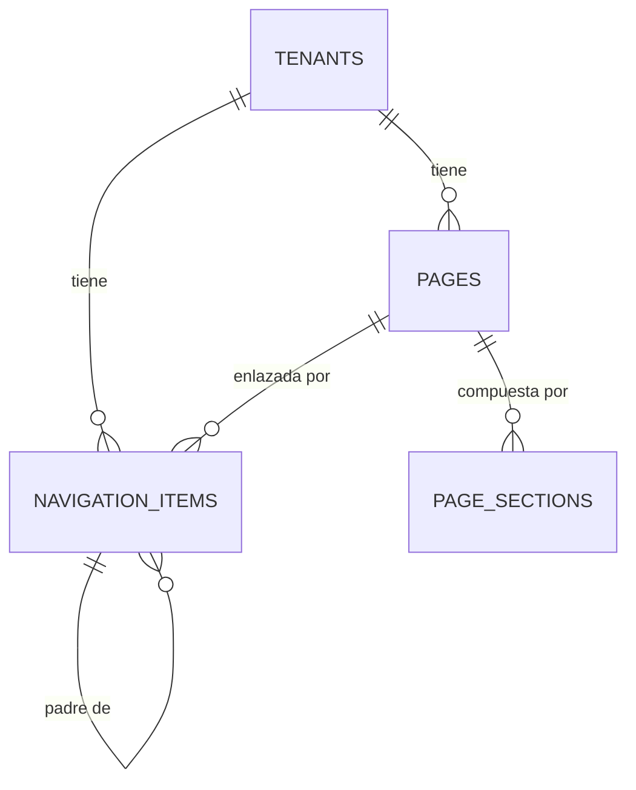

# SPEC — Phase 07 — Navigation + CMS

## 1. Información general

```text
Phase:                07
Nombre:               Navigation + CMS
Estado:               COMPLETED
Versión:              1.2.0
Fecha creación:       2026-08-25
Última actualización: 2026-08-25 (auditoría de fase, §26)
Responsable:          alejandro.avendano@masuno.pe
```

Documento maestro: §5, §7, §9, §10, §12, §18, §19, §22, §30, §33 (Fase 7), §34, §35, §42, §45.
Fases previas: 00 · 01 · 02 · 03 · 04 · 05 · 06 — todas COMPLETED y auditadas.

---

## 2. Objetivo

### ¿Por qué existe esta fase?

La Fase 06 le dio a cada empresa su identidad y su tema, pero no hay ninguna
página donde eso se vea. El resolver de la Fase 01 sabe traducir
`sugurolls.com` a un tenant desde el primer día y nadie lo ha usado todavía.

Esta fase cierra ese circuito: contenido administrable por el propio negocio, y
una web pública que lo sirve.

### La restricción que gobierna la fase

§33 lo dice en una línea: **«Evitar permitir HTML arbitrario peligroso.»**

Un CMS que acepta HTML es un CMS que acepta `<script>`. Y en una plataforma
multi-tenant eso es peor que en un blog: el script se sirve desde el dominio del
propio negocio, con sus cookies y su confianza. Por eso el contenido de esta
fase es **datos estructurados con forma fija**, nunca marcado.

### ¿Qué debe ser posible al terminarla?

```text
- Que un negocio cree páginas y las componga con secciones de tipos conocidos.
- Que ordene, active y desactive entradas de su navbar, con jerarquía padre/hijo.
- Que publique o deje en borrador.
- Que un visitante anónimo vea SOLO lo publicado, y solo de empresas activas.
- Que nada de lo que escriba un negocio pueda ejecutarse como código.
```

---

## 3. Alcance

### Incluido

```text
CM-01  Enums: page_status, section_type, nav_link_type
CM-02  Tabla pages (slug por tenant, estado)
CM-03  Tabla page_sections (tipo + contenido estructurado, ordenadas)
CM-04  Tabla navigation_items (jerarquía padre/hijo, orden, activo)
CM-05  Permisos content.view y content.manage en el catálogo
CM-06  RLS: miembros según permiso; ANÓNIMO solo lo publicado
CM-07  Función is_tenant_public() para la lectura anónima
CM-08  Guarda de ciclos y de profundidad en la jerarquía
CM-09  Validación por tipo de sección con Zod (sin HTML)
CM-10  Renderizador público por hostname
CM-11  Componentes de sección que NUNCA interpretan marcado
CM-12  UI de administración: páginas, secciones y navegación
CM-13  Tests: esquema, jerarquía, RLS anónima y ausencia de XSS
```

### Fuera de alcance

```text
OUT-01  Metadata y SEO por página        -> Fase 08 (crea el SEO, aquí solo el título)
OUT-02  Dominios personalizados          -> Fase 09 (el resolver ya existe)
OUT-03  Sección `products` con datos     -> Fase 11; aquí queda su envoltorio
OUT-04  Editor visual / arrastrar        -> no planificado
OUT-05  Versionado y borradores paralelos -> no planificado
OUT-06  Footer administrable             -> reutiliza navigation_items, Fase 08
OUT-07  Subida de imágenes desde el CMS  -> usa el Storage de la Fase 06
```

---

## 4. Dependencias

```text
Phase 01  resolve_tenant_by_domain (el renderizador público lo usa)
Phase 03  has_permission, catálogo de permisos (se amplía)
Phase 06  tenant_themes (colores del sitio), tenant_settings (nombre)
```

---

## 5. Casos de uso

### UC-701 — Crear una página

```text
Actor:            Propietario
Acción:           Crea "Nosotros" con slug `nosotros`
Resultado:        Página en borrador, invisible al público
Errores posibles: Slug repetido en la misma empresa -> error de campo
```

### UC-702 — Componer con secciones

```text
Actor:            Propietario
Acción:           Añade un hero y dos bloques de texto
Resultado:        Se guardan en orden, con contenido estructurado
Errores posibles: Un campo obligatorio del tipo falta -> error de campo
```

### UC-703 — Publicar

```text
Actor:            Propietario
Acción:           Cambia el estado a publicado
Resultado:        La página se sirve en el dominio del negocio
```

### UC-704 — Visitante anónimo

```text
Actor:            Cualquiera
Acción:           Abre sugurolls.clovercodeapp.com/nosotros
Resultado:        Ve la página publicada y el navbar activo
Errores posibles: Página en borrador -> 404
                  Empresa suspendida o archivada -> no se sirve contenido
```

### UC-705 — Jerarquía del navbar

```text
Actor:            Propietario
Acción:           Cuelga "Makis" de "Carta"
Resultado:        Se muestra anidado
Errores posibles: Colgar de un hijo (profundidad 3) -> rechazado
                  Colgar de sí mismo o crear un ciclo -> rechazado
```

### UC-706 — Intento de inyección

```text
Actor:            Propietario malicioso de su propia web
Acción:           Escribe `<script>fetch('/api')</script>` en un texto
Resultado:        Se muestra como TEXTO. No se ejecuta nada.
```

---

## 6. Requerimientos funcionales

```text
FR-701  pages tendrá UNIQUE (tenant_id, slug), nunca UNIQUE (slug).
FR-702  El slug será minúsculas, dígitos y guiones.
FR-703  pages tendrá estado draft | published.
FR-704  page_sections referenciará su página con ON DELETE CASCADE.
FR-705  Cada sección tendrá un `type` del enum y un `content` JSONB.
FR-706  El contenido se validará por tipo antes de escribirse.
FR-707  Ningún campo de contenido admitirá HTML: se guarda y se muestra texto.
FR-708  Las secciones estarán ordenadas por `position`.
FR-709  navigation_items admitirá jerarquía de DOS niveles como máximo.
FR-710  Un elemento no podrá ser su propio padre ni formar un ciclo.
FR-711  navigation_items tendrá `is_active` para ocultar sin borrar.
FR-712  Un elemento apuntará a una página propia o a una URL externa.
FR-713  Una URL externa será https.
FR-714  Se añadirán content.view y content.manage al catálogo.
FR-715  Un miembro con content.view podrá leer todo el contenido.
FR-716  Solo content.manage podrá escribir.
FR-717  El rol anónimo podrá leer SOLO páginas publicadas.
FR-718  El rol anónimo solo verá contenido de tenants con status `active`.
FR-719  El rol anónimo NO podrá escribir nada.
FR-720  El renderizador público resolverá el tenant por hostname.
FR-721  Una empresa suspendida mostrará aviso, no contenido.
FR-722  Los componentes de sección no usarán dangerouslySetInnerHTML.
FR-723  La administración exigirá content.manage y dará 404 sin él.
```

---

## 7. Requerimientos no funcionales

```text
NFR-701 Seguridad
  - Ningún camino permite almacenar ni renderizar marcado.
  - La lectura anónima está acotada por estado de página Y estado de tenant.
  - Un enlace externo no puede ser `javascript:`.

NFR-702 Performance
  - Una página pública son dos consultas: la página con sus secciones, y el
    navbar. Ambas por índice.
  - §18: los listados de administración se paginarán cuando haga falta.

NFR-703 Accesibilidad
  - El navbar público es <nav> con lista; los anidados van en <ul> anidada.
  - Cada sección aporta encabezados en orden, sin saltar niveles.
```

---

## 8. Modelo de datos

### pages

```text
id          uuid PK
tenant_id   uuid FK tenants ON DELETE CASCADE
slug        text NOT NULL
title       text NOT NULL
status      page_status NOT NULL default 'draft'
created_at / updated_at

UNIQUE (tenant_id, slug)
CHECK slug ~ '^[a-z0-9]([a-z0-9-]*[a-z0-9])?$'
CHECK char_length(slug) BETWEEN 1 AND 80
INDEX (tenant_id, status)

enum page_status: draft | published
```

### page_sections

```text
id          uuid PK
page_id     uuid FK pages ON DELETE CASCADE
tenant_id   uuid FK tenants ON DELETE CASCADE   -- denormalizado, ver abajo
type        section_type NOT NULL
content     jsonb NOT NULL default '{}'
position    smallint NOT NULL default 0
is_visible  boolean NOT NULL default true

INDEX (page_id, position)
CHECK jsonb_typeof(content) = 'object'

enum section_type: hero | text | image | banner | cta | gallery | products | faq
```

`tenant_id` está **denormalizado** a propósito. Sin él, cada política de esta
tabla tendría que unir con `pages` para saber de quién es la fila, y una
política que necesita un JOIN es una política más difícil de auditar y más
lenta. Un trigger lo mantiene sincronizado con la página, así que no puede
divergir.

`content` es JSONB, y §7 lo permite para «configuraciones dinámicas
justificadas»: cada tipo de sección tiene una forma distinta, y modelarlas en
ocho tablas sería peor. Lo que **no** se hace es aceptar cualquier cosa dentro:
la validación por tipo ocurre antes de escribir.

### navigation_items

```text
id          uuid PK
tenant_id   uuid FK tenants ON DELETE CASCADE
parent_id   uuid FK navigation_items ON DELETE CASCADE NULL
label       text NOT NULL
link_type   nav_link_type NOT NULL
page_id     uuid FK pages ON DELETE CASCADE NULL
external_url text NULL
position    smallint NOT NULL default 0
is_active   boolean NOT NULL default true

CHECK (link_type='page' AND page_id IS NOT NULL AND external_url IS NULL)
   OR (link_type='external' AND external_url IS NOT NULL AND page_id IS NULL)
CHECK external_url IS NULL OR external_url ~ '^https://'
CHECK parent_id IS NULL OR parent_id <> id
INDEX (tenant_id, parent_id, position)

enum nav_link_type: page | external
```

Profundidad y ciclos se imponen con un trigger: un CHECK no puede consultar
otras filas.

### Políticas RLS

```text
pages / page_sections / navigation_items
  select  authenticated -> has_permission(tenant_id, 'content.view')
  all     authenticated -> has_permission(tenant_id, 'content.manage')
  select  anon          -> solo publicado y de tenant activo
```

La política anónima es la novedad de la fase y la que más cuidado necesita: es
la primera vez que un rol sin sesión lee filas de negocio.

---

## 9. Diagrama de relaciones



---

## 10. Tenant Isolation

```text
Tenant Isolation Impact: ALTO — primera lectura ANÓNIMA de datos de negocio.
```

```text
¿Qué tablas llevan tenant_id?
  Las tres, incluida page_sections aunque podría deducirlo de su página.

¿Cómo evita RLS el acceso cross-tenant?
  Para miembros, igual que desde la Fase 03: has_permission por tenant.

  Para el anónimo es distinto y por eso se detalla: la política NO acota por
  tenant, porque un visitante no pertenece a ninguno. Acota por ESTADO: solo
  páginas `published`, y solo de tenants `active`. El tenant correcto lo elige
  el resolver por hostname, en la aplicación.

  Esa asimetría es deliberada. Si la política intentase adivinar el tenant del
  visitante, tendría que confiar en algo que el visitante controla. En su lugar
  la base de datos garantiza «esto es publicable», y la aplicación garantiza
  «esto es lo que corresponde a este hostname».

¿Qué pasa si el resolver falla?
  Se serviría contenido publicado de otra empresa: público, pero equivocado.
  Por eso el renderizador filtra SIEMPRE por el tenant resuelto, y hay un test
  que lo comprueba.
```

---

## 11. Seguridad

```text
AB-701  Guardar `<script>` en un texto y que se ejecute.
        Mitigación: el contenido es texto en datos estructurados y se renderiza
        con JSX, que escapa por defecto. No existe dangerouslySetInnerHTML en
        el árbol público; hay un test que lo verifica sobre el código fuente.

AB-702  Enlace `javascript:` en el navbar.
        Mitigación: CHECK exige https en la base de datos.

AB-703  Un visitante lee borradores.
        Mitigación: la política anónima exige status = 'published'.

AB-704  Un visitante lee contenido de una empresa suspendida.
        Mitigación: la política exige tenant activo, vía función guardada.

AB-705  Un visitante escribe.
        Mitigación: ninguna política de escritura menciona a anon.

AB-706  Ciclo en la jerarquía que cuelgue el renderizado.
        Mitigación: trigger que rechaza ciclos y profundidad > 2.

AB-707  Contenido de otra empresa servido por hostname equivocado.
        Mitigación: el renderizador filtra por el tenant resuelto, además de la
        política.

AB-708  Sección con un tipo válido y contenido de otro tipo.
        Mitigación: validación por tipo con Zod antes de escribir.
```

---

## 12. API / Server Actions

```text
createPageAction / updatePageAction / setPageStatusAction
upsertSectionAction / deleteSectionAction / reorderSectionsAction
upsertNavItemAction / deleteNavItemAction / toggleNavItemAction

Todas: requireActiveTenant + requirePermission(content.manage).
```

Sin endpoints HTTP nuevos. El sitio público son rutas de renderizado.

---

## 13. UI / UX

```text
Administración
  /dashboard/[tenantSlug]/contenido            listado de páginas
  /dashboard/[tenantSlug]/contenido/[pageId]   editor de secciones
  /dashboard/[tenantSlug]/navegacion           navbar

Público
  /sitio                 portada del tenant resuelto por hostname
  /sitio/[pageSlug]      página publicada
```

El sitio público vive bajo un grupo de rutas propio, con su propio layout: no
comparte la cabecera del panel ni su sesión.

---

## 14. Flujos principales

```text
PUBLICAR
  editor -> requirePermission(content.manage) -> update status
         -> revalidate

VISITA ANÓNIMA
  hostname -> resolve_tenant_by_domain()  [Fase 01]
           -> ¿tenant activo?  no -> aviso, sin contenido
           -> pages where tenant = resuelto AND slug AND published
           -> sections order by position
           -> navigation_items activos, jerarquía de 2 niveles
```

---

## 15. Manejo de errores

```text
Sin content.manage                 -> 404
Slug repetido en la empresa        -> error de campo
Contenido que no cumple su tipo    -> error de campo
Ciclo o profundidad > 2            -> error de campo
Hostname sin tenant                -> 404
Tenant suspendido                  -> aviso, no contenido
Página no publicada, visitante     -> 404
```

---

## 16. Observabilidad

```text
cms.page.created / cms.page.published   info { tenantId, pageId }
cms.section.saved                       info { tenantId, type }
cms.nav.saved                           info { tenantId }
site.page.miss                          debug { tenantId, slug }
```

---

## 17. Testing Plan

```text
Esquema
TEST-701  UNIQUE (tenant_id, slug): dos empresas pueden usar el mismo slug.
TEST-702  Slug con mayúsculas o espacios es rechazado.
TEST-703  Un enlace externo sin https es rechazado.
TEST-704  Un enlace de tipo page sin page_id es rechazado.
TEST-705  Un enlace de tipo external con page_id es rechazado.
TEST-706  Borrar una página arrastra sus secciones.
TEST-707  page_sections.tenant_id se mantiene igual al de su página.

Jerarquía
TEST-708  Un elemento no puede ser su propio padre.
TEST-709  Un ciclo de dos elementos es rechazado.
TEST-710  Colgar de un hijo (profundidad 3) es rechazado.
TEST-711  Padre e hijo en el mismo tenant es aceptado.
TEST-712  Un padre de OTRO tenant es rechazado.

RLS de miembros
TEST-713  Sin content.view no se lee.
TEST-714  Con content.view se lee, sin poder escribir.
TEST-715  Con content.manage se escribe.
TEST-716  Nadie escribe en otra empresa.

RLS anónima — LA NOVEDAD
TEST-717  Un anónimo lee una página publicada.
TEST-718  Un anónimo NO lee un borrador.
TEST-719  Un anónimo NO lee páginas de un tenant suspendido.
TEST-720  Un anónimo NO lee páginas de un tenant archivado.
TEST-721  Un anónimo NO puede insertar, actualizar ni borrar.
TEST-722  Un anónimo solo ve secciones de páginas publicadas.
TEST-723  Un anónimo solo ve elementos de navegación activos.

Contenido
TEST-724  El validador rechaza un contenido que no cumple su tipo.
TEST-725  El validador conserva el texto tal cual, sin escapar ni alterar.
TEST-726  Ningún componente público usa dangerouslySetInnerHTML.
```

---

## 18. Edge Cases

```text
EC-701  Dos empresas con el mismo slug de página -> permitido.
EC-702  Página publicada sin secciones -> se sirve vacía, no falla.
EC-703  Elemento de navegación que apunta a una página borrada -> cascada.
EC-704  Elemento de navegación a una página en borrador -> se oculta al público.
EC-705  Texto con `<script>` -> se muestra literal.
EC-706  Sección con tipo `products` -> se renderiza su envoltorio vacío hasta
        la Fase 11.
EC-707  Padre desactivado con hijos activos -> se ocultan todos.
```

---

## 19. Performance considerations

```text
La página pública son dos consultas: página+secciones y navegación. Ambas por
índice. Sin caché entre peticiones: publicar debe verse de inmediato, y la
caché de contenido público es de la Fase 26 con medición.
```

---

## 20. Migraciones

```text
20260825170000_create_cms_permissions.sql   content.view y content.manage
20260825170100_create_pages.sql             pages, page_sections, triggers, RLS
20260825170200_create_navigation.sql        navigation_items, guardas, RLS
20260825170300_create_public_read.sql       is_tenant_public() y políticas anon
```

---

## 21. Rollback

```text
drop policy ... (anon y miembros de las tres tablas);
drop function public.is_tenant_public();
drop table public.navigation_items, public.page_sections, public.pages;
drop type public.nav_link_type, public.section_type, public.page_status;
delete from public.role_permissions where permission like 'content.%';
delete from public.permissions where code like 'content.%';
```

Riesgo: **ALTO**. Revertir borra el contenido que los negocios hayan escrito.
A partir de aquí el rollback exige respaldo.

---

## 22. Definition of Done

```text
- [ ] Tres tablas con constraints, índices y triggers
- [ ] content.view y content.manage en el catálogo
- [ ] RLS de miembros por permiso
- [ ] RLS anónima: solo publicado, solo tenant activo, sin escritura
- [ ] Guarda de ciclos y profundidad
- [ ] Validación por tipo de sección
- [ ] Renderizador público por hostname
- [ ] Ningún dangerouslySetInnerHTML, verificado por test
- [ ] UI de administración de páginas, secciones y navegación
- [ ] Tests de esquema, jerarquía, RLS anónima y XSS
- [ ] Typecheck / Lint / Format / Build PASS
- [ ] SPEC actualizado con el resultado real
```

---

## 23. Implementation notes

### 23.1 Resultado

```text
Format PASS · Lint PASS (0/0) · Types PASS · Tests 711/711 (30 archivos) · Build PASS
```

```text
  43  database/cms.test.ts        <- añadidos
  22  unit/cms-sections.test.ts   <- añadidos
 646  heredados
 711  total
```

22 rutas + Proxy. Las dos nuevas superficies son `/sitio` y `/sitio/[pageSlug]`,
que es la primera vez que CloverCode sirve algo a alguien sin sesión.

### 23.2 Cómo se cumple «evitar HTML arbitrario peligroso»

No sanitizando marcado, sino **no aceptándolo nunca**. Cada campo de cada tipo de
sección es texto plano, una URL o una lista de objetos de texto plano. No existe
ningún campo `html` en ningún esquema, así que no hay nada que sanear y nada que
se pueda olvidar de sanear más adelante.

Lo que sí se guarda literal es lo que la persona escribió. Si teclea
`<script>`, se almacena tal cual y **JSX lo escapa al renderizar**, con lo que
aparece en su página como los caracteres que escribió. Es su contenido, no su
código. Escaparlo al guardar habría corrompido texto legítimo que simplemente
contiene ángulos.

La garantía se sostiene con tres capas:

```text
Esquema      no hay dónde poner marcado
Renderizado  todo pasa por JSX, que escapa
Test         TEST-726 recorre el código fuente del CMS y del sitio público y
             falla si aparece dangerouslySetInnerHTML o innerHTML
```

TEST-726 tuvo que refinarse: su primera versión falló porque el propio
comentario del renderizador **nombra** `dangerouslySetInnerHTML` para decir que
no se usa. Ahora quita los comentarios antes de mirar, y hay un segundo test que
comprueba que el detector sí atraparía un caso real — un guard que no puede
fallar no demuestra nada.

### 23.3 La lectura anónima, y por qué su política tiene otra forma

Es lo genuinamente nuevo de la fase. Todas las políticas anteriores responden
«¿pertenece ESTE usuario a ESTE tenant?». Un visitante no pertenece a ninguno,
así que la suya responde otra pregunta: **«¿es esta fila publicable?»** — página
`published`, de un tenant `active`.

Qué tenant debe ver el visitante **no lo decide la base de datos**, y es
deliberado: tendría que confiar en algo que el visitante controla. Lo decide el
resolver por hostname de la Fase 01, y el renderizador filtra por el tenant
resuelto. Dos garantías de dos capas distintas, y ninguna basta sola:

```text
sin la primera -> un fallo en la app serviría borradores
sin la segunda -> un fallo en la app serviría el contenido correcto de la
                  empresa equivocada
```

Detalle que se decidió con cuidado: un elemento de navegación que apunta a una
página en borrador **no se muestra**. El enlace daría 404 de todos modos, pero su
_etiqueta_ filtraría lo que el negocio está a punto de lanzar.

### 23.4 Correcciones durante la implementación

| #   | Qué pasó                                                            | Corrección                                                                                                                 |
| --- | ------------------------------------------------------------------- | -------------------------------------------------------------------------------------------------------------------------- |
| 1   | El resolver de assets usaba `getPublicUrl` sobre un bucket privado  | Devolvía URLs que nadie puede abrir, ni siquiera el visitante legítimo. Cambiado a firmar por lote con `createSignedUrls`. |
| 2   | El renderizador recibía una función síncrona para resolver imágenes | Firmar es asíncrono. Ahora la página firma todo primero y el componente consulta un `Map`.                                 |
| 3   | TEST-726 se detectaba a sí mismo                                    | Quita comentarios antes de buscar, y se añadió un test que verifica el detector.                                           |

### 23.5 Decisiones menos obvias

```text
- page_sections.tenant_id está DENORMALIZADO. Sin él cada política necesitaría
  un JOIN con `pages`, y una política con JOIN es más difícil de auditar. Un
  trigger lo sobrescribe con el tenant real de la página, así que la comodidad
  no puede convertirse en mentira: hay un test que le pasa un tenant ajeno y
  comprueba que se corrige.

- La jerarquía se limita a dos niveles con un trigger, no con un CHECK: un CHECK
  no puede consultar otras filas. Importa porque el renderizador recorre ese
  árbol y un ciclo colgaría la petición.

- El editor de secciones es un campo JSON, no un editor visual. Es honesto sobre
  qué es una sección — datos estructurados — y el esquema rechaza lo malformado
  señalando el campo. Un formulario por tipo llega cuando las formas se asienten.

- Los enlaces aceptan https o ruta interna. `//evil.com` se rechaza
  explícitamente: parece una ruta y navega fuera del sitio.
```

---

## 24. Known limitations

```text
KL-701  El editor de secciones es JSON. Funciona y valida, pero no es una
        interfaz que se le pueda dar a un dueño de restaurante sin explicar.
        Owner: SIN ASIGNAR. Se apuntó a la Fase 08 al cerrar esta fase, pero
        la Fase 08 es SEO + Metadata (§33) y un editor visual no es SEO.
        Reasignado en lugar de darse por hecho.

KL-702  No hay reordenar arrastrando: el orden es un número. Suficiente y
        aburrido, que para esto es una virtud.

KL-703  CERRADA por la Fase 11: la sección `products` renderiza el catálogo
        real. El renderizador sigue siendo síncrono y puro - recibe los
        productos por props, no los consulta - así que la garantía de que nada
        aquí interpreta markup se sigue comprobando leyendo un archivo.

KL-704  No se pueden subir imágenes desde el CMS: hay que usar la pantalla de
        la Fase 06 y pegar la ruta. Owner: SIN ASIGNAR, por el mismo motivo
        que KL-701. Los formularios de SEO de la Fase 08 heredan la misma
        limitación: se pega la ruta del archivo.

KL-705  RESUELTO en la auditoría de la fase (§26, A7-3): `/sitio` se excluyó
        del matcher del proxy.

KL-706  Sin caché de la web pública: publicar se ve de inmediato, a cambio de
        una consulta por visita. Medir antes de cachear (§26).

KL-707  El footer no es administrable todavía; reutilizará navigation_items.

KL-708  CERRADA por la Fase 08: el tema viaja como variables CSS en el
        atributo `style` del contenedor del sitio, nunca como hoja generada.

KL-710  DEFECTO ENCONTRADO EN LA FASE 08, no en esta. `signAssetPaths` firma
        como el visitante, que es anónimo, y `storage.objects` solo tenía
        política de lectura para miembros: ninguna imagen de ninguna web
        pública se veía para quien no estuviera logueado. Corregido en
        `20260825180200_create_public_site_reads.sql`. Anotado aquí porque
        el fallo nació en esta fase y la auditoría de esta fase no lo vio:
        se probó el renderizado, no la firma.

KL-709  Los cambios de esta fase están sin commitear.
```

---

## 25. Future considerations

```text
- Fase 08 añade metadata y SEO por página, y es donde el tema de la Fase 06
  debe empezar a aplicarse como variables CSS - nunca interpolando el color en
  una hoja de estilos.
- Cualquier tipo de sección nuevo añade su esquema y su caso en el renderizador.
  TEST-726 lo cubrirá automáticamente; el esquema es lo que hay que pensar.
- Si alguna vez se quiere texto enriquecido, la respuesta NO es aceptar HTML:
  es un formato estructurado propio (una lista de nodos con tipo) que el
  renderizador traduce a JSX.
- Fase 09 conecta dominios propios; el renderizador ya funciona con ellos
  porque el resolver de la Fase 01 no distingue.
```

---

## 26. Auditoría de la fase

Tres hallazgos. El primero rompía la web pública para una parte enorme de sus
visitantes, y ninguna de las 43 pruebas que escribí lo detectó.

### A7-1 — La web pública era invisible para cualquiera con sesión (corregido)

Las políticas públicas se concedieron `to anon`. Un visitante que **tiene sesión
en CloverCode** es `authenticated`, no `anon`, así que:

```text
pages_select_member  -> exige content.view en ESE tenant, que un extraño no tiene
pages_select_public  -> to anon, no aplica a authenticated
```

Sonda:

```text
usuario logueado ve paginas publicas de OTRO tenant: 0   (esperado >= 1)
el mismo contenido como anonimo:                     1
```

Es decir: **la web pública de todos los negocios funcionaba en una ventana
privada y no en el navegador de siempre.** Es la peor forma que tiene un fallo de
presentarse, porque quien lo reporta parece estar equivocado.

Por qué no lo vieron mis tests: los escribí preguntando «¿puede el anónimo ver
esto?» y «¿puede el miembro ver aquello?». Nunca pregunté por el tercer actor —
alguien con sesión que **no es miembro de ese tenant**— porque no lo había
modelado como un actor. Es exactamente el hueco que una auditoría existe para
encontrar.

La corrección es también el modelo más correcto: **«publicable» es propiedad de
la FILA, no de quien lee**. Esas filas las puede leer internet entero de forma
anónima, así que concedérselas a un lector con sesión no añade exposición
ninguna. Las tres políticas son ahora `to anon, authenticated`.

### A7-2 — La web se veía distinta según quién mirara (corregido)

Un owner en su propia web veía entradas de navbar apuntando a **borradores**
(«Proximamente»), porque su política de miembro se las mostraba y
`getPublicNavigation` confiaba en que la política anónima las filtrara.

Un owner no podía usar su propio sitio como vista previa de lo que ven sus
clientes, que es justo para lo que lo va a usar.

Corregido filtrando por `status = 'published'` **en la consulta**, no delegando
en qué política resultó coincidir. La mitad de la garantía que le toca a la
aplicación no debe depender de la mitad que le toca a la base de datos.

### A7-3 — KL-705 era un defecto, no una limitación (corregido)

Lo había documentado como coste aceptable. Al revisarlo, el mismo razonamiento
que escribí para excluir `/api/health` del proxy aplica con **más** fuerza a la
web pública:

```text
/api/health   una llamada a Auth haría que una caída de Auth reporte la app caída
/sitio        una llamada a Auth acopla la web de CADA negocio a la
              disponibilidad del servicio de autenticación
```

Una caída de Auth no debería tumbar la carta de un restaurante. Y es la
superficie con más tráfico del producto, servida a visitantes que no tienen
sesión ni la necesitan.

Excluido del matcher. No se pierde nada: `/sitio` ya era prefijo público, así
que la rama de protección decidía «no requiere sesión» de todos modos, y el
refresco de sesión no lo necesita una página que no usa la sesión.

Se añadió `proxy-matcher.test.ts`: **un regex que nadie prueba es un regex que
deja de excluir lo que se escribió para excluir**. Incluye un caso que verifica
que la exclusión no es más ancha de lo previsto (`/dashboard/x/sitios` sigue
protegido).

### Tests preexistentes actualizados

Tres aserciones de la fase decían «un miembro sin permiso no ve nada» y «un
miembro nunca ve páginas de otro tenant». Con A7-1 corregido eso dejó de ser
cierto **a propósito**: una página publicada es pública. Se reescribieron para
expresar la línea más afilada, que es más fuerte que la anterior:

```text
antes  "no ve nada"                  -> ahora "solo ve lo ya publicado, nunca un borrador"
antes  "nunca ve otro tenant"        -> ahora "ve la WEB de otro tenant, jamas sus borradores"
```

### Revisado sin hallazgos

```text
- Ninguna política pública de escritura, para ningún rol.
- Borradores, tenants suspendidos y archivados siguen ocultos, también al
  lector con sesión.
- La jerarquía sigue rechazando ciclos, profundidad 3 y padres de otro tenant.
- TEST-726 sigue verde: nada en el CMS ni en el sitio interpreta marcado.
```

### Resultado

```text
Format PASS · Lint PASS · Types PASS · Tests 728/728 · Build PASS
```
