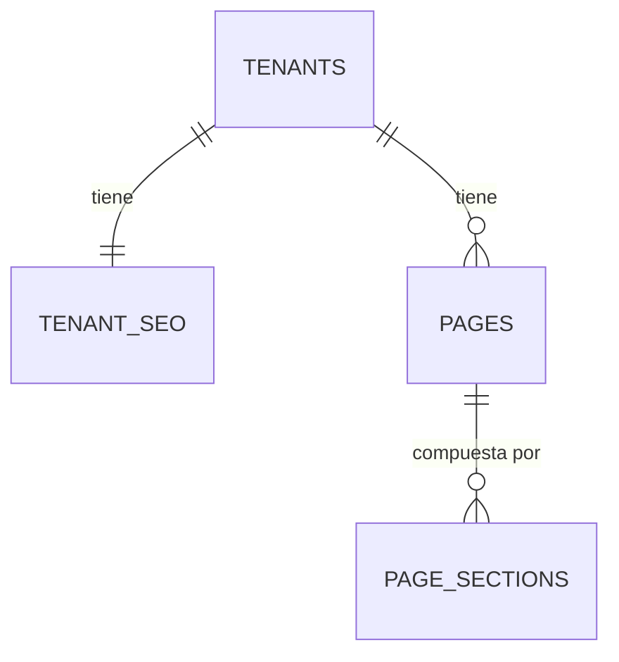

# SPEC — Phase 08 — SEO + Metadata

## 1. Información general

```text
Phase:                08
Nombre:               SEO + Metadata
Estado:               COMPLETED
Versión:              1.1.0
Fecha creación:       2026-08-25
Última actualización: 2026-08-25
Responsable:          alejandro.avendano@masuno.pe
```

Documento maestro: §4, §7, §9, §10, §18, §19, §22, §31, §32, §33 (Fase 8), §34, §40.
Fases previas: 00 a 07 — todas COMPLETED y auditadas.

---

## 2. Objetivo

### ¿Por qué existe esta fase?

La Fase 07 sirve la web de cada negocio, pero para un buscador todas esas webs
son la misma cosa anónima: mismo título por defecto, sin descripción, sin imagen
al compartir, sin sitemap, sin favicon propio.

§33 lo resume en una frase que es el criterio de toda la fase:

> **Cada tenant debe ser tratado como sitio independiente.**

No es un sitio con muchas secciones. Son muchos sitios, y cada uno tiene que
poder decirle a Google y a WhatsApp quién es.

### ¿Qué debe ser posible al terminarla?

```text
- Que cada empresa defina su título, descripción e imagen social.
- Que cada página los sobrescriba cuando le convenga.
- Que compartir un enlace en WhatsApp muestre la imagen y el texto correctos.
- Que cada sitio tenga su favicon, su sitemap.xml y su robots.txt.
- Que un negocio pueda pedir que NO lo indexen.
- Que un negocio suspendido no sea indexable.
- Que el tema de la Fase 06 por fin se vea.
```

---

## 3. Alcance

### Incluido

```text
SE-01  Tabla tenant_seo (1:1 con tenant)
SE-02  Columnas SEO en pages: seo_title, seo_description, og_image_path
SE-03  RLS: lectura pública, escritura con content.manage
SE-04  tenant_seo se crea con el tenant (trigger de la Fase 06)
SE-05  generateMetadata por hostname + pathname
SE-06  Cascada: página -> tenant -> valores por defecto
SE-07  OpenGraph y Twitter Card con imagen firmada
SE-08  Canonical absoluto sobre el dominio primario del tenant
SE-09  robots por tenant, respetando robots_index y el estado
SE-10  Favicon del tenant desde tenant_themes
SE-11  sitemap.xml por tenant, solo páginas publicadas
SE-12  robots.txt por tenant
SE-13  Structured data JSON-LD, con escapado seguro auditado
SE-14  Aplicación del tema de la Fase 06 (cierra KL-708)
SE-15  UI de SEO por sitio y por página
SE-16  Tests, incluido el de escapado del JSON-LD
```

### Fuera de alcance

```text
OUT-01  Dominios personalizados            -> Fase 09 (el canonical ya los usará)
OUT-02  Analítica y Search Console          -> Fase 23
OUT-03  Redirecciones 301 administrables    -> no planificado
OUT-04  hreflang / multi-idioma             -> no planificado
OUT-05  Structured data de producto         -> Fase 11
OUT-06  Optimización de imágenes            -> Fase 26
```

---

## 4. Dependencias

```text
Phase 01  resolve_tenant_by_domain, dominio primario del tenant
Phase 03  content.manage
Phase 06  tenant_themes (favicon, colores), tenant_settings (nombre, dirección)
Phase 07  pages, page_sections, renderizador público
```

---

## 5. Casos de uso

### UC-801 — SEO del sitio

```text
Actor:            Propietario
Acción:           Define título y descripción del sitio
Resultado:        Toda página sin SEO propio los hereda
```

### UC-802 — SEO de una página

```text
Actor:            Propietario
Acción:           Da a "Nosotros" su propio título
Resultado:        Esa página lo usa; el resto sigue heredando
```

### UC-803 — Compartir en WhatsApp

```text
Actor:            Un cliente del negocio
Acción:           Pega el enlace del sitio en un chat
Resultado:        Aparece la imagen, el título y la descripción del negocio
```

### UC-804 — Pedir no ser indexado

```text
Actor:            Propietario de un sitio en construcción
Acción:           Desactiva la indexación
Resultado:        robots noindex y robots.txt que lo desaconseja
```

### UC-805 — Sitemap

```text
Actor:            Un buscador
Acción:           Pide /sitemap.xml en el dominio del negocio
Resultado:        Solo las páginas publicadas de ESE negocio
```

### UC-806 — Negocio suspendido

```text
Actor:            Un buscador
Acción:           Rastrea el sitio de un negocio suspendido
Resultado:        noindex y sitemap vacío. Un sitio suspendido no se indexa.
```

---

## 6. Requerimientos funcionales

```text
FR-801  tenant_seo tendrá tenant_id como PK.
FR-802  Guardará site_title, site_description, og_title, og_description.
FR-803  Guardará og_image_path y twitter_image_path como RUTAS de Storage.
FR-804  Guardará robots_index booleano, por defecto true.
FR-805  Guardará google_verification.
FR-806  pages tendrá seo_title, seo_description y og_image_path.
FR-807  Las tres tablas SEO serán legibles públicamente, como el contenido.
FR-808  La escritura exigirá content.manage.
FR-809  Todo tenant tendrá su fila de SEO, creada por el trigger.
FR-810  La metadata se resolverá por hostname + pathname (§31).
FR-811  La cascada será: valor de página -> valor del tenant -> derivado.
FR-812  El título derivado usará el nombre comercial de la Fase 06.
FR-813  El canonical será absoluto sobre el dominio primario del tenant.
FR-814  Se emitirá OpenGraph y Twitter Card.
FR-815  La imagen social será una URL firmada del bucket privado.
FR-816  El favicon saldrá de tenant_themes.favicon_path.
FR-817  robots será noindex si robots_index es false.
FR-818  robots será noindex si el tenant no está activo.
FR-819  Existirá /sitemap.xml por hostname, con las páginas publicadas.
FR-820  Existirá /robots.txt por hostname.
FR-821  Un sitio no indexable tendrá sitemap vacío y robots.txt restrictivo.
FR-822  El JSON-LD escapará `<` para que no pueda cerrar su propio script.
FR-823  El tema del tenant se aplicará como variables CSS.
FR-824  Ningún color llegará a una hoja de estilos sin pasar por el CHECK.
FR-825  La UI de SEO exigirá content.manage y dará 404 sin él.
```

---

## 7. Requerimientos no funcionales

```text
NFR-801 Seguridad
  - El JSON-LD es el ÚNICO punto del sitio que inyecta contenido en un script.
    Va en un componente propio, con escapado, y con un test que intenta
    romperlo con `</script>`.
  - Los colores llegan como variables CSS en un atributo `style`, no como una
    hoja de estilos construida por concatenación.

NFR-802 Independencia por tenant
  - Ningún valor por defecto de la plataforma se filtra a un sitio de tenant:
    ni el nombre CloverCode, ni su favicon, ni su descripción.

NFR-803 Performance
  - La metadata reutiliza las consultas memoizadas por petición de la Fase 07:
    resolver el tenant y leer la página no se repiten.
```

---

## 8. Modelo de datos

### tenant_seo

```text
tenant_id            uuid PK, FK tenants ON DELETE CASCADE
site_title           text NULL
site_description     text NULL
og_title             text NULL
og_description       text NULL
og_image_path        text NULL
twitter_image_path   text NULL
robots_index         boolean NOT NULL default true
google_verification  text NULL
created_at / updated_at

CHECK longitudes razonables para cada texto
CHECK las rutas de imagen apuntan a la carpeta del PROPIO tenant
```

Las rutas se validan contra `tenant_id` de la misma fila, aplicando lo aprendido
en la auditoría de la Fase 06 (A6-2): comprobar solo la forma permitía guardar
una ruta de otra empresa.

### pages (columnas nuevas)

```text
seo_title        text NULL
seo_description  text NULL
og_image_path    text NULL
```

Nulos a propósito: null significa «hereda del sitio», que es distinto de una
cadena vacía, que significaría «déjalo en blanco».

### Políticas

```text
tenant_seo   select  anon + authenticated -> is_tenant_public(tenant_id)
             update  authenticated        -> has_permission(..., 'content.manage')
```

Sin INSERT ni DELETE, por lo aprendido en la auditoría de la Fase 06 (A6-1): la
fila la crea el trigger y no hay motivo para que la aplicación la destruya.

---

## 9. Diagrama de relaciones



Cascada de resolución:

```text
seo_title de la pagina
   |  null
site_title del tenant
   |  null
trade_name de tenant_settings
   |  null
nombre del tenant
```

---

## 10. Tenant Isolation

```text
Tenant Isolation Impact: MEDIO
```

```text
¿Qué tablas llevan tenant_id?
  tenant_seo, con tenant_id como clave primaria.

¿Cómo evita RLS el acceso cross-tenant?
  Lectura: is_tenant_public, igual que el contenido de la Fase 07 - y desde el
  principio para `anon` Y `authenticated`, aplicando lo aprendido en A7-1.
  Escritura: has_permission(content.manage).

Riesgo propio de esta fase
  Filtrar la identidad de la PLATAFORMA en el sitio de un tenant: que una web
  muestre "CloverCode" como título o el favicon de la plataforma. No es una
  fuga entre tenants, pero rompe la premisa de §33. Hay un test que lo cubre.

¿Y las imágenes sociales?
  Son rutas del bucket privado, firmadas al renderizar. El CHECK las ata a la
  carpeta del propio tenant.
```

---

## 11. Seguridad

```text
AB-801  Romper el script del JSON-LD con `</script>` dentro de un título.
        Mitigación: se serializa con JSON.stringify y se escapa `<` como
        \\u003c. Un test lo intenta con esa carga exacta.

AB-802  Inyectar CSS mediante un color del tema.
        Mitigación: CHECK de hex en la base de datos (Fase 06) y entrega como
        variables CSS en un atributo `style`, nunca concatenando una hoja.

AB-803  Apuntar la imagen social a la carpeta de otra empresa.
        Mitigación: CHECK contra el tenant_id de la propia fila.

AB-804  Un sitio suspendido queda indexado y sigue apareciendo en Google.
        Mitigación: noindex y sitemap vacío cuando el tenant no está activo.

AB-805  Un canonical apuntando a otro dominio.
        Mitigación: se construye desde el dominio primario del tenant, leído
        de la base de datos, nunca del hostname de la petición.
```

`google_verification` se emite como `<meta>`; se valida su forma para que no
pueda cerrar la etiqueta.

---

## 12. API / Server Actions

```text
updateTenantSeoAction(prev, formData) -> FormState
updatePageSeoAction(prev, formData)   -> FormState

Rutas generadas:
  GET /sitemap.xml   por hostname
  GET /robots.txt    por hostname
```

---

## 13. UI / UX

```text
/dashboard/[tenantSlug]/contenido/seo         SEO del sitio
/dashboard/[tenantSlug]/contenido/[pageId]    gana una sección de SEO
```

---

## 14. Flujos principales

```text
METADATA DE UNA PAGINA
  hostname -> resolve_tenant_by_domain()
           -> tenant_seo + pages.seo_*
           -> cascada pagina > tenant > derivado
           -> firmar og_image
           -> canonical sobre el dominio primario
           -> robots segun robots_index Y estado del tenant

SITEMAP
  hostname -> tenant -> ¿activo e indexable?
           -> no: documento vacio
           -> si: todas las paginas publicadas, con lastmod
```

---

## 15. Manejo de errores

```text
Sin content.manage             -> 404
Texto SEO demasiado largo      -> error de campo
Ruta de imagen ajena           -> error de campo
Hostname sin tenant            -> sitemap y robots vacios, no un 500
Fallo al firmar la imagen      -> se omite la imagen, la metadata se emite igual
```

---

## 16. Observabilidad

```text
seo.tenant.updated   info  { tenantId }
seo.page.updated     info  { tenantId, pageId }
seo.sitemap.served   debug { tenantId, pages }
```

---

## 17. Testing Plan

```text
Esquema
TEST-801  tenant_seo existe con PK y CHECKs.
TEST-802  robots_index es true por defecto.
TEST-803  Una ruta de imagen de OTRO tenant es rechazada.
TEST-804  pages gana las tres columnas SEO, nulas por defecto.
TEST-805  El trigger crea tenant_seo con el tenant.
TEST-806  Borrar el tenant arrastra su fila de SEO.

RLS
TEST-807  Un anónimo lee el SEO de un tenant activo.
TEST-808  Un usuario CON SESION tambien lo lee (leccion de A7-1).
TEST-809  Nadie lee el SEO de un tenant suspendido.
TEST-810  Sin content.manage no se escribe.
TEST-811  No hay política de INSERT ni DELETE (leccion de A6-1).

Cascada
TEST-812  El título de la página gana al del sitio.
TEST-813  Sin título de página se usa el del sitio.
TEST-814  Sin ninguno se deriva del nombre comercial.
TEST-815  Nunca aparece el nombre de la plataforma en el sitio de un tenant.

Robots y sitemap
TEST-816  robots_index false produce noindex.
TEST-817  Un tenant suspendido produce noindex aunque robots_index sea true.
TEST-818  El sitemap solo lista páginas publicadas.
TEST-819  El sitemap de un tenant no indexable va vacío.
TEST-820  Un hostname desconocido da un sitemap vacío, no un error.

Structured data — EL PUNTO DELICADO
TEST-821  El JSON-LD escapa `<` y no puede cerrar su propio script.
TEST-822  Una carga con `</script>` queda inerte.
TEST-823  El JSON-LD sigue siendo JSON válido tras el escapado.
TEST-824  Solo UN archivo del sitio usa dangerouslySetInnerHTML, y es ese.
```

---

## 18. Edge Cases

```text
EC-801  Página sin SEO y tenant sin SEO -> se deriva, nunca queda vacío.
EC-802  Descripción con saltos de línea -> se normaliza a una línea.
EC-803  Imagen social sin firmar -> se omite; la metadata se emite igual.
EC-804  Tenant sin dominio primario -> canonical desde el dominio de sistema.
EC-805  Título larguísimo -> se recorta al emitirlo, no al guardarlo.
EC-806  Sitio sin páginas -> sitemap con solo la portada si existe.
EC-807  google_verification con comillas -> rechazado por formato.
```

---

## 19. Performance considerations

```text
`generateMetadata` y el componente de página piden lo mismo, y ambas llamadas
están memoizadas por petición con cache(), así que es una consulta y no dos.
El sitemap es una consulta por índice (tenant_id, status).
```

---

## 20. Migraciones

```text
20260825180000_create_tenant_seo.sql   tabla, CHECKs, RLS, trigger, retro-relleno
20260825180100_add_page_seo.sql        columnas SEO en pages
```

---

## 21. Rollback

```text
alter table public.pages drop column seo_title, seo_description, og_image_path;
drop table public.tenant_seo;
-- el trigger de la Fase 06 vuelve a su version anterior
```

Riesgo: **MEDIO**. Se pierde el SEO escrito por los negocios; el contenido no.

---

## 22. Definition of Done

```text
- [x] tenant_seo con CHECKs atados al propio tenant
- [x] Columnas SEO en pages
- [x] RLS de lectura pública para anon Y authenticated
- [x] Sin INSERT ni DELETE en tenant_seo
- [x] Trigger y retro-relleno
- [x] generateMetadata por hostname + pathname con cascada
- [x] Canonical, OpenGraph, Twitter, favicon, robots
- [x] sitemap.xml y robots.txt por tenant
- [x] JSON-LD con escapado probado contra `</script>`
- [x] Tema aplicado como variables CSS
- [x] UI de SEO por sitio y por página
- [x] Tests, incluidos los de escapado y los de cascada
- [x] Typecheck / Lint / Format / Build PASS
- [x] SPEC actualizado con el resultado real
```

Resultado real:

```text
Format   PASS   prettier --check .
Lint     PASS   eslint --max-warnings=0
Types    PASS   next typegen && tsc --noEmit
Tests    PASS   819 tests, 37 archivos
Build    PASS   /sitemap.xml y /robots.txt como rutas dinámicas
```

---

## 23. Implementation notes

### Lo que se construyó

```text
supabase/migrations/
  20260825180000_create_tenant_seo.sql       tabla, CHECKs, RLS, trigger
  20260825180100_add_page_seo.sql            3 columnas en pages
  20260825180200_create_public_site_reads.sql  lo que un visitante puede leer

src/modules/seo/
  metadata.ts             la cascada, pura
  theme.ts                tema -> variables CSS
  structured-data.tsx     JSON-LD (la única excepción, ver ADR-012)
  schemas.ts              validación de los dos formularios
  server/queries.ts       lecturas públicas
  server/page-metadata.ts hostname + pathname -> Metadata
  server/actions.ts       las dos escrituras
  components/             formulario de sitio y de página

src/app/
  sitemap.ts              /sitemap.xml por hostname
  robots.ts               /robots.txt por hostname
  (site)/layout.tsx       metadata del sitio + tema + JSON-LD
  (site)/sitio/**         generateMetadata por página

docs/adr/012-structured-data-and-public-reads.md
```

### Tres decisiones que merecen explicarse

**1. La excepción del JSON-LD se declaró, no se escondió.**

Los datos estructurados solo se entregan dentro de un `<script>`, y React
escapa el texto de sus hijos, lo que rompería el JSON. La salida fácil era
poner ese componente fuera de los directorios que TEST-726 revisa. Se hizo lo
contrario: se **amplió** el detector para incluir `src/modules/seo` y se
añadió una lista blanca de un solo archivo, con TEST-824 comprobando que sigue
teniendo un solo nombre. El escapado se ataca directamente con una carga
`</script>` en TEST-821 a TEST-823. Una garantía que se cumple moviendo un
archivo no es una garantía.

**2. `tenant_settings` no recibió política pública.**

RLS es por fila, no por columna: publicar el nombre comercial habría publicado
el RUC, la razón social y el correo de contacto que viven en la misma fila. La
función `get_public_business_identity` devuelve cinco campos y ninguno fiscal.
Un test lo comprueba en dos direcciones - que la función no tiene esas columnas
y que un anónimo no lee la tabla.

**3. Se descubrió y corrigió un defecto de la Fase 07.**

El bucket es privado y la Fase 06 le dio una sola política de lectura, para
miembros. La Fase 07 construyó webs públicas que firman imágenes **como el
visitante**, que es anónimo. Comprobado empíricamente antes de escribir el
arreglo: `anon` veía **0 objetos**. Es decir, ningún logo, banner ni foto de
producto se veía en ninguna web pública - y solo para quien no estuviera
logueado, que es la peor forma de fallar. La Fase 08 lo habría heredado para el
og:image y el favicon, cuyo consumidor es un crawler sin sesión.

La política nueva cubre `branding`, `banners` y `products`, y deja fuera
`documents` a propósito.

### Un arreglo de fidelidad en el arnés de tests

El shim de `storage.foldername` devolvía todos los segmentos de la ruta; el
real descarta el último - el nombre del archivo. Nada dependía de la diferencia
hasta que esta fase leyó la carpeta del elemento 3. Se corrigió el shim, que es
exactamente el tipo de detalle que un doble de pruebas no puede permitirse
tener mal.

### Dos tests cambiaron de premisa

`settings-storage.test.ts` afirmaba que un anónimo no ve nada en `tenant_themes`
y que un miembro no ve ningún objeto de otro tenant. Ambas premisas cambiaron a
propósito y se reescribieron hacia el invariante más afilado: lo que sigue sin
ser público es la identidad fiscal y la carpeta `documents`.

---

## 24. Known limitations

```text
KL-801  Sin dominios propios todavía: el canonical usa el subdominio del
        sistema cuando no hay dominio verificado. Owner: Fase 09.

KL-802  No hay sitemap índice. Un negocio con miles de páginas superaría el
        límite de 50.000 URLs de un solo sitemap, algo muy lejos del caso de
        uso actual.

KL-803  El JSON-LD describe LocalBusiness, no productos ni menú. Owner: Fase 11.

KL-804  Los enlaces sociales de la Fase 06 no se emiten como `sameAs`. Es una
        mejora clara de SEO y se dejó fuera para no ampliar el alcance.

KL-805  El tema se aplica al contenedor, la cabecera y el pie. Las secciones
        del renderizador siguen usando los tokens por defecto en su mayoría.

KL-806  El favicon y la imagen social son URLs firmadas que caducan en una
        hora. La página que las contiene es dinámica, así que se renuevan en
        cada visita, pero un crawler que guarde la URL la verá caducar.

KL-807  `robots.txt` y `sitemap.xml` son dinámicos: una consulta por petición
        de crawler. Suficiente hoy; cachear es cosa de la Fase 26.

KL-808  Los cambios de esta fase están sin commitear.
```

---

## 25. Future considerations

```text
- Fase 09 traerá dominios propios: el canonical y el robots.txt ya los leen de
  `get_tenant_primary_domain`, así que empezarán a funcionar solos.
- Fase 11 puede añadir structured data de producto reutilizando el mismo
  componente y su escapado, sin ampliar la lista blanca.
- `sameAs` con los enlaces sociales es la mejora de SEO más barata pendiente.
- Una imagen social generada (OG dinámico) es posible con el runtime de Next,
  pero necesita una fuente propia y encaja mejor con la Fase 26.
```
