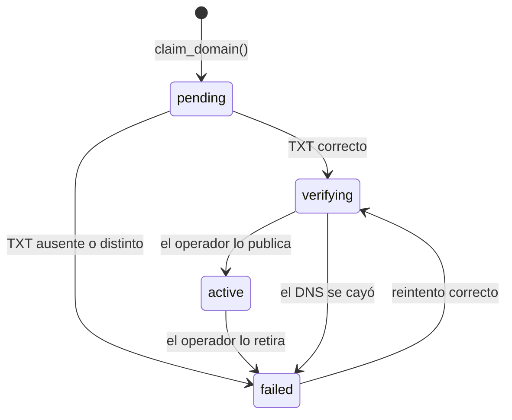

# SPEC — Phase 09 — Custom Domains

## 1. Información general

```text
Phase:                09
Nombre:               Custom Domains
Estado:               COMPLETED
Versión:              1.1.0
Fecha creación:       2026-08-25
Última actualización: 2026-08-25
Responsable:          alejandro.avendano@masuno.pe
```

Documento maestro: §9, §10, §22, §27, §33 (Fase 9), §36, §42, §45.
Fases previas: 00 a 08 — todas COMPLETED y auditadas.

---

## 2. Objetivo

### ¿Por qué existe esta fase?

Desde la Fase 01 cada negocio tiene `{slug}.clovercodeapp.com`. Funciona, pero
no es su dirección: un restaurante que reparte tarjetas quiere `sugurolls.com`.

La Fase 08 ya lee el dominio primario para construir el canonical. Esta fase es
la que permite que ese dominio sea uno propio.

### La frase que gobierna la fase

§33, Fase 9, textual:

> **Nunca asumir que agregar un registro a nuestra BD configura Vercel
> automáticamente.**

Es la regla de diseño entera. Insertar una fila en `tenant_domains` no hace que
el dominio funcione: hacen falta tres hechos independientes, y ninguno implica
al siguiente.

```text
1. El negocio es dueño del dominio        -> se prueba con DNS TXT
2. El DNS apunta a la plataforma          -> lo hace el negocio en su registrador
3. El proveedor sirve TLS para ese host   -> lo hace un operador en Vercel
```

Un sistema que trate estos tres como uno solo enseña "dominio activo" mientras
el visitante ve un error de certificado. El modelo de datos los guarda por
separado a propósito.

### ¿Qué debe ser posible al terminarla?

```text
- Que un negocio añada su propio dominio y vea qué registros DNS crear.
- Que compruebe él mismo si su DNS ya está bien, sin esperar a nadie.
- Que un operador vea qué dominios esperan trabajo del lado del proveedor.
- Que un dominio empiece a servir solo cuando los tres hechos son ciertos.
- Que elegir el dominio primario cambie el canonical de la Fase 08.
- Que nadie pueda reclamar un dominio que no es suyo, ni bloquearlo a su dueño.
```

---

## 3. Alcance

### Incluido

```text
CD-01  Permisos domains.view y domains.manage
CD-02  Columnas de verificación en tenant_domains
CD-03  Enum domain_provider_status y su columna
CD-04  claim_domain(): reclamar un dominio sin oráculo y sin secuestro
CD-05  Regla de reclamos caducados: un pending no bloquea para siempre
CD-06  record_domain_ownership_check(): el inquilino NUNCA activa un dominio
CD-07  set_primary_domain(): cambio atómico, solo entre dominios activos
CD-08  RLS: lectura por miembros, borrado acotado, cero UPDATE directo
CD-09  Verificación DNS TXT real, con el resolver inyectado
CD-10  Instrucciones DNS derivadas, no escritas a mano
CD-11  UI de dominios del negocio
CD-12  UI de dominios del operador, con el estado del proveedor
CD-13  Arreglo: el aprovisionamiento ya no se traga un conflicto de dominio
CD-14  Tests
```

### Fuera de alcance

```text
OUT-01  Llamadas reales a la API de Vercel        -> ADR-013, cuando haya token
OUT-02  Re-verificación periódica automática      -> Fase 24 (observabilidad)
OUT-03  Comodines (*.negocio.com)                 -> no planificado
OUT-04  Redirección apex <-> www                  -> la resuelve el registrador
OUT-05  Emisión de certificados                   -> es del proveedor, no nuestra
OUT-06  Compra de dominios                        -> no planificado
```

---

## 4. Dependencias

```text
Phase 01  tenant_domains, resolve_tenant_by_domain, normalizeHostname
Phase 03  has_permission, catálogo de permisos
Phase 04  platform_admins, políticas de plataforma, provision_tenant
Phase 08  get_tenant_primary_domain (el canonical ya lo consume)
```

---

## 5. Casos de uso

### UC-901 — Conectar un dominio propio

```text
Actor:       Propietario
Acción:      Añade sugurolls.com
Resultado:   Queda en `pending` con un token y las instrucciones de DNS
```

### UC-902 — Comprobar el DNS uno mismo

```text
Actor:       Propietario
Acción:      Pulsa "Comprobar DNS" tras crear el registro TXT
Resultado:   Si el token coincide pasa a `verifying`; si no, `failed` con el
             motivo. En ningún caso pasa a `active`.
```

### UC-903 — Poner el dominio en producción

```text
Actor:       Operador de plataforma
Acción:      Registra el dominio en el proveedor y lo marca activo
Resultado:   `active`. Desde ese momento resuelve tráfico.
```

### UC-904 — Cambiar el dominio primario

```text
Actor:       Propietario
Acción:      Marca sugurolls.com como primario
Resultado:   El subdominio del sistema deja de ser primario pero sigue
             resolviendo. El canonical de la Fase 08 cambia.
```

### UC-905 — Intento de secuestro

```text
Actor:       Un inquilino cualquiera
Acción:      Reclama un dominio que ya sirve otro negocio
Resultado:   Error genérico. No se le dice de quién es.
```

### UC-906 — Reclamo caducado

```text
Actor:       El dueño real de un dominio
Acción:      Reclama un dominio que otro dejó en `pending` hace meses
Resultado:   Lo consigue: un reclamo sin verificar caduca a los 7 días.
```

---

## 6. Requerimientos funcionales

```text
FR-901  Existirán domains.view y domains.manage.
FR-902  Solo owner y admin los tendrán por defecto.
FR-903  tenant_domains guardará verification_token, único por fila.
FR-904  Guardará verification_checked_at y last_error.
FR-905  Guardará provider_status y provider_synced_at.
FR-906  El token se generará en la base de datos, no en la aplicación.
FR-907  claim_domain() normalizará el dominio antes de nada.
FR-908  Rechazará cualquier dominio bajo el sufijo del sistema.
FR-909  Rechazará un dominio que ya sirve otro negocio, sin decir cuál.
FR-910  Liberará un reclamo ajeno sin verificar de más de 7 días.
FR-911  Un reclamo repetido del MISMO negocio será idempotente.
FR-912  record_domain_ownership_check() solo llevará a `verifying` o `failed`.
FR-913  Nunca escribirá `active`: eso es del operador.
FR-914  No degradará un dominio que ya está `active`.
FR-915  set_primary_domain() exigirá que el dominio esté `active`.
FR-916  Quitará el primario anterior y pondrá el nuevo en una transacción.
FR-917  Los miembros con domains.view leerán los dominios de SU negocio.
FR-918  No habrá política de UPDATE para inquilinos en tenant_domains.
FR-919  Se podrá borrar un dominio custom propio que no sea primario.
FR-920  El dominio del sistema no será borrable por el negocio.
FR-921  La verificación consultará el TXT real de _clovercode.<dominio>.
FR-922  El resolver será inyectable, para poder probar la lógica.
FR-923  Las instrucciones DNS se derivarán del dominio y del token.
FR-924  El operador verá y cambiará provider_status.
FR-925  provision_tenant fallará si su dominio de sistema es de otro.
```

---

## 7. Requerimientos no funcionales

```text
NFR-901 Seguridad
  - Un inquilino no puede activar un dominio. Ni por RPC, ni por UPDATE,
    ni por una política mal escrita: no existe la política.
  - Reclamar un dominio ajeno no revela de quién es.
  - Un reclamo sin verificar no bloquea al dueño real para siempre.

NFR-902 Honestidad de estado
  - La UI nunca dice "activo" por el hecho de existir la fila. Enseña los
    tres hechos por separado y cuál falta.

NFR-903 Operabilidad
  - El motivo del último fallo se guarda en texto legible, sin trazas.
```

---

## 8. Modelo de datos

### Enum nuevo

```text
domain_provider_status: unknown | requested | ready | error
```

`unknown` es el valor inicial y significa exactamente eso: no sabemos qué hay
del lado del proveedor. Ese es el estado sincero antes de que alguien mire.

### tenant_domains (columnas nuevas)

```text
verification_token      text  UNIQUE, NULL para los del sistema
verification_checked_at timestamptz NULL
last_error              text NULL
provider_status         domain_provider_status NOT NULL default 'unknown'
provider_synced_at      timestamptz NULL

CHECK  un dominio custom siempre tiene token
CHECK  un dominio del sistema nunca tiene token
CHECK  last_error <= 300 caracteres
```

### Estados y quién los escribe

```text
pending    claim_domain()                     el negocio
verifying  record_domain_ownership_check()    el negocio (prueba de DNS)
active     el operador                        SOLO el operador
failed     record_domain_ownership_check()    el negocio, o el operador
```

Esa columna de "quién" es la garantía de la fase. `resolve_tenant_by_domain`
solo sirve `active`, y `active` no es alcanzable desde una sesión de inquilino.

---

## 9. Diagrama de relaciones



---

## 10. Tenant Isolation

```text
Tenant Isolation Impact: ALTO
```

```text
¿Qué tablas llevan tenant_id?
  tenant_domains, ya desde la Fase 01.

¿Cómo evita RLS el acceso cross-tenant?
  Lectura: has_permission(tenant_id, 'domains.view').
  Borrado: has_permission(tenant_id, 'domains.manage') Y type='custom' Y no
  primario.
  Escritura: no hay política. Todo pasa por funciones SECURITY DEFINER que
  comprueban el permiso sobre el tenant DUEÑO de la fila, no sobre el que
  dice el cliente.

El riesgo propio de esta fase es peor que el habitual
  Un dominio es identidad global (§27: un dominio pertenece a exactamente un
  tenant). Un fallo aquí no filtra datos: entrega el TRÁFICO de un negocio a
  otro. Por eso `active` está fuera del alcance del inquilino, y por eso el
  reclamo comprueba el estado del dominio antes de cualquier otra cosa.

Y el riesgo inverso, que es fácil de olvidar
  Un reclamo sin verificar bloquea el dominio globalmente. Sin caducidad,
  cualquiera podría reservar `mcdonalds.pe` y su dueño no podría conectarlo
  jamás. La regla de los 7 días existe para eso.
```

---

## 11. Seguridad

```text
AB-901  Auto-verificarse llamando al RPC con p_ok = true.
        Mitigación: la función nunca escribe `active`. Lo peor que se
        consigue es `verifying`, que no sirve tráfico y va a la cola del
        operador.

AB-902  Poner `active` con un UPDATE directo por PostgREST.
        Mitigación: no existe política de UPDATE para `authenticated` sobre
        tenant_domains fuera de la de plataforma.

AB-903  Reclamar el subdominio de sistema de un negocio aún no creado, para
        romper su aprovisionamiento.
        Mitigación: claim_domain rechaza el sufijo del sistema, y
        provision_tenant deja de tragarse el conflicto (CD-13).

AB-904  Averiguar si un competidor usa CloverCode reclamando su dominio.
        Mitigación: mensaje genérico, siempre el mismo. El detalle va al log.

AB-905  Bloquear el dominio de otro dejándolo en pending.
        Mitigación: caduca a los 7 días.

AB-906  Marcar como primario un dominio no verificado, para que el canonical
        de la Fase 08 apunte a un sitio que no sirve.
        Mitigación: set_primary_domain exige `active`.

AB-907  Usar la comprobación de DNS como sonda de red.
        Mitigación: solo se resuelve TXT sobre un nombre ya normalizado y
        validado; no hay petición HTTP a ningún sitio.
```

---

## 12. API / Server Actions

```text
addDomainAction(prev, formData)        -> FormState   domains.manage
checkDomainDnsAction(prev, formData)   -> FormState   domains.manage
setPrimaryDomainAction(prev, formData) -> FormState   domains.manage
deleteDomainAction(prev, formData)     -> FormState   domains.manage

setDomainStatusAction(formData)        -> operador
setProviderStatusAction(formData)      -> operador
```

---

## 13. UI / UX

```text
/dashboard/[tenantSlug]/configuracion/dominios   dominios del negocio
/super-admin/tenants/[id]                        bloque de dominios
```

La pantalla del negocio enseña los tres hechos como tres líneas, no como un
semáforo único. Un dominio verificado pero sin proveedor dice exactamente eso.

---

## 14. Flujos principales

```text
CONECTAR UN DOMINIO
  negocio escribe sugurolls.com
    -> normalizar
    -> claim_domain(): rechaza sistema, ajenos vivos; libera caducados
    -> pending + token
    -> UI muestra: TXT _clovercode.sugurolls.com = <token>
                   CNAME/A hacia la plataforma

COMPROBAR
  negocio pulsa Comprobar
    -> resolveTxt('_clovercode.sugurolls.com')
    -> ¿alguno igual al token?
         sí -> record_domain_ownership_check(ok)   -> verifying
         no -> record_domain_ownership_check(fail) -> failed + motivo

PUBLICAR
  operador registra el dominio en el proveedor
    -> provider_status = ready
    -> marca active  (única transición que sirve tráfico)
```

---

## 15. Manejo de errores

```text
Dominio mal formado           -> error de campo
Dominio bajo el sufijo sistema-> error de campo, explícito
Dominio de otro negocio vivo  -> mensaje genérico, log con el detalle
Dominio ya propio             -> idempotente, sin error
Sin domains.manage            -> 404
TXT ausente                   -> failed, motivo legible
Fallo de red del resolver     -> failed, motivo legible, sin traza
Primario sobre no verificado  -> error de campo
```

---

## 16. Observabilidad

```text
domain.claimed          info  { tenantId, domainId }
domain.claim_rejected   warn  { tenantId, reason }
domain.check.passed     info  { tenantId, domainId }
domain.check.failed     info  { tenantId, domainId, reason }
domain.activated        info  { tenantId, domainId }   por operador
domain.primary_changed  info  { tenantId, domainId }
domain.deleted          info  { tenantId, domainId }
```

---

## 17. Testing Plan

```text
Esquema y catálogo
TEST-901  Existen domains.view y domains.manage con sus roles.
TEST-902  Las columnas nuevas existen con el tipo y nulabilidad declarados.
TEST-903  Un dominio custom sin token es rechazado.
TEST-904  Un dominio de sistema con token es rechazado.
TEST-905  El token es único globalmente.

claim_domain
TEST-906  Reclamar deja la fila en pending con token.
TEST-907  Reclamar dos veces el mismo dominio propio es idempotente.
TEST-908  Un dominio bajo el sufijo del sistema es rechazado.
TEST-909  Un dominio activo de otro negocio es rechazado.
TEST-910  El mensaje de rechazo no nombra al otro negocio.
TEST-911  Un pending ajeno de hace 8 dias se libera y se reclama.
TEST-912  Un pending ajeno de hoy NO se libera.
TEST-913  Sin domains.manage no se reclama.

Verificación
TEST-914  Un check correcto lleva pending -> verifying.
TEST-915  Un check correcto NUNCA lleva a active.
TEST-916  Un check fallido lleva a failed y guarda el motivo.
TEST-917  Un dominio active no es degradado por un check del inquilino.
TEST-918  Sin permiso, el check no escribe nada.

Primario
TEST-919  Marcar primario un dominio activo cambia el primario anterior.
TEST-920  No se puede marcar primario un dominio no activo.
TEST-921  Nunca hay dos primarios (lo cubre el índice, se prueba igual).

RLS
TEST-922  Un miembro con domains.view ve los dominios de su negocio.
TEST-923  No ve los de otro negocio.
TEST-924  Un anónimo no ve ninguno.
TEST-925  No existe política de UPDATE para inquilinos.
TEST-926  Se borra un custom propio no primario.
TEST-927  No se borra el dominio del sistema.
TEST-928  No se borra el primario.

Aprovisionamiento
TEST-929  provision_tenant falla si su dominio de sistema es de otro tenant.

Lógica pura de DNS
TEST-930  El nombre del registro TXT se deriva del dominio.
TEST-931  Un TXT con el token entre varios valores se acepta.
TEST-932  Un TXT fragmentado en trozos se une antes de comparar.
TEST-933  Un TXT ausente da un motivo legible.
TEST-934  Un fallo del resolver no propaga la excepción.
```

---

## 18. Edge Cases

```text
EC-901  Dominio escrito con https:// y barra final -> se normaliza.
EC-902  Dominio con mayúsculas -> se normaliza.
EC-903  Punto final de FQDN -> se quita.
EC-904  El negocio borra su único dominio custom -> queda el del sistema.
EC-905  El operador desactiva el primario -> el canonical cae al del sistema.
EC-906  TXT dividido por el proveedor DNS en cadenas de 255 -> se concatena.
EC-907  El resolver tarda o falla -> failed con motivo, nunca un 500.
EC-908  Dos negocios reclaman a la vez -> la unicidad global decide, el
        perdedor recibe el mensaje genérico.
```

---

## 19. Performance considerations

```text
La resolución por hostname no cambia: sigue siendo el índice único de la
Fase 01. Las columnas nuevas no entran en esa consulta.
La comprobación de DNS es una acción explícita del usuario, nunca parte de
servir una página.
```

---

## 20. Migraciones

```text
20260825190000_create_domain_permissions.sql   domains.view / domains.manage
20260825190100_extend_tenant_domains.sql       columnas, enum, CHECKs
20260825190200_create_domain_functions.sql     claim / check / primary
20260825190300_create_domain_policies.sql      RLS de inquilino
20260825190400_fix_provisioning_domain.sql     CD-13
```

---

## 21. Rollback

```text
drop function set_primary_domain, record_domain_ownership_check, claim_domain;
drop policy ... on public.tenant_domains;
alter table public.tenant_domains drop column verification_token, ...;
drop type domain_provider_status;
delete from public.permissions where resource = 'domains';
```

Riesgo: **MEDIO**. Los dominios ya activos siguen resolviendo: esta fase no
toca `resolve_tenant_by_domain`. Se pierde el rastro de verificación.

---

## 22. Definition of Done

```text
- [x] Permisos y roles
- [x] Columnas, enum y CHECKs
- [x] claim_domain con sufijo del sistema, ajenos y caducidad
- [x] record_domain_ownership_check que no puede activar
- [x] set_primary_domain atómico y solo sobre activos
- [x] RLS sin UPDATE de inquilino
- [x] Verificación DNS con resolver inyectable
- [x] UI de negocio y de operador
- [x] Aprovisionamiento que no se traga el conflicto
- [x] Tests
- [x] Typecheck / Lint / Format / Build PASS
- [x] SPEC actualizado con el resultado real
```

Resultado real:

```text
Format   PASS   prettier --check .
Lint     PASS   eslint --max-warnings=0
Types    PASS   next typegen && tsc --noEmit
Tests    PASS   886 tests, 39 archivos (66 nuevos en esta fase)
Build    PASS   /dashboard/[tenantSlug]/configuracion/dominios como ruta dinámica
```

---

## 23. Implementation notes

### Lo que se construyó

```text
supabase/migrations/
  20260825190000_create_domain_permissions.sql   domains.view / domains.manage
  20260825190100_extend_tenant_domains.sql       enum, columnas, CHECKs, token
  20260825190200_create_domain_functions.sql     claim / check / primary
  20260825190300_create_domain_policies.sql      select + delete, sin update
  20260825190400_fix_provisioning_domain.sql     CD-13

src/modules/domains/
  dns.ts                   comprobación TXT, resolver inyectado, instrucciones
  server/queries.ts        lectura por tenant
  server/actions.ts        añadir / comprobar / primario / quitar
  components/              gestor y las tres líneas de estado

src/modules/platform/components/tenant-domains.tsx   pantalla del operador
src/app/(app)/dashboard/[tenantSlug]/configuracion/dominios/page.tsx

docs/adr/013-domain-verification-and-provider.md
```

### La decisión central: quién puede llegar a `active`

El problema de esta fase no es hacer la consulta DNS, es que **el resultado lo
aporta quien llama**. `record_domain_ownership_check(id, true)` es invocable por
cualquier miembro con `domains.manage`, exista o no el registro TXT.

Lo que impide que eso sea un secuestro de dominio es que el mejor estado
alcanzable desde una sesión de inquilino es `verifying`, y
`resolve_tenant_by_domain` solo sirve `active`. Mentir no lleva a ninguna parte:
lleva a una cola donde mira un operador.

Y encima coincide con la realidad. El dominio no puede funcionar hasta que
alguien lo registre en el proveedor - un paso que ningún inquilino puede dar -
así que el operador está en el circuito de todas formas. TEST-915 lo ejecuta:
cinco intentos seguidos de auto-verificarse y el dominio sigue en `verifying`,
con `verified_at` nulo.

La alternativa habitual - un escritor de confianza con `service_role` - se
descartó otra vez, y esta vez con el razonamiento escrito: ADR-011 lo dejó para
"la fase que demuestre una necesidad que la base de datos no cubra", y esta
parecía serlo hasta que la máquina de estados la cubrió.

### El defecto de la Fase 04 que salió al tirar del hilo

`provision_tenant` insertaba el dominio de sistema con `on conflict (domain) do
nothing`. La cláusula estaba por idempotencia, y para eso es correcta. Pero
`domain` es único **globalmente**, así que el conflicto que se tragaba no era
siempre un reintento nuestro: si ese dominio ya era de otro tenant, la función
terminaba contenta y creaba una empresa **sin ningún dominio**, que no resolvía
en ninguna parte y parecía un fallo de routing semanas después.

La Fase 09 lo volvía alcanzable: bastaba reclamar `futuro-negocio.clovercodeapp.com`
antes de que existiera ese negocio. `claim_domain` cierra esa mitad rechazando
el espacio de nombres de la plataforma; la migración 190400 cierra la otra
comprobando, después del insert, que el dominio es nuestro. TEST-929 comprueba
además que la excepción deja la transacción limpia, sin empresa a medio crear.

### Ocupación de dominios, que es el riesgo inverso

La unicidad global es lo que impide el secuestro y también lo que permite
ocupar: cualquiera podría escribir `mcdonalds.pe`, no verificarlo nunca, y su
dueño real no podría conectarlo jamás. Un reclamo sin verificar caduca a los 7
días (TEST-911); uno verificado no caduca nunca, tenga la edad que tenga.

### Dos cambios de premisa en tests existentes

`isolation.test.ts` afirmaba que toda política de `tenant_domains` se predica
sobre autoridad de plataforma. Dejó de ser cierto y se reescribió hacia algo más
afilado: cada política se predica sobre plataforma **o** sobre un permiso de
dominios, y - la parte que de verdad importa - sigue sin haber política de
UPDATE alcanzable desde una sesión de inquilino.

Los dos tests que contaban permisos con un número literal (22, 21) ahora cuentan
contra `ALL_PERMISSIONS`. Un literal así lo bump a cada fase el que añade un
permiso, y en ese momento la aserción solo comprueba que alguien escribió el
número nuevo.

---

## 24. Known limitations

```text
KL-901  Sin integración con Vercel: `provider_status` lo escribe un operador a
        mano. Razonado en ADR-013. Owner: cuando exista token de API.

KL-902  `provider_status` puede estar desactualizado: dice lo que dijo un
        operador, no lo que el proveedor tiene ahora. `provider_synced_at` es
        la confianza honesta que se puede ofrecer.

KL-903  Publicar un dominio requiere un humano en CloverCode. Es el precio
        deliberado de que `active` no sea alcanzable por el inquilino.

KL-904  No hay re-verificación periódica: un dominio cuyo DNS se retire sigue
        `active` hasta que alguien lo mire. Owner: Fase 24.

KL-905  Los objetivos DNS son constantes en `src/config/app.ts`. Si el
        proveedor los cambia, hay que desplegar.

KL-906  `dnsInstructions` decide apex por número de etiquetas, así que para
        sufijos compuestos (`negocio.com.pe`) propone CNAME donde tocaría A.
        La pantalla muestra ambos registros y explica cuál aplica.

KL-907  No hay límite de dominios por empresa ni control de frecuencia sobre
        la comprobación de DNS.

KL-908  Los cambios de esta fase están sin commitear.
```

---

## 25. Future considerations

```text
- El adaptador de Vercel rellena las mismas dos columnas y no cambia nada más:
  por eso el estado del proveedor se guarda como hecho propio y no se deduce.
- La Fase 24 puede re-verificar periódicamente, con cuidado de no retirar un
  dominio vivo por una consulta fallida.
- Redirección apex <-> www: hoy la resuelve el registrador.
```
