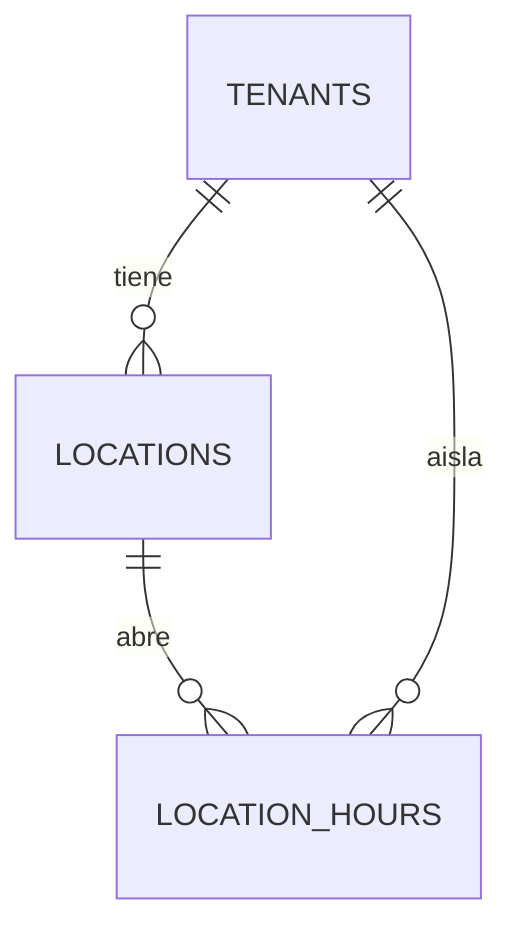

# SPEC — Phase 10 — Locations

## 1. Información general

```text
Phase:                10
Nombre:               Locations
Estado:               COMPLETED
Versión:              1.1.0
Fecha creación:       2026-08-25
Última actualización: 2026-08-25
Responsable:          alejandro.avendano@masuno.pe
```

Documento maestro: §5, §7, §8, §10, §11, §12, §21, §22, §30, §33 (Fase 10), §40.
Fases previas: 00 a 09 — todas COMPLETED y auditadas.

---

## 2. Objetivo

### ¿Por qué existe esta fase, y por qué AHORA?

§33 lo dice en una línea:

> Crear soporte multi-sucursal **antes de** módulos operativos.

Es una decisión de orden, no de funcionalidad. Un pedido ocurre en una sucursal,
el stock está en una sucursal, una caja se abre en una sucursal, y una factura
se emite desde una sucursal. Si `locations` llega después de `orders`, cada una
de esas tablas nace sin `location_id` y añadirlo luego significa migrar datos
reales de negocios reales, adivinando a qué sede pertenecía cada pedido.

§8 ya lo anticipa: nombra `tenant_id + location_id` entre los índices a los que
prestar atención. Esa columna tiene que existir antes que las tablas que la
llevan.

### La frase que decide el modelo

> **Incluso clientes de una sola sede utilizarán una location.**

No hay caso especial de "negocio sin sucursales". Un negocio con un solo local
tiene una location igual, creada sola, y nunca ve la palabra "sucursal" si no
quiere. Lo contrario - permitir `location_id` nulo "para los sencillos" -
convierte cada consulta futura en dos consultas y cada índice en uno peor.

### ¿Qué debe ser posible al terminarla?

```text
- Que todo negocio tenga al menos una sede desde el momento en que se crea.
- Que pueda añadir, editar y desactivar sedes.
- Que cada sede tenga dirección, distrito, coordenadas, teléfono y horarios.
- Que los horarios admitan turno partido, que es lo normal en Perú.
- Que la web pública muestre dónde está el negocio y cuándo abre (§30).
- Que ninguna sede pueda quedar sin sede: no se borran, se desactivan.
```

---

## 3. Alcance

### Incluido

```text
LO-01  Permisos locations.view y locations.manage
LO-02  Tabla locations con los campos de §33
LO-03  Tabla location_hours (horario relacional, no JSONB)
LO-04  Validación de solapes por trigger
LO-05  Una location por defecto en cada tenant, por trigger
LO-06  Nunca queda un tenant sin sede activa
LO-07  Sin DELETE: se desactiva
LO-08  RLS: miembros leen, locations.manage escribe
LO-09  Lectura pública de sedes activas de tenants activos
LO-10  Índices de §8
LO-11  UI de sedes en el dashboard
LO-12  Editor de horarios
LO-13  Bloque de sedes en la web pública
LO-14  Tests
```

### Fuera de alcance

```text
OUT-01  Sección CMS "sucursales" con posición y estilo  -> más adelante
OUT-02  Zonas de reparto y distancias                   -> Fase 19
OUT-03  Stock por sede                                  -> Fase 18
OUT-04  Asignar empleados a una sede                    -> Fase 13+
OUT-05  Feriados y cierres puntuales                    -> no planificado
OUT-06  PostGIS y búsquedas geográficas                 -> ver §19
OUT-07  Sede primaria / por defecto                     -> Fase 13, cuando
                                                           haya algo que
                                                           necesite elegir una
```

---

## 4. Dependencias

```text
Phase 01  tenants, is_tenant_public
Phase 03  has_permission, catálogo de permisos
Phase 06  create_tenant_defaults (el trigger que se amplía), timezone
Phase 07  el sitio público donde se muestran
```

---

## 5. Casos de uso

### UC-1001 — Un negocio de una sola sede

```text
Actor:       Propietario recién dado de alta
Acción:      Entra a Sedes
Resultado:   Ya hay una, con el nombre del negocio. Solo tiene que
             completar la dirección.
```

### UC-1002 — Abrir una segunda sede

```text
Actor:       Propietario
Acción:      Añade "Sugu Rolls San Isidro"
Resultado:   Dos sedes activas, ambas con su propio horario
```

### UC-1003 — Turno partido

```text
Actor:       Propietario de un restaurante
Acción:      Lunes 12:00-15:00 y 19:00-23:00
Resultado:   Dos filas del mismo día, sin solape
```

### UC-1004 — Cerrar una sede

```text
Actor:       Propietario
Acción:      Desactiva la sede de Miraflores
Resultado:   Deja de aparecer en la web. El historial se conserva.
```

### UC-1005 — Intentar quedarse sin sedes

```text
Actor:       Propietario con una sola sede
Acción:      Intenta desactivarla
Resultado:   Se rechaza. Un negocio operativo tiene al menos una sede.
```

### UC-1006 — Un cliente busca la dirección

```text
Actor:       Visitante anónimo
Acción:      Entra a la web del negocio
Resultado:   Ve las sedes activas con dirección y horario
```

---

## 6. Requerimientos funcionales

```text
FR-1001  Existirán locations.view y locations.manage.
FR-1002  locations.view lo tendrán todos los roles operativos.
FR-1003  locations.manage solo owner y admin.
FR-1004  locations llevará tenant_id, y el nombre será único por tenant.
FR-1005  La unicidad del nombre no distinguirá mayúsculas.
FR-1006  Guardará address_line, district, city, reference y phone.
FR-1007  Guardará latitude y longitude, ambas o ninguna.
FR-1008  Validará los rangos geográficos reales.
FR-1009  Guardará `is_active`.
FR-1010  location_hours llevará location_id, tenant_id, día, apertura, cierre.
FR-1011  El día será 0..6 con 0 = domingo.
FR-1012  closes_at será estrictamente mayor que opens_at.
FR-1013  Un día podrá tener varios tramos (turno partido).
FR-1014  Dos tramos del mismo día no podrán solaparse.
FR-1015  Cada tenant tendrá una location al crearse.
FR-1016  No habrá DELETE de locations desde la aplicación.
FR-1017  No se podrá desactivar la última sede activa.
FR-1018  Los miembros con locations.view verán las sedes de SU tenant.
FR-1019  locations.manage será necesario para escribir.
FR-1020  Un visitante anónimo verá las sedes ACTIVAS de tenants activos.
FR-1021  También las verá un usuario con sesión de otro tenant.
FR-1022  Los horarios seguirán la misma regla de visibilidad.
FR-1023  Habrá índice por (tenant_id, is_active).
FR-1024  Habrá índice por (tenant_id, location_id) en location_hours.
FR-1025  La web pública mostrará sedes activas con dirección y horario.
```

---

## 7. Requerimientos no funcionales

```text
NFR-1001 Aislamiento
  - location_hours lleva tenant_id denormalizado, mantenido por trigger,
    para que su política no tenga que unir con locations.

NFR-1002 Honestidad temporal
  - Los horarios se guardan como hora local del negocio (`time`), no como
    timestamptz. Un horario de apertura no es un instante: "abrimos a las 9"
    sigue siendo verdad cuando cambia el huso. §40 gobierna los INSTANTES,
    que siguen en UTC.

NFR-1003 Sin extensiones
  - Las coordenadas son dos numeric con CHECK, no PostGIS: la extensión no
    está activa, no existe en el arnés de tests, y esta fase no calcula
    distancias. Ver §19.
```

---

## 8. Modelo de datos

### locations

```text
id            uuid PK
tenant_id     uuid FK tenants ON DELETE CASCADE
name          text NOT NULL
address_line  text
district      text
city          text
reference     text          -- "frente al parque", que en Perú es la dirección real
phone         text
latitude      numeric(9,6)
longitude     numeric(9,6)
is_active     boolean NOT NULL default true
created_at / updated_at

UNIQUE (tenant_id, lower(name))
CHECK  longitudes de texto
CHECK  (latitude is null) = (longitude is null)
CHECK  latitude between -90 and 90
CHECK  longitude between -180 and 180
```

### location_hours

```text
id           uuid PK
location_id  uuid FK locations ON DELETE CASCADE
tenant_id    uuid FK tenants   ON DELETE CASCADE   -- denormalizado, por trigger
day_of_week  smallint NOT NULL   0 = domingo .. 6 = sábado
opens_at     time NOT NULL
closes_at    time NOT NULL

CHECK  day_of_week between 0 and 6
CHECK  closes_at > opens_at
TRIGGER  sin solapes en (location_id, day_of_week)
```

### Por qué el horario es una tabla y no un JSONB

§7 reserva JSONB para configuración genuinamente dinámica y manda a lo
relacional los grupos que se repiten. Un horario es exactamente eso: siete días,
y en Perú casi siempre dos tramos por día. En JSONB, "no solapar" y "cierra
después de abrir" serían validación de aplicación, es decir, validación que
depende de que todo el mundo pase por el mismo código. Aquí son un CHECK y un
trigger.

### Por qué la noche se parte en dos filas

Un bar que abre a las 18:00 y cierra a las 02:00 se guarda como
`18:00-24:00` del viernes y `00:00-02:00` del sábado.

La alternativa - permitir `closes_at < opens_at` con el significado "cruza la
medianoche" - hace indecidible la detección de solapes y convierte "¿está
abierto ahora?" en un caso especial en cada consulta futura. Dos filas dicen lo
mismo sin ambigüedad. `time` admite `24:00:00`, así que "hasta medianoche" se
escribe sin trampa.

---

## 9. Diagrama de relaciones



---

## 10. Tenant Isolation

```text
Tenant Isolation Impact: ALTO
```

```text
¿Qué tablas llevan tenant_id?
  locations y location_hours. La segunda lo lleva denormalizado y mantenido
  por trigger, igual que page_sections en la Fase 07: una política que
  tuviera que unir con locations sería más difícil de auditar y más lenta.

¿Cómo evita RLS el acceso cross-tenant?
  Lectura de miembro:  has_permission(tenant_id, 'locations.view')
  Escritura:           has_permission(tenant_id, 'locations.manage')
  Lectura pública:     is_tenant_public(tenant_id) AND is_active,
                       concedida a anon Y authenticated desde el principio
                       (lección A7-1).

Por qué esta fase es de impacto ALTO aunque solo cree dos tablas
  Es la columna que van a llevar pedidos, caja, stock y facturas. Si el
  aislamiento de `locations` fuera flojo, cada tabla operativa heredaría el
  fallo. Y el trigger que denormaliza tenant_id es un sitio clásico donde se
  cuela un desajuste: hay un test que intenta escribir una hora con el
  tenant_id de otro y comprueba que el trigger lo corrige.
```

---

## 11. Seguridad

```text
AB-1001  Crear una sede en el tenant de otro pasando su tenant_id.
         Mitigación: WITH CHECK sobre has_permission del tenant de la FILA.

AB-1002  Colgar un horario de una sede ajena pasando su location_id.
         Mitigación: el trigger deriva tenant_id de la location, y la
         política lo comprueba sobre el valor derivado, no sobre el enviado.

AB-1003  Dejar a un negocio sin sedes para romper módulos posteriores.
         Mitigación: trigger que rechaza desactivar la última activa.

AB-1004  Borrar una sede con historial operativo colgando.
         Mitigación: no hay política de DELETE. Se desactiva.

AB-1005  Ver las sedes de un negocio suspendido.
         Mitigación: is_tenant_public, igual que el resto del contenido.

AB-1006  Guardar coordenadas absurdas para envenenar un mapa futuro.
         Mitigación: CHECK de rango real.
```

---

## 12. API / Server Actions

```text
createLocationAction(prev, formData)   -> FormState   locations.manage
updateLocationAction(prev, formData)   -> FormState   locations.manage
setLocationActiveAction(prev, formData)-> FormState   locations.manage
addLocationHourAction(prev, formData)  -> FormState   locations.manage
deleteLocationHourAction(prev,formData)-> FormState   locations.manage
```

---

## 13. UI / UX

```text
/dashboard/[tenantSlug]/sedes            listado y alta
/dashboard/[tenantSlug]/sedes/[id]       datos y horario de una sede
```

Y en la web pública, un bloque de sedes en el pie con dirección y horario.

---

## 14. Flujos principales

```text
ALTA DE TENANT
  insert tenants -> trigger create_tenant_defaults
                 -> settings, theme, seo, Y AHORA una location con el
                    nombre del negocio

DESACTIVAR
  setLocationActive(false)
    -> trigger cuenta las activas restantes
    -> 0  -> excepción, no se permite
    -> >0 -> se desactiva

HORARIO
  addLocationHour(dia, abre, cierra)
    -> CHECK cierra > abre
    -> trigger: ¿solapa con otro tramo del mismo día?
    -> se guarda
```

---

## 15. Manejo de errores

```text
Nombre repetido en el tenant       -> error de campo
Coordenada fuera de rango          -> error de campo
Solo una coordenada de las dos     -> error de campo
Cierre <= apertura                 -> error de campo
Tramo solapado                     -> error de campo, con el tramo existente
Desactivar la última sede          -> mensaje explicando por qué
Sin locations.manage               -> 404
```

---

## 16. Observabilidad

```text
location.created      info  { tenantId, locationId }
location.updated      info  { tenantId, locationId }
location.deactivated  info  { tenantId, locationId }
location.hours.added   info { tenantId, locationId, day }
location.hours.removed info { tenantId, locationId }
```

---

## 17. Testing Plan

```text
Catálogo y esquema
TEST-1001  locations.view y locations.manage existen con sus roles.
TEST-1002  locations.manage solo lo tienen owner y admin.
TEST-1003  El nombre es único por tenant, sin distinguir mayúsculas.
TEST-1004  Dos tenants pueden tener sedes con el mismo nombre.
TEST-1005  Una coordenada sin la otra es rechazada.
TEST-1006  Una latitud de 91 es rechazada.
TEST-1007  Una longitud de 181 es rechazada.
TEST-1008  day_of_week fuera de 0..6 es rechazado.
TEST-1009  closes_at <= opens_at es rechazado.
TEST-1010  closes_at = 24:00 es aceptado.

Invariantes
TEST-1011  Un tenant nuevo nace con una location.
TEST-1012  Se llama como el negocio.
TEST-1013  Borrar el tenant arrastra sus locations y horarios.
TEST-1014  No se puede desactivar la última sede activa.
TEST-1015  Sí se puede desactivar una si queda otra activa.
TEST-1016  Se puede reactivar.

Horarios
TEST-1017  Dos tramos del mismo día sin solape se guardan.
TEST-1018  Un tramo que solapa es rechazado.
TEST-1019  Un tramo que toca el borde (10-12 y 12-14) SÍ se guarda.
TEST-1020  El mismo tramo en días distintos no solapa.
TEST-1021  Editar un tramo no choca consigo mismo.
TEST-1022  El trigger rellena tenant_id desde la location.
TEST-1023  Un tenant_id enviado a mano es corregido, no aceptado.

RLS
TEST-1024  Un miembro con locations.view ve las sedes de su tenant.
TEST-1025  No ve las de otro.
TEST-1026  Sin locations.manage no escribe.
TEST-1027  No puede crear una sede en otro tenant.
TEST-1028  No hay política de DELETE.
TEST-1029  Un anónimo ve las sedes activas de un tenant activo.
TEST-1030  Un usuario logueado de otro tenant también (lección A7-1).
TEST-1031  Nadie de fuera ve una sede inactiva.
TEST-1032  Nadie de fuera ve las sedes de un tenant suspendido.
TEST-1033  Los horarios siguen la misma regla.
TEST-1034  Un miembro sí ve sus propias sedes inactivas.
```

---

## 18. Edge Cases

```text
EC-1001  Sede sin dirección todavía -> se guarda; la web omite la línea.
EC-1002  Sede sin horario -> la web dice "consultar horario", no miente.
EC-1003  Nombre con espacios alrededor -> se recorta antes de comparar.
EC-1004  Coordenadas 0,0 -> válidas técnicamente, se aceptan.
EC-1005  Un negocio con 20 sedes -> el listado pagina en el futuro; hoy no
         hay caso real y la consulta va por índice.
EC-1006  Turno de 00:00 a 24:00 -> "abierto todo el día", válido.
EC-1007  Reactivar una sede cuando ya hay otras -> sin restricción.
```

---

## 19. Performance considerations

```text
locations       índice por (tenant_id, is_active): el listado del dashboard y
                el bloque público consultan exactamente eso.
location_hours  índice por (location_id, day_of_week): así se lee un horario.
                Y por (tenant_id) para el bloque público de un tenant entero.

Sin PostGIS. No hay ninguna consulta geográfica en esta fase, y activar una
extensión "para más adelante" es coste sin patrón de consulta que lo pida
(§8: cada índice responde a un patrón real; lo mismo vale para una extensión).
La Fase 19 decidirá, y con dos numeric la haversine se calcula en SQL sin nada
instalado.
```

---

## 20. Migraciones

```text
20260825200000_create_location_permissions.sql
20260825200100_create_locations.sql            tabla + triggers + RLS
20260825200200_create_location_hours.sql       tabla + triggers + RLS
20260825200400_extend_tenant_defaults_location.sql
```

El SPEC planeaba una quinta migración solo de políticas. Al escribirla quedó
claro que separar una tabla de sus propias políticas obliga a leer dos archivos
para responder "quién puede tocar esto", así que cada tabla lleva las suyas. El
hueco en la numeración se deja tal cual: renumerar una migración ya escrita es
peor que un hueco.

---

## 21. Rollback

```text
drop trigger tenants_create_defaults ...;  -- volver a la versión Fase 08
drop table public.location_hours;
drop table public.locations;
delete from public.permissions where resource = 'locations';
```

Riesgo: **BAJO** hoy, **ALTO** en cuanto la Fase 13 empiece a referenciar
`location_id`. Ese es justamente el motivo de que esta fase vaya antes.

---

## 22. Definition of Done

```text
- [x] Permisos y roles
- [x] locations con sus CHECKs
- [x] location_hours con solapes prohibidos
- [x] tenant_id denormalizado por trigger
- [x] Location por defecto en cada tenant
- [x] No se puede quedar sin sede activa
- [x] RLS de miembro y pública
- [x] Índices de §8
- [x] UI de sedes y de horarios
- [x] Bloque de sedes en la web pública
- [x] Tests
- [x] Typecheck / Lint / Format / Build PASS
- [x] SPEC actualizado con el resultado real
```

Resultado real:

```text
Format   PASS   prettier --check .
Lint     PASS   eslint --max-warnings=0
Types    PASS   next typegen && tsc --noEmit
Tests    PASS   967 tests, 41 archivos (81 nuevos en esta fase)
Build    PASS   /dashboard/[tenantSlug]/sedes y /sedes/[locationId]
```

---

## 23. Implementation notes

### Lo que se construyó

```text
supabase/migrations/
  20260825200000_create_location_permissions.sql
  20260825200100_create_locations.sql              + guard_last_active_location
  20260825200200_create_location_hours.sql         + sync_tenant + guard_overlap
  20260825200400_extend_tenant_defaults_location.sql

src/modules/locations/
  schedule.ts              semana, horas y solapes, puro
  schemas.ts               validación de los dos formularios
  server/queries.ts        lectura de dashboard y lectura pública
  server/actions.ts        alta, edición, activar, horarios
  components/              formulario, editor de horario, bloque público

src/app/(app)/dashboard/[tenantSlug]/sedes/
src/app/(site)/layout.tsx  bloque de sedes en el pie
```

### Tres decisiones de modelo que conviene poder defender

**1. El horario es una tabla, no un JSONB.**

§7 manda a lo relacional los grupos que se repiten, y un horario lo es: siete
días y, en Perú, casi siempre dos tramos por día. En JSONB, "no solapar" y
"cierra después de abrir" habrían sido validación de aplicación — es decir,
validación que solo se cumple mientras todo el mundo pase por el mismo código.
Aquí son un CHECK y un trigger, y valen también para un operador de plataforma
y para una migración.

**2. Un tramo nunca cruza la medianoche.**

Un bar de 18:00 a 02:00 son dos filas: viernes 18:00-24:00 y sábado
00:00-02:00. La alternativa — permitir `closes_at < opens_at` con el significado
"cruza la medianoche" — haría indecidible la detección de solapes y convertiría
"¿está abierto ahora?" en un caso especial en cada consulta futura. `time`
admite `24:00:00`, así que "hasta medianoche" se escribe sin trampa.

**3. Las sedes no se borran.**

No hay política de DELETE. Desde la Fase 13, pedidos, cajas, movimientos de
stock y facturas van a referenciar una sede: borrarla arrastraría ese historial
o lo dejaría colgando, y ninguna de las dos cosas es aceptable para documentos
que un negocio está obligado a conservar. `is_active = false` dice "ya no
operamos aquí" sin fingir que nunca ocurrió.

Y su complemento: un trigger impide desactivar la última sede activa. Sin él, el
error aparecería tres módulos más allá como "no se puede crear el pedido", en
vez de aquí como "cerraste tu único local".

### El trigger que deriva tenant_id, y por qué no basta la política

`location_hours.tenant_id` lo escribe un trigger a partir de la location, y eso
cierra un ataque que la política sola no ve (AB-1002): un llamante envía el
`location_id` de otra empresa junto con **su propio** tenant_id. La política de
INSERT comprueba el permiso contra el tenant_id de la fila — que sí tiene — y sin
el trigger el tramo quedaría colgado de la sede ajena. Derivar el valor hace
imposible que los dos discrepen. TEST-1023 lo ejecuta: envía A, se guarda B.

### Un test cambió de premisa, y el motivo importa

TEST-1025 iba a decir "un miembro de A no ve nada de B". Es falso, y falso en
una dirección interesante: las sedes **activas** de B están publicadas en la web
de B, así que cualquiera puede leer nombre, dirección y teléfono cargando esa
página. La política pública concede `authenticated` a propósito (lección A7-1),
así que también las ve un miembro de A.

Lo que sí es privado es una sede que B ha **cerrado**: eso es un hecho de negocio
de B — un local que no funcionó, un alquiler que se cayó, una mudanza sin
anunciar — y no está en ninguna web. El test afirma eso, y además que el dueño de
B sí la sigue viendo, porque tiene que poder editarla.

### Sin PostGIS

Dos `numeric(9,6)` con CHECK de rango. La extensión no está activa, no existe en
el arnés de PGlite, y esta fase no calcula ninguna distancia. §8 dice que cada
índice responde a un patrón de consulta real; lo mismo vale para una extensión.
La Fase 19 decidirá, y la haversine se calcula en SQL sin instalar nada.

---

## 24. Known limitations

```text
KL-1001  No hay sede primaria o por defecto. Hoy no hay nada que tenga que
         elegir una; la Fase 13 lo decidirá cuando un pedido necesite sede.

KL-1002  No hay feriados ni cierres puntuales: el horario es semanal y fijo.

KL-1003  El bloque público es del pie, no una sección CMS con posición y
         estilo. Añadir un tipo de sección al enum de la Fase 07 es una fase
         entera de trabajo para una decisión que esta no necesita tomar.

KL-1004  No hay "abierto ahora": necesitaría cruzar el horario con el huso del
         negocio (Fase 06) y con la hora del visitante, y decidir qué reloj
         manda cuando esos dos no coinciden.

KL-1005  El listado de sedes no pagina. Con el índice (tenant_id, is_active) la
         consulta es correcta, pero §18 pide paginar siempre y aquí todavía no
         se hace.

KL-1006  Las coordenadas se escriben a mano copiándolas de Google Maps. No hay
         mapa ni buscador de direcciones.

KL-1007  Los solapes los impide un trigger, no un EXCLUDE: btree_gist no está
         disponible. El trigger cubre el caso real y se ejecuta en los tests,
         pero un EXCLUDE sería atómico frente a concurrencia y el trigger tiene
         una ventana teórica entre su SELECT y el INSERT.

KL-1008  Los cambios de esta fase están sin commitear.
```

---

## 25. Future considerations

```text
- La Fase 13 añadirá location_id a los pedidos, y §8 ya nombra el índice
  (tenant_id, location_id) que hará falta.
- La Fase 18 colgará stock de una sede; la Fase 19, zonas de reparto.
- Si aparece concurrencia real sobre los horarios, activar btree_gist y
  sustituir el trigger por un EXCLUDE (KL-1007).
- "Abierto ahora" en la web pública, cuando se decida qué reloj manda.
```
