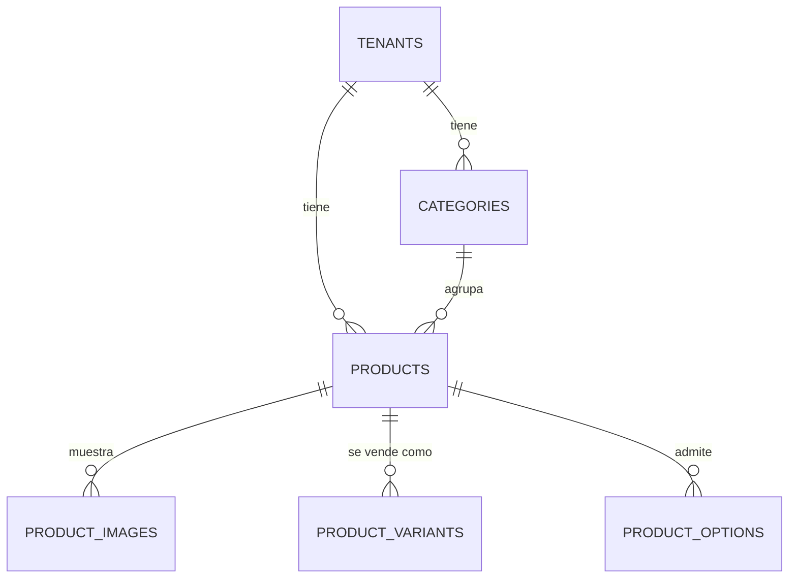

# SPEC — Phase 11 — Catalog

## 1. Información general

```text
Phase:                11
Nombre:               Catalog
Estado:               COMPLETED
Versión:              1.1.1
Fecha creación:       2026-08-25
Última actualización: 2026-08-27
Responsable:          alejandro.avendano@masuno.pe
```

Documento maestro: §7, §8, §10, §11, §12, §18, §21, §22, §30, §32, §33 (Fase 11), §39.
Fases previas: 00 a 10 — todas COMPLETED y auditadas.

---

## 2. Objetivo

### ¿Por qué existe esta fase?

Es lo que el negocio vende. Hasta ahora CloverCode sabe quién es el negocio,
dónde está y cómo se ve su web; no sabe qué ofrece.

Y es la última pieza antes de que empiece lo operativo: la Fase 13 crea pedidos,
y un pedido es una lista de cosas del catálogo a un precio.

### La frase que gobierna la fase

§33, Fase 11, textual:

> Todas las restricciones deben ser tenant-aware.
> `UNIQUE(tenant_id, slug)` — no `UNIQUE(slug)`.

Es §11 repetido donde más fácil sería olvidarlo: un catálogo tiene slugs, SKUs y
nombres, y cada uno de ellos es un sitio donde una restricción global le
impediría a un negocio usar la palabra "ceviche" porque otro la usó antes.

### La decisión que esta fase ya no puede aplazar

§39 exige una estrategia de dinero **documentada**. Aquí aparecen los primeros
precios del sistema, así que la decisión se toma ahora y no en la Fase 13:
enteros en la unidad menor (céntimos), nunca `float`. Razonado en ADR-015.

### ¿Qué debe ser posible al terminarla?

```text
- Que un restaurante cargue su carta con categorías, platos y variantes.
- Que una tienda cargue productos con SKU y varias imágenes.
- Que un plato agotado hoy se marque no disponible sin despublicarlo.
- Que la web pública muestre el catálogo (cierra KL-703 de la Fase 07).
- Que dos negocios puedan tener un producto con el mismo slug.
- Que ningún precio pase nunca por un número de coma flotante.
```

---

## 3. Alcance

### Incluido

```text
CA-01  Dinero como entero en unidad menor + src/lib/money
CA-02  Tabla categories
CA-03  Tabla products
CA-04  Tabla product_images
CA-05  Tabla product_variants
CA-06  Tabla product_options
CA-07  Toda restricción con tenant_id por delante
CA-08  Estado y disponibilidad como dos cosas distintas
CA-09  Destacado, orden y slug
CA-10  RLS: miembros por products.*, público por estado activo
CA-11  Índices de §8, incluido tenant_id + category_id
CA-12  UI de categorías
CA-13  UI de productos, con imágenes, variantes y opciones
CA-14  Render real de la sección `products` de la Fase 07
CA-15  Tests
```

### Fuera de alcance

```text
OUT-01  Stock y existencias                    -> Fase 18
OUT-02  Combos y menús del día                 -> no planificado
OUT-03  Categorías anidadas                    -> ver KL
OUT-04  Grupos de opciones con mínimo/máximo   -> Fase 13, cuando un pedido
                                                   tenga que validarlos
OUT-05  Subida de imágenes desde el catálogo   -> se pega la ruta, como en las
                                                   Fases 07 y 08
OUT-06  Precios por sede o por canal           -> no planificado
OUT-07  Impuestos y afectación IGV             -> Fase 17 (SUNAT)
OUT-08  Buscador y filtros del catálogo        -> Fase 23
```

---

## 4. Dependencias

```text
Phase 03  products.view / create / update / delete, ya en el catálogo
Phase 06  bucket tenant-assets, carpeta products, currency del tenant
Phase 07  sección `products`, hoy un envoltorio vacío (KL-703)
Phase 08  política pública sobre storage.objects para la carpeta products
Phase 10  locations, que la Fase 13 cruzará con esto
```

---

## 5. Casos de uso

### UC-1101 — Cargar la carta

```text
Actor:       Propietario de un restaurante
Acción:      Crea "Makis", y dentro "Maki Acevichado" a S/ 24.90
Resultado:   Producto activo, visible en su web
```

### UC-1102 — Variantes

```text
Actor:       Propietario de una pizzería
Acción:      Personal S/ 18.00, Familiar S/ 39.00
Resultado:   Un producto con dos variantes y dos precios
```

### UC-1103 — Extras

```text
Actor:       Propietario
Acción:      Grupo "Extras": queso +S/ 3.00, tocino +S/ 4.00
Resultado:   Opciones listas para que la Fase 13 las cobre
```

### UC-1104 — Se acabó el ceviche

```text
Actor:       Encargado, a las 3 de la tarde
Acción:      Marca el plato como no disponible
Resultado:   Sigue publicado pero aparece agotado. Mañana vuelve con un clic.
```

### UC-1105 — Retirar un producto

```text
Actor:       Propietario
Acción:      Archiva un producto que ya no vende
Resultado:   Desaparece de la web. Los pedidos históricos no se tocan.
```

### UC-1106 — Dos negocios, el mismo plato

```text
Actor:       Dos restaurantes distintos
Acción:      Ambos crean el slug `ceviche`
Resultado:   Los dos lo consiguen
```

---

## 6. Requerimientos funcionales

```text
FR-1101  Los precios se guardarán como enteros en la unidad menor.
FR-1102  Ningún precio será numeric ni float en ninguna capa.
FR-1103  Habrá helpers puros para parsear, formatear y multiplicar dinero.
FR-1104  categories llevará tenant_id, name, slug, position, is_active.
FR-1105  UNIQUE(tenant_id, slug) en categories, nunca UNIQUE(slug).
FR-1106  products llevará tenant_id y category_id opcional.
FR-1107  UNIQUE(tenant_id, slug) en products.
FR-1108  products tendrá status: draft | active | archived.
FR-1109  products tendrá is_available, distinto de status.
FR-1110  products tendrá is_featured y position.
FR-1111  base_price_cents será >= 0.
FR-1112  product_images llevará tenant_id, path y position.
FR-1113  La ruta apuntará a la carpeta del PROPIO tenant.
FR-1114  Habrá como mucho una imagen principal por producto.
FR-1115  product_variants llevará su propio precio absoluto, no un delta.
FR-1116  El SKU, si existe, será único por tenant.
FR-1117  product_options llevará group_label, name y price_delta_cents.
FR-1118  El delta podrá ser negativo (descuento) dentro de un rango.
FR-1119  Las cuatro tablas hijas llevarán tenant_id denormalizado por trigger.
FR-1120  Los miembros con products.view leerán el catálogo de SU tenant.
FR-1121  products.create / update / delete gobernarán la escritura.
FR-1122  El público verá productos active de tenants activos.
FR-1123  También los verá un usuario con sesión de otro tenant.
FR-1124  Un producto draft o archived no será público.
FR-1125  Habrá índice (tenant_id, category_id) y (tenant_id, status).
FR-1126  La sección `products` de la Fase 07 renderizará el catálogo real.
FR-1127  Esa sección podrá filtrar por categoría.
```

---

## 7. Requerimientos no funcionales

```text
NFR-1101 Precisión
  - Ninguna operación de dinero ocurre en coma flotante, en ninguna capa.
    Los enteros de la unidad menor lo hacen imposible por construcción, no
    por disciplina (§39).

NFR-1102 Aislamiento
  - Las cuatro tablas hijas llevan tenant_id denormalizado y mantenido por
    trigger, igual que location_hours en la Fase 10: la política no tiene que
    unir con products, y un tenant_id enviado a mano se corrige.

NFR-1103 Tenant-awareness explícita
  - Un test recorre pg_indexes y falla si alguna restricción única de estas
    cinco tablas no empieza por tenant_id.
```

---

## 8. Modelo de datos

### Dinero

```text
Todo importe: bigint, en la unidad menor de la moneda del tenant.
S/ 24.90 se guarda como 2490.
La moneda vive en tenant_settings.currency (Fase 06), no en cada fila.
```

### categories

```text
id, tenant_id, name, slug, description, position, is_active
UNIQUE (tenant_id, slug)
UNIQUE (tenant_id, lower(name))
```

### products

```text
id, tenant_id, category_id (NULL), name, slug, description,
base_price_cents bigint NOT NULL,
status product_status NOT NULL default 'draft',
is_available boolean NOT NULL default true,
is_featured boolean NOT NULL default false,
position smallint NOT NULL default 0

UNIQUE (tenant_id, slug)
CHECK base_price_cents >= 0
FK category_id -> categories ON DELETE SET NULL
```

**`status` y `is_available` son cosas distintas, y confundirlas es el error
clásico de un catálogo de restaurante.** `status` es editorial: si el producto
existe para el público. `is_available` es de hoy: se acabó el pescado. Un solo
booleano obligaría a despublicar el plato a las tres de la tarde y volver a
publicarlo al día siguiente, perdiendo por el camino la diferencia entre "ya no
lo vendemos" y "hoy se acabó".

### product_images

```text
id, product_id, tenant_id, path, alt_text, position, is_primary
CHECK  path ~ '^tenants/{tenant_id}/products/'
UNIQUE parcial (product_id) WHERE is_primary
```

### product_variants

```text
id, product_id, tenant_id, name, sku, price_cents, is_active, position
UNIQUE (tenant_id, lower(sku)) WHERE sku IS NOT NULL
UNIQUE (product_id, lower(name))
CHECK price_cents >= 0
```

Precio **absoluto**, no un delta sobre el producto. Un delta obliga a leer dos
filas para saber cuánto cuesta algo, y la Fase 13 tiene que guardar un snapshot
del precio: guardar el número que se cobra es más simple que guardar una resta.

### product_options

```text
id, product_id, tenant_id, group_label, name, price_delta_cents,
position, is_active
UNIQUE (product_id, lower(group_label), lower(name))
CHECK price_delta_cents between -1000000 and 1000000
```

Una sola tabla, como pide §33, con la etiqueta del grupo repetida en cada fila.
Las reglas de grupo — obligatorio, mínimo, máximo — no están: son propiedades
del grupo, no de la opción, y no hay dónde ponerlas sin inventar una tabla que
§33 no pide. Llegan en la Fase 13, que es la primera que tiene que validarlas.

---

## 9. Diagrama de relaciones



---

## 10. Tenant Isolation

```text
Tenant Isolation Impact: ALTO
```

```text
¿Qué tablas llevan tenant_id?
  Las cinco. Las cuatro hijas lo llevan denormalizado y mantenido por
  trigger, como location_hours en la Fase 10.

¿Cómo evita RLS el acceso cross-tenant?
  Miembro:  has_permission(tenant_id, 'products.view')
  Escritura: products.create / products.update / products.delete
  Público:  is_tenant_public(tenant_id) AND status = 'active',
            concedido a anon Y authenticated (lección A7-1)

El riesgo propio de esta fase
  §33 lo nombra: una restricción única global. `UNIQUE(slug)` en products
  no filtra datos, hace algo peor de explicar a un cliente - le impide crear
  un producto porque otro negocio, al que no conoce, usó esa palabra antes.
  Hay un test que recorre los índices y lo comprueba tabla por tabla.
```

---

## 11. Seguridad

```text
AB-1101  Colgar una imagen o variante de un producto ajeno enviando su
         product_id con el tenant_id propio.
         Mitigación: trigger que deriva tenant_id del producto, igual que
         en la Fase 10 (AB-1002).

AB-1102  Guardar una ruta de imagen que apunta a la carpeta de otro negocio.
         Mitigación: CHECK contra el tenant_id de la propia fila (A6-2).

AB-1103  Ver el catálogo en borrador de la competencia.
         Mitigación: la política pública exige status = 'active'.

AB-1104  Ver el catálogo de un negocio suspendido.
         Mitigación: is_tenant_public.

AB-1105  Precio negativo para forzar un total negativo en la Fase 13.
         Mitigación: CHECK >= 0 en producto y variante; el delta de opción
         admite negativo pero acotado.

AB-1106  Desbordar el entero con un precio absurdo.
         Mitigación: CHECK de máximo, y bigint muy por debajo del límite
         seguro de JavaScript.
```

---

## 12. API / Server Actions

```text
createCategoryAction / updateCategoryAction / setCategoryActiveAction
createProductAction / updateProductAction / setProductStatusAction
setProductAvailabilityAction
addProductImageAction / deleteProductImageAction
addVariantAction / deleteVariantAction
addOptionAction / deleteOptionAction
```

---

## 13. UI / UX

```text
/dashboard/[tenantSlug]/catalogo                 categorías y productos
/dashboard/[tenantSlug]/catalogo/[productId]     ficha completa
```

Y en la web pública, la sección `products` deja de ser un envoltorio.

---

## 14. Flujos principales

```text
ALTA DE PRODUCTO
  nombre -> slug sugerido -> precio en soles
    -> parseMoney("24.90") -> 2490
    -> insert products (status draft)
    -> el negocio lo publica cuando quiere

RENDER PÚBLICO
  sección products (heading, limit, categorySlug?)
    -> productos active del tenant
    -> filtrados por categoría si la sección lo pide
    -> destacados primero, luego position
    -> imágenes firmadas (bucket privado, Fase 08)
```

---

## 15. Manejo de errores

```text
Slug repetido en el tenant       -> error de campo
Precio con letras                -> error de campo
Precio negativo                  -> error de campo
SKU repetido en el tenant        -> error de campo
Ruta de imagen ajena             -> error de campo
Dos imágenes principales         -> error de campo
Sin products.update              -> 404
```

---

## 16. Observabilidad

```text
catalog.category.created / updated
catalog.product.created / updated
catalog.product.status_changed   info { tenantId, productId, to }
catalog.product.availability     info { tenantId, productId, available }
catalog.image.added / removed
catalog.variant.added / removed
catalog.option.added / removed
```

---

## 17. Testing Plan

```text
Dinero (puro)
TEST-1101  parseMoney lee "24.90" como 2490.
TEST-1102  Acepta coma decimal.
TEST-1103  Rechaza tres decimales.
TEST-1104  Rechaza texto y vacío.
TEST-1105  formatMoney escribe 2490 como "24.90".
TEST-1106  Un céntimo suelto se formatea con dos decimales.
TEST-1107  multiplyMoney redondea a entero, sin float.
TEST-1108  sumMoney de una lista larga es exacto.
TEST-1109  0.1 + 0.2 en céntimos da exactamente 30.

Esquema
TEST-1110  categories: UNIQUE(tenant_id, slug), no global.
TEST-1111  products: UNIQUE(tenant_id, slug), no global.
TEST-1112  Dos tenants pueden repetir slug.
TEST-1113  NINGUNA restricción única de estas tablas es global (§33).
TEST-1114  base_price_cents negativo se rechaza.
TEST-1115  Un precio absurdo se rechaza.
TEST-1116  Borrar una categoría deja sus productos sin categoría.
TEST-1117  Borrar un producto arrastra imágenes, variantes y opciones.
TEST-1118  SKU único por tenant, y repetible entre tenants.
TEST-1119  Dos imágenes principales del mismo producto se rechazan.
TEST-1120  Ruta de imagen de otro tenant se rechaza.
TEST-1121  status y is_available son independientes.

Triggers
TEST-1122  tenant_id de las hijas se deriva del producto.
TEST-1123  Un tenant_id enviado a mano se corrige.
TEST-1124  Una hija de un producto inexistente se rechaza.

RLS
TEST-1125  Un miembro con products.view ve su catálogo.
TEST-1126  Un cajero (products.view) NO puede escribir.
TEST-1127  Sin products.create no se crea.
TEST-1128  No se puede crear en otro tenant.
TEST-1129  Un anónimo ve productos active.
TEST-1130  Un usuario logueado de otro tenant también (A7-1).
TEST-1131  Nadie de fuera ve draft ni archived.
TEST-1132  Nadie de fuera ve el catálogo de un tenant suspendido.
TEST-1133  Las hijas siguen la visibilidad del producto.
TEST-1134  Un miembro sí ve sus propios borradores.
```

---

## 18. Edge Cases

```text
EC-1101  Producto sin categoría -> válido, sale sin agrupar.
EC-1102  Producto sin imagen -> la web deja el hueco, no rompe.
EC-1103  Producto con variantes -> el precio base es el "desde".
EC-1104  Precio 0 -> válido: hay cosas gratis (una salsa, un vaso de agua).
EC-1105  Categoría desactivada con productos activos -> los productos siguen
         activos; una categoría es una agrupación, no un permiso.
EC-1106  Imagen firmada que falla -> se omite esa imagen, no la ficha.
EC-1107  Sección products con limit mayor que el catálogo -> muestra lo que hay.
EC-1108  Sección products con una categoría que ya no existe -> muestra el
         catálogo sin filtrar, no un error.
```

---

## 19. Performance considerations

```text
products         (tenant_id, status) para la web y (tenant_id, category_id)
                 para el listado por categoría, que es el índice que §8
                 nombra explícitamente.
product_images   (product_id, position)
product_variants (product_id)
product_options  (product_id, group_label)

La consulta pública pide productos + imágenes en una sola llamada anidada de
PostgREST, no una por producto.
```

---

## 20. Migraciones

```text
20260825210000_create_categories.sql
20260825210100_create_products.sql
20260825210200_create_product_children.sql
20260825210300_extend_public_identity_currency.sql
```

La cuarta no estaba prevista y apareció al implementar CA-14: la web pública
muestra precios, y un precio sin moneda no es un precio. La moneda vive en
`tenant_settings` (Fase 06), que no tiene política pública porque el RUC está en
la misma fila (ADR-012), así que sale por la misma función estrecha que el resto
de la identidad pública. Cambia el tipo de retorno, de ahí el DROP y CREATE.

---

## 21. Rollback

```text
drop table product_options, product_variants, product_images, products,
           categories;
drop type product_status;
```

Riesgo: **BAJO** hoy, **ALTO** en cuanto la Fase 13 referencie `product_id`.

---

## 22. Definition of Done

```text
- [x] src/lib/money y su decisión documentada en un ADR
- [x] Las cinco tablas con sus CHECKs
- [x] Toda restricción única empieza por tenant_id
- [x] tenant_id denormalizado por trigger en las tres hijas
- [x] status e is_available separados
- [x] RLS de miembro y pública
- [x] Índices de §8
- [x] UI de categorías y de productos
- [x] La sección `products` renderiza el catálogo real (cierra KL-703)
- [x] Tests
- [x] Typecheck / Lint / Format / Build PASS
- [x] SPEC actualizado con el resultado real
```

Resultado real:

```text
Format   PASS   prettier --check .
Lint     PASS   eslint --max-warnings=0
Types    PASS   next typegen && tsc --noEmit
Tests    PASS   1048 tests, 43 archivos (81 nuevos en esta fase)
Build    PASS   /dashboard/[tenantSlug]/catalogo y /catalogo/[productId]
```

Nota: el SPEC decía "cuatro hijas" contando `categories`, que no lo es -
`categories` cuelga del tenant, no de un producto. Las que llevan tenant_id
derivado por trigger son tres: imágenes, variantes y opciones.

---

## 23. Implementation notes

### Lo que se construyó

```text
src/lib/money/index.ts        parse, format, multiply, sum, percent

supabase/migrations/
  20260825210000_create_categories.sql
  20260825210100_create_products.sql          + guard_product_category_tenant
  20260825210200_create_product_children.sql  + sync_product_child_tenant
  20260825210300_extend_public_identity_currency.sql

src/modules/catalog/
  schemas.ts               validación, slugify, precios como enteros
  server/queries.ts        lectura de dashboard y lectura pública
  server/actions.ts        categorías, productos, imágenes, variantes, opciones
  components/              formularios

src/app/(app)/dashboard/[tenantSlug]/catalogo/
src/modules/cms/           la sección `products` renderiza de verdad

docs/adr/015-money-as-minor-units.md
```

### La decisión que §39 obligaba a tomar aquí

El índice de ADRs tenía el dinero apuntado para la Fase 13/14, pero los primeros
precios del sistema aparecen en esta, y un catálogo escrito contra una
representación y unos pedidos escritos contra otra es una migración que nadie
quiere. Así que se decidió ahora: **enteros en la unidad menor**, `bigint`,
S/ 24.90 es `2490`.

El motivo no es que PostgreSQL falle con `numeric` - no falla. Es el borde:
PostgREST serializa `numeric` como número JSON, JavaScript lo convierte en un
double, y a partir de ahí todo total calculado en la aplicación es coma
flotante. "Calcula siempre en SQL" es disciplina, no garantía: aguanta hasta que
alguien suma un array de líneas en un componente, que es algo perfectamente
razonable de escribir.

Un detalle que merece la pena: `parseMoney` parte la cadena en el separador
decimal en vez de hacer `Math.round(Number(v) * 100)`. La implementación obvia
falla en `"8.07"` - `Number("8.07") * 100` es `806.9999999999999` - y
`Math.round` la salva, que es justo lo que hace que el bug sobreviva a una
revisión. TEST-1101 incluye los valores que la cazan.

### `status` y `is_available` son dos cosas

El error clásico de un catálogo de restaurante es un solo booleano. Una cocina
que se queda sin pescado a las tres de la tarde tendría que despublicar el plato
y volver a publicarlo mañana, y el sistema perdería por el camino la diferencia
entre "ya no lo vendemos" y "hoy se acabó" - que es exactamente la diferencia
que le importa al cliente y al reporte.

La política pública deliberadamente **no** filtra por `is_available`: un plato
agotado sigue en la carta, marcado. Esconderlo le diría al cliente que el
restaurante no sirve ceviche.

### El test que comprueba la regla, no el ejemplo

§33 dice `UNIQUE(tenant_id, slug)` y no `UNIQUE(slug)`. TEST-1113 no comprueba
una tabla: recorre `pg_indexes` y falla ante cualquier índice único de las cinco
tablas que no esté acotado por `tenant_id` o por `product_id`. Una regla
enunciada con un ejemplo es una regla que alguien aplicará a cuatro tablas de
cinco.

### Se cerró KL-703 sin ampliar la superficie de la Fase 07

La sección `products` renderiza el catálogo real. El renderizador sigue siendo
**síncrono y puro**: recibe el catálogo por props, no lo consulta. Eso mantiene
la garantía de la Fase 07 - nada en el sitio público interpreta markup -
comprobable leyendo un archivo, y permite firmar las imágenes de producto en el
mismo lote que las de las secciones, una llamada a Storage en vez de una por
producto. Una página sin sección `products` no consulta el catálogo en absoluto.

### Dos cosas que el trigger cierra y la política no ve

`sync_product_child_tenant` deriva `tenant_id` del producto. Sin él, un llamante
que envíe el `product_id` de otra empresa con **su propio** tenant_id pasa la
política de INSERT - tiene permiso sobre la fila que escribe - y la variante
queda colgada del producto ajeno (TEST-1123).

Y `guard_product_category_tenant`: dos claves foráneas a dos tablas que llevan
cada una su tenant son un sitio donde los dos pueden discrepar. Nada en el
esquema impedía que un producto de A apuntara a una categoría de B, y RLS
tampoco lo veía.

---

## 24. Known limitations

```text
KL-1101  Sin stock: `is_available` es manual. Owner: Fase 18.

KL-1102  Los grupos de opciones no tienen reglas (obligatorio, mínimo,
         máximo). Son propiedades del grupo y `product_options` es una sola
         tabla, como pide §33. Owner: Fase 13, la primera que tiene que
         validar una selección.

KL-1103  Categorías planas, sin anidar.

KL-1104  Las imágenes se suben en Configuración y aquí se pega la ruta, como
         en las Fases 07 y 08 (KL-704 sigue abierta).

KL-1105  La sección pública muestra el precio base aunque el producto tenga
         variantes; no dice "desde S/ X". La consulta pública no trae
         variantes todavía.

KL-1106  Sin buscador ni filtros en el listado del dashboard, y sin paginar:
         §18 pide paginar siempre. Con el índice (tenant_id, status) la
         consulta es correcta, pero un catálogo de mil productos lo pedirá.

KL-1107  Sin impuestos ni afectación IGV en el producto. Owner: Fase 17.

KL-1108  `slugify` está en el módulo pero el formulario no lo usa todavía: el
         slug se escribe a mano. Es una mejora de UI, no de modelo.
```

---

## 25. Future considerations

```text
- La Fase 13 añadirá líneas de pedido con snapshot de precio (§33: "nunca
  depender del precio actual de products"), y los enteros de esta fase son lo
  que hace que ese snapshot sea exacto.
- La Fase 17 puede necesitar más de dos decimales en el precio unitario para
  SUNAT; ADR-015 explica por qué eso sería una columna nueva y no un cambio de
  representación.
- La Fase 18 colgará stock del par (location_id, variant_id).
```
