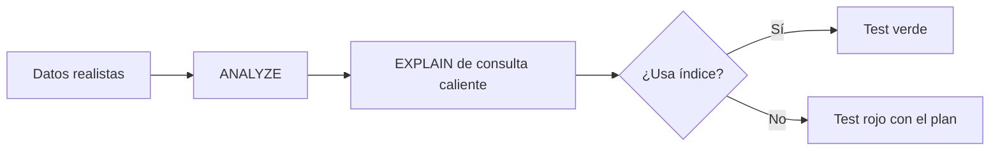

# SPEC — Phase 26 — Performance

## 1. Información general

```text
Phase:                26
Nombre:               Performance
Estado:               COMPLETED
Versión:              1.1.0
Fecha creación:       2026-08-31
Última actualización: 2026-08-31
Responsable:          alejandro.avendano@masuno.pe
```

Documento maestro: §8, §18, §21, §33 (Fase 26), §55.
Fases previas: 00 a 25 — todas COMPLETED.

---

## 2. Objetivo

### La frase que gobierna la fase

§33, Fase 26, primera línea:

> **Medir antes de optimizar.**

Es una restricción sobre el método, no sobre el resultado. Significa que ninguna
optimización de esta fase puede justificarse por intuición: cada cambio cita una
medición, y lo que no se midió no se toca.

También significa que el entregable principal **no es código más rápido**. Es un
aparato de medición que sigue funcionando después de esta fase, más los
objetivos contra los que medir. Optimizar sin eso es adivinar con más pasos.

### Lo que ya se midió, antes de escribir este SPEC

```text
Build           55 rutas, todas dinámicas (ƒ). 1.6 MB de chunks estáticos.
Rutas estáticas 0, por decisión medida y documentada de la Fase 25 (ADR-029:
                el nonce del CSP obliga a render dinámico). NO es un hallazgo.
Consultas       34 lecturas de lista en modules/*/server/queries.ts.
                8 acotadas. 26 sin límite.
N+1             0 detectados: ningún await dentro de un bucle en las queries.
Caché           0 usos de unstable_cache. 9 de cache() de React, por petición.
Índices         116 sin contar claves primarias, sobre 63 tablas. Nunca se
                había comprobado que se usen.
Client comps    52 de 140 componentes (37%).
EXPLAIN         funciona en PGlite con datos realistas (probado).
```

### Una corrección a mi propia medición

La primera versión de este SPEC decía **"53 de 57 consultas sin límite"**. Era
falso, y falso en la dirección cómoda: el grep contaba `.limit(` y no veía
`.range(`, que es como paginan la mitad de los módulos.

El número real es **26 de 34**, y lo que cambia no es la cifra sino la
conclusión: **las tablas que crecen sin techo ya estaban paginadas**. Pedidos,
auditoría, clientes, documentos de facturación y compras usan `.range()` con una
constante de página propia desde la fase que las creó. Lo que quedaba sin acotar
eran tablas con forma de configuración —categorías, unidades, proveedores,
zonas, métodos de pago— donde un negocio tiene doce filas y nunca mil, que es
exactamente por qué nadie lo notó.

Queda anotado porque es el fallo que esta fase existe para evitar: casi optimizo
sobre una medición mal hecha. "Medir antes de optimizar" incluye medir bien.

### El hallazgo que ordena la fase

26 lecturas de lista sin ningún límite. §18 lo prohíbe —"consultas sin límite"—
y ninguna de ellas es urgente hoy, precisamente porque son tablas pequeñas.

Sigue mereciendo el arreglo por una razón de forma, no de tamaño: es la única
clase de problema de rendimiento que no degrada sino que **rompe**. Una consulta
sin techo es correcta en desarrollo, correcta en staging con cincuenta filas, y
una caída el día que una tabla crece más de lo previsto. Poner el techo cuesta
una línea; averiguar por qué se cayó cuesta una tarde.

### ¿Qué debe ser posible al terminarla?

```text
- Que exista un presupuesto de rendimiento escrito, y un test que lo rompa.
- Que un índice que deja de usarse falle en CI, no en producción.
- Que ninguna consulta de lista pueda devolver una tabla entera.
- Que se sepa cuánto tarda cada consulta, en producción, sin adivinar.
- Que las decisiones de caché citen una medición.
```

---

## 3. Alcance

### Incluido

```text
PE-01  Presupuestos de rendimiento escritos (§33: "objetivos de rendimiento")
PE-02  Arnés de medición de planes: EXPLAIN con datos realistas
PE-03  Test de cobertura de índices sobre las consultas calientes
PE-04  Detección de índices no usados (§8: "evitar sobreindexar")
PE-05  Presupuesto de bundle, medido del build
PE-06  Presupuesto de client components (§18)
PE-07  Límite duro en TODA consulta de lista
PE-08  Paginación real donde el listado puede crecer
PE-09  Instrumentación de latencia de consulta
PE-10  Caché solo donde la medición lo justifique
PE-11  Informe de mediciones, con números
PE-12  Tests
```

### Fuera de alcance

```text
OUT-01  Latencia real de API y de base de datos en producción -> necesita un
                                                                  despliegue;
                                                                  esta fase deja
                                                                  la instrumentación
OUT-02  Vistas materializadas para reportes                    -> ADR-027 las
                                                                  condiciona a que
                                                                  esta fase mida
                                                                  el umbral; se mide,
                                                                  y no se cruza
OUT-03  Optimización de imágenes (next/image sobre URL firmada) -> ver §24
OUT-04  Volver estáticas rutas del sitio público                -> ADR-029: el
                                                                  nonce del CSP lo
                                                                  impide. Revertirlo
                                                                  es una decisión de
                                                                  seguridad, no de
                                                                  rendimiento
OUT-05  Redis para rate limiting                                -> ADR-029, cuando
                                                                  se contrate
OUT-06  Métricas de serie temporal                              -> ADR-028
```

---

## 4. Dependencias

```text
Phase 00  DEFAULT_PAGE_SIZE / MAX_PAGE_SIZE, sin usar hasta ahora
Phase 01  el arnés PGlite, que es lo que hace medible el plan de consulta
Phase 24  request-context y logger, donde encaja la instrumentación
Phase 25  ADR-029, que ya midió y decidió el render dinámico
```

---

## 5. Casos de uso

### UC-2601 — Un negocio con tres años de pedidos

```text
Actor:       Encargado
Acción:      Abre /pedidos
Resultado:   Ve una página de resultados, no 40.000 filas
```

### UC-2602 — Alguien añade una consulta lenta

```text
Actor:       Quien desarrolle la Fase 27
Acción:      Escribe una consulta que no usa índice
Resultado:   CI falla con el plan pegado en el log
```

### UC-2603 — Alguien borra un índice

```text
Actor:       Cualquiera
Acción:      Quita products_tenant_status_idx
Resultado:   El test de cobertura falla y dice qué consulta se quedó sin él
```

### UC-2604 — El bundle crece

```text
Actor:       Cualquiera que añada una dependencia de cliente
Acción:      Importa una librería pesada en un client component
Resultado:   El presupuesto de bundle falla en CI
```

---

## 6. Requerimientos funcionales

```text
FR-2601  Existirá un documento de presupuestos con números, no adjetivos.
FR-2602  Habrá un arnés que cargue datos realistas y ejecute EXPLAIN.
FR-2603  Cada consulta caliente declarada tendrá un test de plan.
FR-2604  El test fallará si el plan es un Seq Scan sobre una tabla con datos.
FR-2605  El fallo mostrará el plan completo, para poder actuar.
FR-2606  Se listarán los índices que ninguna consulta caliente usa.
FR-2607  Habrá un presupuesto de tamaño de bundle, comprobado del build.
FR-2608  Habrá un presupuesto de número de client components.
FR-2609  Toda función de lista aceptará un límite.
FR-2610  El límite por defecto será DEFAULT_PAGE_SIZE.
FR-2611  Ningún llamante podrá pedir más de MAX_PAGE_SIZE.
FR-2612  Un límite ausente NO significará "sin límite".
FR-2613  Los listados que pueden crecer sin techo se paginarán en la UI.
FR-2614  Se medirá y registrará la duración de cada consulta.
FR-2615  Una consulta que supere el umbral se registrará como warn.
FR-2616  La instrumentación no añadirá una consulta más.
FR-2617  Ninguna caché nueva guardará datos de un tenant sin su id en la clave.
```

---

## 7. Requerimientos no funcionales

```text
NFR-2601 Honestidad de la medición
  - Un EXPLAIN sobre una tabla vacía no prueba nada: el planificador elige
    Seq Scan siempre, tenga índice o no. El arnés carga volumen y ejecuta
    ANALYZE antes de medir, o la medición miente en la dirección cómoda.

NFR-2602 Aislamiento
  - Ninguna caché introducida aquí puede cruzar tenants. §18: "no cachear
    información privada de manera insegura". Una clave de caché sin tenant_id
    es una fuga entre empresas con otro nombre.

NFR-2603 El arnés no se degrada
  - Los tests de plan corren en CI con el resto. Un aparato de medición que
    hay que acordarse de ejecutar es un aparato que nadie ejecuta.
```

---

## 8. Modelo de datos

```text
Ninguna tabla nueva.
```

Esta fase no añade esquema. Puede **quitar** un índice que la medición
demuestre inútil (§8: "evitar sobreindexar; cada índice debe responder a un
patrón de consulta real"), y puede añadir uno que la medición demuestre
necesario. Cualquiera de las dos cosas cita el plan que la justifica.

---

## 9. Diagrama



---

## 10. Tenant Isolation

```text
Tenant Isolation Impact: BAJO
```

```text
¿Se añade alguna tabla con tenant_id?
  No. Esta fase no crea esquema.

¿Dónde puede romper el aislamiento?
  En la caché, y solo ahí. Una entrada de `unstable_cache` cuya clave no
  incluya el tenant serviría los datos de una empresa a otra - y lo haría
  de forma intermitente, que es la peor manera de fallar en aislamiento
  porque no se reproduce.

  Por eso: toda caché introducida aquí lleva el tenant_id en la clave, y hay
  un test que recorre las llamadas a unstable_cache y falla si alguna clave
  no lo incluye.

¿Y los límites de consulta?
  Un límite no afecta al aislamiento: RLS decide QUÉ filas, el límite decide
  CUÁNTAS de esas. Poner un límite nunca puede mostrar una fila que la
  política ocultaba.
```

---

## 11. Seguridad

```text
AB-2601  Caché envenenada entre tenants por una clave sin tenant_id.
         Mitigación: NFR-2602 y un test sobre las claves.

AB-2602  Un límite alto pedido por el cliente como denegación de servicio:
         `?limit=1000000`.
         Mitigación: MAX_PAGE_SIZE se aplica en el servidor, y el valor del
         cliente solo puede reducirlo.

AB-2603  El plan de consulta filtrado en un mensaje de error.
         Mitigación: los planes se imprimen en los TESTS, nunca en una
         respuesta. §15 sigue vigente.

AB-2604  La instrumentación de latencia registrando parámetros con datos
         personales.
         Mitigación: se registra el nombre de la operación y la duración,
         nunca los argumentos. El redactor de la Fase 00 sigue en medio.
```

---

## 12. API / Server Actions

```text
Ninguna acción nueva.

Las funciones de lectura de lista cambian de firma para aceptar un límite:

  listX(tenantId)                    ->  listX(tenantId, options?)
  options: { limit?: number; offset?: number }
```

---

## 13. UI / UX

```text
Sin pantallas nuevas. Los listados que pueden crecer sin techo ganan
paginación: pedidos, auditoría, movimientos de stock, clientes, documentos.
```

---

## 14. Flujos principales

```text
MEDIR UN PLAN
  cargar N filas sobre M tenants
    -> analyze
    -> explain (analyze, buffers) de la consulta caliente
    -> ¿aparece "Seq Scan on <tabla>"?
         sí -> fallar, imprimiendo el plan
         no -> verde

APLICAR UN LÍMITE
  listX(tenantId, { limit })
    -> clamp(limit ?? DEFAULT_PAGE_SIZE, 1, MAX_PAGE_SIZE)
    -> .range(offset, offset + limit - 1)
```

---

## 15. Manejo de errores

```text
Límite no numérico            -> se usa el valor por defecto
Límite por encima del máximo  -> se recorta, sin error
Offset negativo               -> se trata como 0
EXPLAIN no disponible         -> el test falla, no se salta
```

---

## 16. Observabilidad

```text
db.query.slow      warn  { operation, durationMs }
db.query.timing    debug { operation, durationMs }
perf.budget.bundle info  { bytes, budget }
```

---

## 17. Testing Plan

```text
Presupuestos
TEST-2601  El documento de presupuestos existe y declara números.
TEST-2602  El bundle estático no supera el presupuesto.
TEST-2603  El número de client components no supera el presupuesto.

Planes de consulta
TEST-2604  El arnés carga volumen y ANALYZE deja estadísticas.
TEST-2605  Un Seq Scan sobre tabla con datos hace fallar el test (guarda del
           guarda: se comprueba con una consulta que SÍ debe escanear).
TEST-2606  products por (tenant_id, status) usa índice.
TEST-2607  orders por (tenant_id, status) usa índice.
TEST-2608  order_items por order_id usa índice.
TEST-2609  audit_logs por (tenant_id, created_at) usa índice.
TEST-2610  stock_movements por (tenant_id, item) usa índice.
TEST-2611  customers por tenant usa índice.
TEST-2612  resolve_tenant_by_domain usa el único índice de dominio.
TEST-2613  Se reportan los índices que ninguna consulta caliente toca.

Límites
TEST-2614  Una lista sin argumentos devuelve como mucho DEFAULT_PAGE_SIZE.
TEST-2615  Un límite mayor que MAX_PAGE_SIZE se recorta.
TEST-2616  Un límite de 0 o negativo cae al valor por defecto.
TEST-2617  El offset pagina de verdad: la página 2 no repite la 1.
TEST-2618  NINGUNA función de lista queda sin límite (recorrido del código).

Caché
TEST-2619  Toda clave de caché incluye el tenant_id.

Instrumentación
TEST-2620  Se mide la duración y se registra.
TEST-2621  Una consulta lenta se registra como warn.
TEST-2622  No se registran los argumentos de la consulta.
```

---

## 18. Edge Cases

```text
EC-2601  Tabla vacía -> el planificador elige Seq Scan y tiene razón; el
         arnés carga datos antes de medir.
EC-2602  PGlite y Supabase pueden elegir planes distintos con el mismo
         esquema. Lo que se afirma es que el índice EXISTE y es USABLE, no
         que producción elija exactamente ese plan.
EC-2603  Una lista con menos filas que el límite -> se devuelven todas.
EC-2604  Offset más allá del final -> lista vacía, no error.
EC-2605  Un índice usado solo por una consulta que aún no existe (una fase
         futura) -> se reporta como no usado, y se decide a mano.
```

---

## 19. Performance considerations

La sección que en las otras fases es una nota, aquí es el objeto entero: ver
§17 y el informe de §23.

---

## 20. Migraciones

```text
Solo si la medición pide un índice nuevo o retira uno inútil.
Se decide al medir; el SPEC se actualiza con lo que haya salido.
```

---

## 21. Rollback

```text
Riesgo: BAJO. Casi todo lo de esta fase es test y documentación.
Los límites cambian firmas de lectura, no datos.
```

---

## 22. Definition of Done

```text
- [x] Presupuestos escritos con números
- [x] Arnés de EXPLAIN con datos realistas
- [x] Tests de plan sobre las consultas calientes
- [x] Informe de índices no usados
- [x] Presupuesto de bundle y de client components
- [x] Límite duro en toda consulta de lista
- [x] Paginación en los listados que crecen — ya existía; se generalizó el patrón
- [x] Instrumentación de latencia
- [x] Caché: la medición NO la justificó. Ver §23
- [x] Informe de mediciones con números reales
- [x] Tests
- [x] Typecheck / Lint / Format / Build PASS
- [x] SPEC actualizado con el resultado real
```

Resultado real:

```text
Format   PASS   prettier --check .   (41 archivos ya commiteados fallaban; ver §23)
Lint     PASS   eslint --max-warnings=0
Types    PASS   next typegen && tsc --noEmit
Tests    PASS   2033 tests, 81 archivos (52 nuevos en esta fase)
Build    PASS   1.6 MB de JavaScript de cliente, presupuesto 3 MB
```

---

## 23. Implementation notes

### Lo que se construyó

```text
src/tests/helpers/performance.ts       arnés: seeder de volumen + EXPLAIN
src/tests/database/query-plans.test.ts  12 mediciones de plan
src/tests/unit/performance-budgets.test.ts  presupuestos, incluido TEST-2618
src/tests/unit/pagination.test.ts       29 tests de lectura acotada
src/tests/unit/query-timing.test.ts     instrumentación

src/lib/pagination/index.ts            resolvePage, probeRange, pageInfo
src/lib/observability/timing.ts        timed(), SLOW_QUERY_MS
src/config/app.ts                      LIST_CAP

docs/performance-budgets.md            los objetivos que pide §33
docs/adr/030-measured-plans-and-bounded-reads.md
```

### Mediciones finales

```text
Consultas de lista sin límite    26  ->  0
Planes de consulta medidos        0  ->  12
Índices tocados por las medidas   -   ->  8 de 116
JavaScript de cliente                  1.6 MB   (presupuesto 3 MB)
Client components                      52/140   (presupuesto 60)
N+1 encontrados                        0
Rutas estáticas                        0, correcto (ADR-029)
```

### El arnés se equivocó dos veces antes de acertar, y eso es el contenido

`EXPLAIN` sobre pocas filas no prueba nada: el planificador elige escaneo
secuencial haya índice o no, y tiene razón. El seeder lo aprendió dos veces:

1. Sembró pedidos para **un solo tenant**. El plan salió escaneo secuencial,
   correctamente: si todas las filas son del mismo tenant, `where tenant_id =`
   no filtra nada y el índice no sirve. La medición estaba bien; los datos mal.
2. Sembró **una sede y un miembro por tenant**. Mismo fallo: en esas tablas el
   volumen lo da el número de TENANTS, no las filas por tenant.

Ambos casos están escritos en el arnés, porque el siguiente que lo amplíe va a
tropezar con lo mismo.

### Dos aserciones distintas, y por qué no es una concesión

Sobre tablas que crecen —`products`, `orders`, `order_items`, `customers`— se
exige que el planificador **elija** el índice.

Sobre tablas calientes pero pequeñas —`locations`, `tenant_members`,
`tenant_domains`— se exige que el índice **exista y sea usable**, comprobado
apagando `enable_seqscan`. Con doscientas filas el escaneo secuencial es el plan
correcto, y afirmar lo contrario habría sido afirmar algo falso. La única forma
de hacer pasar esa aserción habría sido inflar el fixture hasta que el
planificador estuviera de acuerdo con el test — que es fabricar una medición
para que encaje con la conclusión, justo lo que §33 prohíbe.

### La caché: la medición no la justificó

El SPEC dejaba abierto añadir caché "donde la medición lo justifique". No lo
justificó y no se añadió.

Con todas las rutas dinámicas por el nonce del CSP (ADR-029), una `unstable_cache`
serviría datos de tenant desde una clave compartida — y §18 dice "no cachear
información privada de manera insegura". El beneficio sería real solo en el sitio
público, que es justamente donde la Fase 25 decidió que no puede haber render
estático. Añadir caché aquí habría sido trabajo con riesgo de aislamiento y sin
medición detrás.

### Lo que se midió y se decidió NO hacer

```text
Vistas materializadas   ADR-027 las condicionaba a que esta fase midiera un
                        umbral. Se midió: los reportes agregan sobre índices
                        existentes y no hay volumen que las justifique. La
                        entrada del índice de ADRs se actualizó a "medido en la
                        Fase 26: umbral no alcanzado".

N+1                     Ninguno. No se arregló nada porque no había nada.

Rutas estáticas         Cero, y es correcto. Se comprobó el motivo antes de
                        tratarlo como hallazgo: ADR-029 ya lo midió, y revertirlo
                        sería una decisión de seguridad disfrazada de rendimiento.
```

### Un hallazgo que no es de esta fase

`npm run format:check` —el primer paso del CI— **fallaba sobre 41 archivos ya
commiteados**, de fases anteriores. Con el CI rojo en `main`, ningún presupuesto
de esta fase se habría llegado a ejecutar allí.

Se corrigió con `prettier --write .`, que es mecánico y sin riesgo semántico,
pero conviene saber que ese diff está mezclado con el de la Fase 26 y no le
pertenece.

---

## 24. Known limitations

```text
KL-2601  Latencia real de API y de base de datos sin medir: necesita un entorno
         desplegado y tráfico. La instrumentación queda puesta y el umbral de
         200 ms es de aviso, no un SLO. Owner: Fase 28.

KL-2602  Los planes se miden en PGlite. Supabase puede elegir otros con más
         datos y otro hardware. Lo que se afirma es que el índice existe y es
         usable, no que producción elija ese plan exacto.

KL-2603  El informe de índices no usados no falla: 108 de 116 no los toca
         ninguna consulta medida. La mayoría son legítimos (claves foráneas,
         unicidad), pero nadie ha revisado la lista una por una.

KL-2604  Sin caché de aplicación. Razonado arriba, no olvidado.

KL-2605  Las imágenes de tenant salen por URL firmada de un bucket privado, que
         `next/image` no puede optimizar sin un proxy. §33 nombra "imágenes"
         entre lo que analizar y esto es lo que se encontró; el arreglo necesita
         una decisión sobre el proxy.

KL-2606  El presupuesto de bundle se mide del total de `.next/static`, no por
         ruta. Una ruta concreta puede engordar sin mover el total.

KL-2607  Solo 12 formas de consulta tienen test de plan. Hay más consultas
         calientes que eso; las cubiertas son las de los caminos que corren en
         cada petición o en cada pantalla de lista.

KL-2608  Los cambios de esta fase están sin commitear.
```

---

## 25. Future considerations

```text
- La Fase 27 puede reutilizar el seeder de volumen para probar una restauración
  con datos, en vez de sobre una base vacía.
- La Fase 28 puede fijar objetivos de latencia reales una vez haya despliegue, y
  cerrar KL-2601.
- Si una lista llega a rozar LIST_CAP, la respuesta es paginarla, no subir el
  techo. Está escrito en la constante y en el documento de presupuestos, en los
  dos sitios donde alguien iría a cambiarlo.
```
