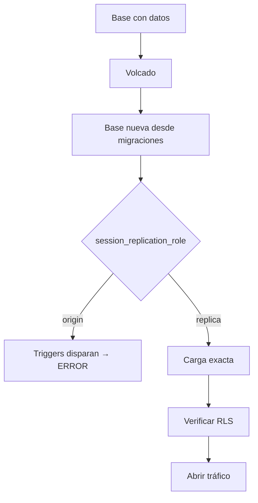

# SPEC — Phase 27 — Backups + Disaster Recovery

## 1. Información general

```text
Phase:                27
Nombre:               Backups + Disaster Recovery
Estado:               COMPLETED
Versión:              1.1.0
Fecha creación:       2026-08-31
Última actualización: 2026-08-31
Responsable:          alejandro.avendano@masuno.pe
```

Documento maestro: §17, §21, §22, §24, §32, §33 (Fase 27), §55.
Fases previas: 00 a 26 — todas COMPLETED.

---

## 2. Objetivo

### La frase que gobierna la fase

§33, Fase 27, última línea:

> **Un backup que nunca se probó no puede considerarse estrategia de
> recuperación.**

Y la penúltima, que es la que la hace ejecutable:

> Realizar al menos una prueba real de restauración en entorno no productivo.

Esto convierte la fase en algo distinto de documentación. Se puede escribir un
runbook perfecto sobre una restauración que no funciona; la única forma de saber
que funciona es restaurar.

### Lo que se midió antes de escribir este SPEC

Se hizo la prueba primero, y falló.

```text
Esquema         49 migraciones con 123 triggers.
Restore ingenuo insertar las filas volcadas con los triggers activos:
                el trigger `create_tenant_defaults` crea una sede fantasma al
                insertar el tenant, y la sede REAL del volcado choca después
                contra el índice único (tenant_id, lower(name)).
                -> ERROR: duplicate key value violates unique constraint
                -> la restauración ABORTA a media carga
Restore correcto  con session_replication_role = 'replica' los triggers no
                disparan: 1 sede, exacta, sin error.
PGlite          soporta session_replication_role, así que las dos rutas se
                pueden probar en CI.
```

### El hallazgo

**Restaurar esta base de datos con los triggers activos no degrada los datos:
falla.** Y falla a mitad de la carga, que es el peor momento posible — con parte
de los datos dentro y parte fuera, durante un incidente, con alguien mirando el
reloj.

No es un defecto del esquema. Los 123 triggers son correctos: mantienen
invariantes, numeran pedidos, denormalizan `tenant_id`, escriben auditoría. Lo
que ocurre es que **una restauración no es una inserción**: los datos ya
existieron, ya pasaron por esas reglas, y volver a aplicárselas los reescribe.

Esto es exactamente lo que §33 quiere decir con "un backup que nunca se probó".
El backup habría estado bien. La restauración habría fallado.

### ¿Qué debe ser posible al terminarla?

```text
- Que exista un runbook que alguien pueda seguir a las 3 de la mañana.
- Que RPO y RTO sean números, no adjetivos.
- Que la prueba de restauración corra en CI, no una vez y nunca más.
- Que se sepa qué NO cubre el backup de la base de datos.
- Que audit_logs no crezca para siempre.
- Que las claves se puedan rotar sin adivinar cuáles hay.
```

---

## 3. Alcance

### Incluido

```text
BK-01  Documento de recuperación: estrategia, restore, RPO, RTO,
       incident response, rollback, recovery
BK-02  Prueba REAL de restauración, ejecutable y en CI
BK-03  Prueba de que el restore ingenuo falla (el hallazgo, fijado)
BK-04  Verificación de que RLS sigue en pie tras restaurar
BK-05  Verificación de que el esquema se reconstruye desde cero
BK-06  Política de retención y purga de audit_logs (KL-2402)
BK-07  Inventario de secretos y procedimiento de rotación (KL-2503)
BK-08  Qué NO cubre el backup: Storage, Auth, secretos (KL-603)
BK-09  Tests
```

### Fuera de alcance

```text
OUT-01  Configurar PITR en el proyecto Supabase   -> requiere el proyecto y un
                                                     plan; el documento dice
                                                     cuál hace falta y por qué
OUT-02  Backup automático de Storage              -> ver §24; no hay mecanismo
                                                     de proveedor equivalente
OUT-03  Un scheduler que ejecute la purga         -> mismo bloqueo que las
                                                     Fases 20 y 22
OUT-04  Restauración de un solo tenant            -> ver §24, es un problema
                                                     distinto y más difícil
OUT-05  Réplica en caliente / alta disponibilidad -> no planificado
```

---

## 4. Dependencias

```text
Phase 01  el arnés PGlite, que es lo que hace ejecutable la prueba
Phase 24  audit_logs y sus triggers, que son parte del problema del restore
Phase 25  el inventario de secretos que ADR-029 dejó a medias
Phase 26  el seeder de volumen, reutilizado para restaurar algo con datos
```

---

## 5. Casos de uso

### UC-2701 — Alguien borra una tabla en producción

```text
Actor:       Operador de plataforma
Situación:   Un DELETE sin WHERE a las 2 de la tarde
Resultado:   Runbook: PITR al minuto anterior, restore con triggers apagados,
             verificación de RLS antes de abrir tráfico
```

### UC-2702 — Una migración rompe producción

```text
Actor:       Quien despliega
Situación:   La migración aplica y deja los datos inconsistentes
Resultado:   Rollback documentado: la migración de vuelta atrás de su propia
             fase (§21 de cada SPEC), no un restore completo
```

### UC-2703 — El proveedor pierde la región

```text
Actor:       Todos
Situación:   Supabase caído en su región
Resultado:   RTO declarado, y lo que se puede y no se puede hacer al respecto
```

### UC-2704 — Ensayo periódico

```text
Actor:       CI, en cada push
Acción:      Restaura una base con datos y verifica que sale idéntica
Resultado:   La estrategia de recuperación deja de ser una hipótesis
```

---

## 6. Requerimientos funcionales

```text
FR-2701  Existirá un documento de recuperación con las siete cosas de §33.
FR-2702  RPO y RTO serán números con una unidad.
FR-2703  El documento dirá qué mecanismo de Supabase hace falta para cumplirlos.
FR-2704  Habrá una prueba de restauración ejecutable.
FR-2705  La prueba cargará datos, los volcará, los restaurará y los comparará.
FR-2706  La prueba fallará si el resultado no es idéntico al origen.
FR-2707  Habrá una prueba de que el restore CON triggers falla.
FR-2708  Tras restaurar, se verificará que RLS sigue aislando tenants.
FR-2709  Se verificará que el esquema se reconstruye desde cero con migraciones.
FR-2710  Existirá purge_audit_logs(interval).
FR-2711  La purga respetará un mínimo legal de retención.
FR-2712  La purga no podrá ser invocada por un inquilino.
FR-2713  Habrá un inventario de secretos con su procedimiento de rotación.
FR-2714  El documento dirá explícitamente qué NO cubre el backup.
```

---

## 7. Requerimientos no funcionales

```text
NFR-2701 La prueba es real
  - Restaura de verdad: vuelca, reconstruye desde las migraciones y recarga.
    No comprueba que exista un archivo de backup.

NFR-2702 Aislamiento tras el desastre
  - Un restore que devuelve los datos y rompe RLS es peor que no restaurar:
    devuelve los datos de todos a todos. Se verifica después de restaurar.

NFR-2703 El runbook es seguible bajo presión
  - Pasos numerados, comandos literales, y el orden importa. Nadie diseña un
    procedimiento a las 3 de la mañana.
```

---

## 8. Modelo de datos

```text
Ninguna tabla nueva.

Se añade:
  purge_audit_logs(p_older_than interval) -> bigint
    SECURITY DEFINER, sin grant a anon ni authenticated.
```

### Retención de audit_logs

```text
Retención por defecto   365 días
Mínimo permitido        90 días, impuesto por la función
```

El mínimo es una barrera contra un `purge_audit_logs(interval '1 hour')` escrito
con prisa. Una auditoría que se puede vaciar con un parámetro no es una
auditoría; §17 la exige precisamente para el momento en que alguien quiere que
no exista.

---

## 9. Diagrama



---

## 10. Tenant Isolation

```text
Tenant Isolation Impact: ALTO
```

```text
¿Se añade alguna tabla con tenant_id?
  No.

Por qué el impacto es ALTO aunque no haya esquema nuevo
  Una restauración toca TODAS las tablas de TODOS los tenants a la vez, con
  los triggers apagados y, en producción, con un rol que salta RLS. Es el
  único procedimiento del sistema que opera fuera de las defensas que
  veinticinco fases construyeron.

  De ahí FR-2708: después de restaurar se verifica que un tenant sigue sin
  ver al otro. Un restore que devuelve los datos y deja RLS deshabilitado
  devuelve los datos de todos a todos, y nadie lo notaría hasta que fuera
  tarde.

  `session_replication_role = 'replica'` desactiva triggers, NO políticas.
  Se comprueba, no se supone.
```

---

## 11. Seguridad

```text
AB-2701  Un volcado con datos personales en un sitio sin cifrar.
         Mitigación: el documento dice dónde puede vivir un volcado y por
         cuánto tiempo. ADR-016 minimizó los datos; un backup los reúne
         todos otra vez.

AB-2702  Vaciar la auditoría con la función de purga.
         Mitigación: mínimo de 90 días impuesto por la función, y sin grant
         a roles de inquilino.

AB-2703  Restaurar y dejar RLS deshabilitado.
         Mitigación: FR-2708, verificado en la prueba.

AB-2704  Un secreto rotado en un sitio y no en otro.
         Mitigación: el inventario dice dónde vive cada uno.

AB-2705  Restaurar una base de staging sobre producción por confundir el
         proyecto.
         Mitigación: el runbook nombra el proyecto en cada comando y exige
         confirmar el identificador antes de escribir.
```

---

## 12. API / Server Actions

```text
Ninguna. Esta fase no añade superficie de aplicación.
```

---

## 13. UI / UX

```text
Ninguna pantalla. El público de esta fase es quien opera, no quien usa.
```

---

## 14. Flujos principales

```text
ENSAYO DE RESTAURACIÓN (el que corre en CI)
  sembrar datos
    -> volcar todas las tablas en orden de dependencia
    -> crear base nueva aplicando las migraciones
    -> session_replication_role = replica
    -> cargar el volcado
    -> session_replication_role = origin
    -> comparar conteos y filas
    -> comprobar que RLS sigue aislando

RECUPERACIÓN REAL (el runbook)
  confirmar el proyecto
    -> elegir el punto de restauración
    -> restaurar en un proyecto NUEVO, nunca sobre el roto
    -> verificar integridad y RLS
    -> mover el tráfico
    -> escribir el post-mortem
```

---

## 15. Manejo de errores

```text
Restore que falla a media carga  -> el runbook dice: no continuar, empezar de
                                    nuevo en una base limpia
Volcado incompleto               -> la prueba compara conteos por tabla
Purga por debajo del mínimo      -> excepción, no recorte silencioso
```

---

## 16. Observabilidad

```text
audit.purged  info  { deleted, olderThan }
```

---

## 17. Testing Plan

```text
Reconstrucción del esquema
TEST-2701  Las migraciones aplican desde cero sobre una base vacía.
TEST-2702  Aplicarlas dos veces sobre bases distintas da el mismo esquema.

El hallazgo
TEST-2703  Un restore con triggers activos FALLA (no degrada: falla).
TEST-2704  El error es el que se documentó, no otro.

La restauración correcta
TEST-2705  Con replica, los triggers no disparan.
TEST-2706  Los conteos por tabla coinciden con el origen.
TEST-2707  Las filas coinciden, no solo la cantidad.
TEST-2708  Las columnas que un trigger habría reescrito conservan su valor.
TEST-2709  Se restauran varios tenants sin mezclarlos.

Aislamiento después del desastre
TEST-2710  RLS sigue habilitada en todas las tablas tras restaurar.
TEST-2711  Un miembro de A no ve datos de B en la base restaurada.
TEST-2712  session_replication_role NO desactiva las políticas.

Retención
TEST-2713  purge_audit_logs borra lo más viejo que el intervalo.
TEST-2714  No borra lo más nuevo.
TEST-2715  Rechaza un intervalo por debajo del mínimo.
TEST-2716  Devuelve cuántas filas borró.
TEST-2717  Un inquilino no puede ejecutarla.

Documentación
TEST-2718  El documento de recuperación declara RPO y RTO con números.
TEST-2719  Cubre las siete cosas que pide §33.
TEST-2720  El inventario de secretos lista los del .env.example.
```

---

## 18. Edge Cases

```text
EC-2701  Volcado de una tabla vacía -> se restaura vacía, sin error.
EC-2702  Orden de carga con claves foráneas -> replica también desactiva la
         comprobación de FK, así que el orden deja de importar; aun así se
         vuelca en orden de dependencia por si se carga sin replica.
EC-2703  Una secuencia o contador que un trigger habría avanzado -> se
         restaura el valor volcado, no uno nuevo.
EC-2704  audit_logs sin filas antiguas -> la purga devuelve 0.
EC-2705  Restaurar sobre una base que ya tiene datos -> fuera de alcance: el
         runbook restaura en un proyecto nuevo, siempre.
```

---

## 19. Performance considerations

```text
El ensayo arranca dos instancias PGlite y mueve unos miles de filas. Corre en
segundos, que es la condición para que corra en cada push en vez de una vez al
año.
```

---

## 20. Migraciones

```text
20260831130000_create_audit_retention.sql   purge_audit_logs
```

---

## 21. Rollback

```text
drop function public.purge_audit_logs(interval);
```

Riesgo: **BAJO**. Nada de esta fase cambia datos existentes.

---

## 22. Definition of Done

```text
- [x] docs/disaster-recovery.md con las siete cosas de §33
- [x] RPO y RTO como números
- [x] Prueba real de restauración, en CI
- [x] El fallo del restore ingenuo, fijado en un test
- [x] RLS verificada después de restaurar
- [x] purge_audit_logs con mínimo de retención
- [x] Inventario de secretos y rotación
- [x] Qué NO cubre el backup, escrito
- [x] Tests
- [x] Typecheck / Lint / Format / Build PASS
- [x] SPEC actualizado con el resultado real
```

Resultado real:

```text
Format   PASS   prettier --check .
Lint     PASS   eslint --max-warnings=0
Types    PASS   next typegen && tsc --noEmit
Tests    PASS   2058 tests, 84 archivos (25 nuevos en esta fase)
Build    PASS
```

---

## 23. Implementation notes

### Lo que se construyó

```text
src/tests/helpers/backup.ts             volcado, restauración en dos modos, diff
src/tests/database/restore-drill.test.ts  11 pruebas: el ensayo real
src/tests/database/audit-retention.test.ts  7 pruebas de la purga
src/tests/unit/disaster-recovery-doc.test.ts  el documento cubre lo que debe

supabase/migrations/20260831130000_create_audit_retention.sql

docs/disaster-recovery.md
docs/adr/031-restore-with-triggers-disabled.md
```

### El hallazgo, otra vez, porque es toda la fase

Se hizo la prueba antes de escribir el runbook, y falló. Si se hubiera escrito
primero, el documento habría sido completo, confiado y falso en el paso tres.

```text
ERROR: duplicate key value violates unique constraint "locations_tenant_name_key"
```

`create_tenant_defaults` inventa una sede al insertar el tenant; la sede real del
volcado choca contra ella. La carga aborta a medias. La frase que resume el
porqué está en el ADR: **una restauración no es una inserción** — los datos ya
existieron y ya pasaron por esas reglas.

### Lo que el ensayo comprueba además del conteo

Contar filas habría pasado mientras los datos volvían sutilmente mal. TEST-2708
comprueba las columnas que un trigger habría reescrito: el número de pedido, que
asigna un trigger, y `updated_at`, que `set_updated_at` sella en cada escritura.
Esa es la corrupción que nadie nota hasta que un reporte contradice a un cliente.

### Una suposición que se comprobó en vez de creerse

Toda la seguridad del procedimiento depende de que
`session_replication_role = 'replica'` desactive triggers y **no** políticas. Si
las desactivara, la ventana de restauración sería una ventana sin aislamiento
ninguno. TEST-2712 lo ejecuta.

### Un test mío repitió el error de premisa de las Fases 10 y 11

Escribí la verificación de aislamiento post-restore sobre `products` y falló: un
producto publicado **es** público, por decisión deliberada desde la Fase 07
(lección A7-1). La afirmación correcta es sobre datos que nunca lo son, así que
se hace sobre `customers`.

Es la tercera vez que el proyecto tropieza con lo mismo, lo cual dice algo:
"aislamiento" y "privado" no son la misma propiedad, y el catálogo publicado es
el sitio donde más fácil se confunden.

### Dos KLs de fases anteriores, cerradas

```text
KL-2402  (Fase 24)  Retención de audit_logs -> purge_audit_logs con suelo de
                    90 días, sin grant a roles de inquilino.
KL-2503  (Fase 25)  Rotación de secretos -> inventario completo en
                    docs/disaster-recovery.md, con un test que comprueba que
                    lista TODAS las variables de .env.example, incluidas las
                    que no son secretas.
```

Lo segundo apareció al escribir el test: faltaban tres variables. No son
secretos, pero un inventario que solo nombra lo peligroso obliga a quien lo lee
a decidir si una ausencia es inofensiva o es un olvido.

---

## 24. Known limitations

```text
KL-2701  Storage no tiene backup. Un restore devuelve las RUTAS y no los
         archivos: un catálogo recuperado tendría imágenes rotas. No hay
         mecanismo de proveedor equivalente contratado. Esto también deja
         KL-603 (assets huérfanos, Fase 06) sin cerrar.

KL-2702  El RPO de 5 minutos EXIGE PITR, y no está verificado que el proyecto
         Supabase lo tenga. Sin PITR el RPO real es de 24 horas y el documento
         estaría declarando algo falso. Bloqueante para producción.

KL-2703  El RTO de 4 horas es una estimación, no una medición. Restaurar de
         verdad y cronometrarlo necesita el proyecto.

KL-2704  El ensayo usa un volcado SQL propio, no pg_dump. Reproduce el peligro
         (triggers sobre datos que ya existieron) y no el formato. Una prueba
         con pg_restore real necesita un entorno con PostgreSQL instalado.

KL-2705  DUMP_ORDER lista 24 tablas de las 63 que hay. Cubre el núcleo
         operativo; las de catálogos de plataforma y las de fases tardías no
         están en el ensayo.

KL-2706  Nada ejecuta purge_audit_logs. Necesita el mismo scheduler que
         esperan las Fases 20 y 22.

KL-2707  No se puede restaurar un solo tenant. Es el precio conocido de
         ADR-001, una sola base para todos.

KL-2708  Los cambios de esta fase están sin commitear, junto con los de la 26.
```

---

## 25. Future considerations

```text
- La Fase 28 puede cerrar KL-2702 verificando el plan de Supabase, que es una
  comprobación de cinco minutos y bloquea el paso a producción.
- Si se contrata almacenamiento con versionado, KL-2701 y KL-603 se cierran
  juntas.
- Ampliar DUMP_ORDER es barato y conviene hacerlo cuando alguien toque el
  esquema por otro motivo.
```
