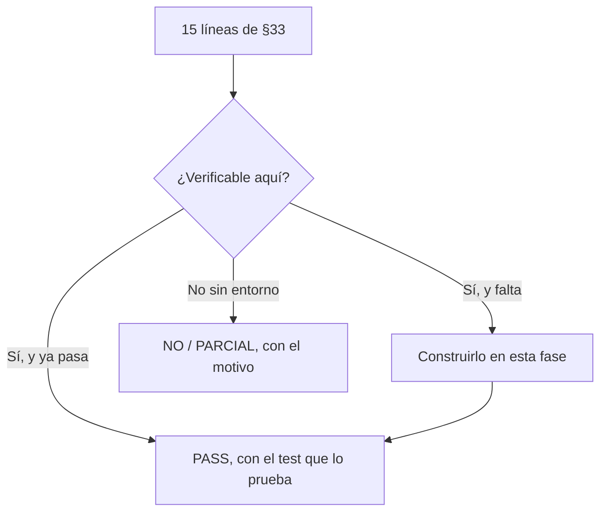

# SPEC — Phase 28 — Production Readiness

## 1. Información general

```text
Phase:                28
Nombre:               Production Readiness
Estado:               COMPLETED
Versión:              1.1.0
Fecha creación:       2026-08-31
Última actualización: 2026-08-31
Responsable:          alejandro.avendano@masuno.pe
```

Documento maestro: §19, §20, §21, §33 (Fase 28), §34, §55.
Fases previas: 00 a 27 — todas COMPLETED.

---

## 2. Objetivo

### Lo que pide §33

Una lista de quince líneas, todas terminadas en `PASS`:

```text
Security · RLS · Cross-tenant tests · Unit tests · Integration tests · E2E
Lint · TypeScript · Build · SEO · Accessibility · Performance · Backups
Monitoring · Documentation
```

### Lo que esta fase NO es

No es marcar quince casillas. Trece de ellas ya son verdad porque veintisiete
fases las hicieron verdad; dos **no se pueden marcar hoy**, y esas dos son el
trabajo:

```text
E2E             0 tests. No existe Playwright ni equivalente en el proyecto.
Accessibility   1 archivo de tests de componente sobre 84. §19 pide teclado,
                labels, focus, contraste y aria; nada de eso se verifica.
```

Un checklist de producción cuyo autor marca `PASS` en algo que no comprobó es
peor que no tener checklist: convierte una duda en una afirmación falsa, y
alguien despliega confiando en ella.

Así que esta fase construye lo que falta, y donde no se pueda construir, **lo
dice**.

### La honestidad como entregable

El resultado de esta fase no es "todo PASS". Es un checklist donde cada línea
dice la verdad, incluida la que diga `NO`. Un proyecto que sabe qué le falta
para producción está más cerca de producción que uno que cree que no le falta
nada.

---

## 3. Alcance

### Incluido

```text
PR-01  Tests de accesibilidad automatizados sobre las primitivas de UI
PR-02  Tests de accesibilidad sobre formularios reales, no solo primitivas
PR-03  Verificación de las siete cosas que pide §19
PR-04  Arnés E2E instalado, configurado y EJECUTADO al menos una vez
PR-05  Especificaciones E2E de los caminos críticos
PR-06  El checklist de §33, con su estado real y verificable
PR-07  Un test que comprueba que el checklist no miente
PR-08  Guía de despliegue: qué hay que hacer antes del primer deploy
PR-09  Triaje de las KLs abiertas: cuáles bloquean producción
```

### Fuera de alcance

```text
OUT-01  Pentest y escaneo automático  -> ADR-029/KL-2501: necesita un entorno
                                         desplegado y un tercero
OUT-02  Ejecutar E2E contra Supabase  -> necesita Docker levantado o un
                                         proyecto; el arnés queda listo y la
                                         guía dice cómo
OUT-03  Auditoría manual de contraste -> automatizable solo en parte; axe cubre
                                         lo que se puede calcular
OUT-04  Corregir las ~195 KLs abiertas -> se TRIAN, no se cierran: la mayoría
                                          son decisiones diferidas a propósito
```

---

## 4. Dependencias

```text
Phase 00  las primitivas de UI y el proyecto dom de Vitest
Phase 25  el barrido de aislamiento, que es la mitad de "Security" y "RLS"
Phase 26  los presupuestos, que son "Performance"
Phase 27  el ensayo de restauración, que es "Backups"
```

---

## 5. Casos de uso

### UC-2801 — Alguien va a desplegar por primera vez

```text
Actor:       Quien despliega
Acción:      Lee el checklist
Resultado:   Sabe qué está verificado, qué no, y qué tiene que hacer él
```

### UC-2802 — Un usuario que no usa ratón

```text
Actor:       Persona navegando con teclado
Acción:      Recorre un formulario del dashboard
Resultado:   Cada control es alcanzable, tiene label y muestra foco
```

### UC-2803 — Un lector de pantalla

```text
Actor:       Persona usando NVDA o VoiceOver
Acción:      Envía un formulario con un error
Resultado:   El error se anuncia y está asociado a su campo
```

### UC-2804 — Alguien rompe la accesibilidad sin darse cuenta

```text
Actor:       Quien añada una pantalla
Acción:      Pone un input sin label
Resultado:   CI falla nombrando el componente y la regla
```

---

## 6. Requerimientos funcionales

```text
FR-2801  Habrá tests de accesibilidad automatizados con axe.
FR-2802  Cubrirán las diez primitivas de UI.
FR-2803  Cubrirán formularios reales, con y sin errores.
FR-2804  Un input sin label hará fallar el test.
FR-2805  Se verificará que los errores se asocian con aria-describedby.
FR-2806  Se verificará que un campo inválido lleva aria-invalid.
FR-2807  Se verificará que nada interactivo queda fuera del orden de tabulación.
FR-2808  Se verificará que el estado de carga se anuncia.
FR-2809  Existirá una configuración de Playwright ejecutable.
FR-2810  Existirá al menos una prueba E2E que se haya EJECUTADO de verdad.
FR-2811  Las specs E2E cubrirán los caminos críticos, aunque requieran stack.
FR-2812  El comando E2E será separado de `npm test`.
FR-2813  Existirá docs/production-readiness.md con las 15 líneas de §33.
FR-2814  Cada línea dirá PASS, PARCIAL o NO, con el motivo.
FR-2815  Un test comprobará que las líneas verificables coinciden con la
         realidad del repositorio.
FR-2816  Existirá una guía de despliegue con los pasos previos obligatorios.
FR-2817  Las KLs que bloquean producción estarán listadas aparte.
```

---

## 7. Requerimientos no funcionales

```text
NFR-2801 El checklist no miente
  - Cada PASS que se pueda comprobar automáticamente, se comprueba. Los que
    no, se marcan como no verificados en vez de suponerse.

NFR-2802 Accesibilidad comprobada, no declarada
  - Veintiocho fases han escrito `aria-describedby` a mano. Nada comprobó
    nunca que estuvieran bien puestos.

NFR-2803 El arnés E2E existe de verdad
  - Instalado y ejecutado al menos una vez. Un archivo de specs que nunca
    corrió es un archivo que no funciona y nadie lo sabe todavía.
```

---

## 8. Modelo de datos

```text
Ninguna tabla nueva. Esta fase no toca la base de datos.
```

---

## 9. Diagrama



---

## 10. Tenant Isolation

```text
Tenant Isolation Impact: NONE
```

```text
Esta fase no añade esquema, ni políticas, ni consultas. No cambia quién ve
qué.

Lo que sí hace es VERIFICAR el aislamiento que ya existe: la línea
"Cross-tenant tests" del checklist se marca contra los tests que la Fase 25
dejó, y el test del checklist comprueba que esos tests siguen ahí. Un
checklist que dijera PASS mientras alguien borró la suite sería exactamente
el fallo que esta fase existe para impedir.
```

---

## 11. Seguridad

```text
AB-2801  Un checklist con PASS falso que lleve a desplegar algo no listo.
         Mitigación: FR-2815, un test que compara las líneas verificables
         contra el repositorio.

AB-2802  Un formulario accesible al teclado que exponga una acción que la
         UI escondía.
         Mitigación: §45 lleva veintiocho fases diciendo que esconder no es
         controlar. La accesibilidad no cambia eso; cada acción sigue
         verificando su permiso en el servidor.

AB-2803  Credenciales reales en la configuración E2E.
         Mitigación: la configuración lee variables de entorno y no trae
         ningún valor por defecto que funcione.
```

---

## 12. API / Server Actions

```text
Ninguna.
```

---

## 13. UI / UX

```text
Ninguna pantalla nueva. Se corrige lo que los tests de accesibilidad
encuentren, que es distinto de rediseñar.
```

---

## 14. Flujos principales

```text
VERIFICAR EL CHECKLIST
  para cada una de las 15 líneas
    -> ¿hay un test que la respalde?
         sí  -> PASS, citando el test
         no  -> ¿se puede construir aquí?
                  sí -> construirlo
                  no -> NO / PARCIAL, con el motivo y el dueño

ANTES DEL PRIMER DEPLOY
  la guía de despliegue: variables, PITR, dominios, y qué comprobar después
```

---

## 15. Manejo de errores

```text
axe encuentra una violación   -> el test falla nombrando la regla y el nodo
Playwright sin navegador      -> el comando lo dice y explica cómo instalarlo
E2E sin stack levantado       -> se salta con un motivo, no falla en silencio
```

---

## 16. Observabilidad

```text
Ninguna señal nueva. La línea "Monitoring" del checklist se marca contra lo
que dejaron las Fases 24 y 25.
```

---

## 17. Testing Plan

```text
Accesibilidad de primitivas
TEST-2801  Button no tiene violaciones de axe.
TEST-2802  Input con label no tiene violaciones.
TEST-2803  Input SIN label sí las tiene (guarda del guarda).
TEST-2804  Alert anuncia su rol.
TEST-2805  Spinner anuncia su estado.
TEST-2806  Badge, Card, EmptyState y Skeleton limpios.

Accesibilidad de formularios reales
TEST-2807  Un formulario del dashboard no tiene violaciones.
TEST-2808  Con errores de campo, tampoco.
TEST-2809  El error está asociado por aria-describedby.
TEST-2810  El campo inválido lleva aria-invalid.
TEST-2811  Todo control interactivo es alcanzable por teclado.
TEST-2812  El botón en carga anuncia su estado.

§19 punto por punto
TEST-2813  Ningún input queda sin label o aria-label en el repositorio.
TEST-2814  Ningún elemento interactivo tiene tabindex negativo sin motivo.
TEST-2815  Los formularios usan <label for> o envuelven su control.

E2E
TEST-2816  El arnés arranca y ejecuta al menos una prueba real.
TEST-2817  /api/health responde sin depender de la base.

El checklist
TEST-2818  docs/production-readiness.md tiene las 15 líneas de §33.
TEST-2819  Cada línea declara PASS, PARCIAL o NO.
TEST-2820  Ninguna línea dice PASS sin citar cómo se comprueba.
TEST-2821  Las suites que el checklist cita existen.
```

---

## 18. Edge Cases

```text
EC-2801  axe en jsdom no puede calcular contraste real -> se declara como
         limitación en vez de fingir que se comprobó.
EC-2802  Un componente que necesita contexto de servidor -> se prueba el
         cliente que renderiza, no la página entera.
EC-2803  Playwright sin navegador instalado -> mensaje claro, no un stack.
EC-2804  E2E sin Supabase -> solo pasan las rutas que no dependen de él.
```

---

## 19. Performance considerations

```text
Los tests de accesibilidad corren en jsdom con el resto del proyecto dom.
Los E2E NO entran en `npm test`: levantan un navegador y un servidor, y
mezclarlos haría que la suite normal dejara de ser rápida.
```

---

## 20. Migraciones

```text
Ninguna.
```

---

## 21. Rollback

```text
Riesgo: NINGUNO. Esta fase solo añade tests y documentación.
```

---

## 22. Definition of Done

```text
- [x] Tests de accesibilidad con axe, primitivas y formularios
- [x] Los siete puntos de §19, verificados o declarados
- [x] Arnés E2E instalado y EJECUTADO: 6 pruebas reales pasando
- [x] Specs E2E de los caminos críticos (se saltan sin Supabase, con motivo)
- [x] docs/production-readiness.md con las 15 líneas y su estado REAL
- [x] Un test que impide que el checklist mienta
- [x] Guía de despliegue
- [x] KLs que bloquean producción, listadas
- [x] Typecheck / Lint / Format / Build PASS
- [x] SPEC actualizado con el resultado real
```

Resultado real:

```text
Format   PASS   prettier --check .
Lint     PASS   eslint --max-warnings=0
Types    PASS   next typegen && tsc --noEmit
Tests    PASS   npm test
E2E      PASS   6 pruebas ejecutadas, 6 saltadas con motivo
Build    PASS

Checklist de §33: 11 PASS · 4 PARCIAL · 0 NO
```

---

## 23. Implementation notes

### Lo que se construyó

```text
playwright.config.ts                      arnés E2E
e2e/standalone.spec.ts                    6 pruebas EJECUTADAS
e2e/stack.spec.ts                         6 pruebas, se saltan sin Supabase

src/tests/helpers/accessibility.ts        axe, con el contraste desactivado
src/tests/components/accessibility.test.tsx   21 pruebas con axe
src/tests/unit/accessibility-sweep.test.ts    barrido de §19 sobre 140 componentes
src/tests/unit/production-checklist.test.ts   el checklist no puede mentir

docs/production-readiness.md              las 15 líneas de §33, con su estado real
docs/adr/032-e2e-split-and-a-checklist-that-cannot-lie.md
```

### El resultado: 11 PASS · 4 PARCIAL · 0 NO

Marcar las cuatro habría costado un commit y producido un documento que se lee
mejor y no significa nada. Las cuatro dicen qué falta, qué cuesta cerrarlo y si
bloquea un despliegue.

### El arnés E2E se ejecutó, y encontró dos cosas de inmediato

**1. `/api/health` NO corre sin dependencias.** La Fase 00 lo construyó como
sonda de vida pura y la Fase 24 le añadió una comprobación de base de datos, así
que sin Supabase responde `degraded` con 503. El comentario del matcher de la
Fase 07 sigue describiendo el comportamiento de la Fase 00, diecisiete fases
después. Leer un comentario no es medir.

**2. La configuración esperaba un 200 de esa ruta** y se quedó dos minutos
esperando contra un servidor que estaba levantado y respondiendo perfectamente.
Ahora espera al puerto, porque "el servidor acepta conexiones" es lo único
cierto sin base de datos.

Ninguna de las dos se habría encontrado escribiendo specs sin ejecutarlas.

### Por qué escribir specs que todavía no pueden correr NO es el error de la Fase 09

La Fase 09 se negó a escribir un adaptador de Vercel que no podía probar. Estas
specs se parecen y son el caso opuesto: **una integración afirma algo; un test
saltado no afirma nada.** Imprime "saltado, necesita Supabase", que es
exactamente cierto, y es lo que alguien ejecuta el día que exista el stack en
vez de empezar de un archivo vacío.

Lo que no son es verificadas. Por eso el checklist dice PARCIAL.

### Accesibilidad: dos defectos reales, invisibles en pantalla

```text
1  <Label htmlFor="customerId"> apuntaba a un id inexistente. El control es
   CustomerPicker, cuyo buscador solo tenía `placeholder` — y un placeholder
   NO es un nombre accesible: desaparece al escribir y algunos lectores de
   pantalla no lo anuncian nunca. Quien usa lector llegaba al campo de cliente
   y no oía nada.

2  Cinco formularios mostraban errores de campo que nada anunciaba.
```

### Y una regla mía del barrido estaba mal

Exigía `aria-invalid` en todas partes, que es correcto para un error de campo y
**incorrecto** para uno de formulario: `errors.items` de un pedido pertenece a
la lista, no a ningún input, y ahí lo correcto es `role="alert"`. La regla ahora
acepta cualquiera de las dos y rechaza ninguna — que es un enunciado más preciso
de lo que §19 pide, no una relajación para que pase.

Otra regla reportó seis componentes correctos por confundir `htmlFor="literal"`
con `htmlFor={expresión}`. Ese modo de fallo —una comprobación bienintencionada
que grita en falso— es como un test acaba borrado en vez de arreglado, así que
se hizo precisa en lugar de laxa.

### El contraste está desactivado a propósito

jsdom no maqueta y no computa estilos, así que las reglas de contraste de axe no
pueden ejecutarse: devolverían cero violaciones y parecerían un aprobado. Un
test que aparenta comprobar el contraste y no lo hace es peor que ninguno,
porque produce la confianza sin la verificación.

### El checklist se pilló a sí mismo

`production-checklist.test.ts` falló a los minutos de escribir el documento: la
fila de Security citaba `src/tests/database/security-*.test.ts`, que no existe.
Los archivos reales son `unit/security-posture.test.ts` y
`database/rate-limit.test.ts`.

Ese es el fallo para el que existe ese test. No que alguien mienta, sino que
alguien renombre un archivo y deje una afirmación que sobrevive a lo que
afirmaba.

---

## 24. Known limitations

```text
KL-2801  BLOQUEANTE. Ningún flujo de negocio se ha ejecutado de extremo a
         extremo. Las specs están escritas y se saltan sin Supabase.

KL-2802  BLOQUEANTE, heredada. El proyecto nunca se ha ejecutado contra
         Supabase real: todo el aislamiento se verifica en PGlite, que shimea
         auth y storage (KL-2704 de la Fase 27).

KL-2803  Contraste de color sin verificar. La spec E2E que lo haría en un
         Chromium real ya está escrita.

KL-2804  El barrido de §19 es estático: ve labels ausentes y referencias
         colgantes, no el foco visible ni el orden real de tabulación en una
         página compuesta.

KL-2805  Los E2E no corren en CI. Necesitarían levantar Supabase en el
         workflow, que es un cambio de infraestructura, no de tests.

KL-2806  Las ~195 KLs abiertas están triadas en tres grupos, no revisadas una
         por una.

KL-2807  Los cambios de las Fases 26, 27 y 28 están sin commitear.
```

---

## 25. Future considerations

```text
- Levantar Supabase en el workflow de CI cierra KL-2801, KL-2802, KL-2803 y
  KL-2805 de una vez. Es el cambio con mejor relación coste/beneficio que le
  queda al proyecto.
- Verificar PITR (KL-2702) cuesta cinco minutos y es lo más barato de la lista
  de bloqueantes.
- Contratar error tracking cierra la línea 14 del checklist; el sitio donde
  enchufarlo ya existe desde la Fase 24.
```
